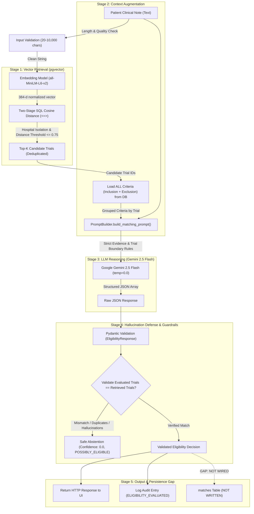

# MedMatch AI & RAG Pipeline Baseline

**Document ID:** AI-BASE-001  
**Phase:** Phase 0 Baseline  
**Scope:** Embeddings, Vector Search, Prompt Engineering, LLM Reasoning, and Decision Flow

---

## 1. AI Pipeline Overview

The MedMatch AI engine is an end-to-end Retrieval-Augmented Generation (RAG) system built to evaluate clinical trial eligibility for patient notes.



---

## 2. Embedding & Vector Search Audit

### 2.1. Embedding Model Specifications
- **Model Architecture:** Dense Bi-Encoder Transformer (`sentence-transformers/all-MiniLM-L6-v2`).
- **Embedding Dimension:** `384`.
- **Weight Source:** Stored locally on the filesystem at `services/ai-service/models/all-MiniLM-L6-v2`.
- **Runtime Execution:** Thread-safe singleton (`app.embeddings.model.EmbeddingModel`). CPU execution via PyTorch 2.8.0.
- **Normalization:** Embeddings are explicitly normalized to unit length (`L2` norm) via `normalize_embeddings=True`.
- **Empirical Latency:**
  - Cold model loading: **`325.8 ms`**.
  - Single text encoding (clinical query): **`153.4 ms`**.
- **Caching:** Redis-backed with key `CacheKeys.embedding(text)` and a 7-day TTL.

### 2.2. Vector Storage & Schema
Three database tables contain vector embeddings, all mapped using `pgvector.sqlalchemy.Vector(384)`:
1. `trial_embeddings`: Encodes a canonical representation of the overall trial (Title + Condition + Summary + Phase + Status + Inclusion + Exclusion). Used for Stage-1 trial discovery.
2. `criteria_embeddings`: Encodes each individual inclusion and exclusion criterion description. Used to pick representative criteria.
3. `patient_note_embeddings`: Encodes historical clinical notes attached to patient records.

### 2.3. Retrieval Implementation & Database Query
Retrieval is implemented in `app/repositories/matching_repository.py:find_similar_criteria` using a two-stage raw SQL Common Table Expression (CTE):
```sql
WITH ranked_trials AS (
    SELECT
        t.id AS trial_id,
        t.title, t.condition, t.phase, t.status, t.brief_summary,
        te.embedding <=> CAST(:embedding AS vector) AS distance
    FROM trials t
    JOIN trial_embeddings te ON te.trial_id = t.id
    WHERE t.hospital_id = :hospital_id
      AND EXISTS (SELECT 1 FROM trial_criteria tc WHERE tc.trial_id = t.id)
    ORDER BY te.embedding <=> CAST(:embedding AS vector) ASC, t.id ASC
    LIMIT :trial_limit
),
ranked_criteria AS (
    SELECT
        rt.trial_id, rt.title, rt.condition, rt.phase, rt.status, rt.brief_summary,
        tc.id, tc.criteria_type, tc.description, rt.distance,
        ROW_NUMBER() OVER (
            PARTITION BY rt.trial_id
            ORDER BY ce.embedding <=> CAST(:embedding AS vector) ASC, tc.id ASC
        ) AS criterion_rank
    FROM ranked_trials rt
    JOIN trial_criteria tc ON tc.trial_id = rt.trial_id
    JOIN criteria_embeddings ce ON ce.criteria_id = tc.id
)
SELECT id, trial_id, title, condition, phase, status, brief_summary, criteria_type, description, distance
FROM ranked_criteria
WHERE criterion_rank = 1
ORDER BY distance ASC, trial_id ASC, id ASC;
```

### 2.4. Retrieval Classification
```text
Retrieval Type: PURE VECTOR RETRIEVAL
```
- **Vector Metric:** Cosine distance operator (`<=>`).
- **Keyword Retrieval (BM25):** **MISSING**. No lexical search, inverted index, or Postgres full-text search (`tsvector`) is utilized.
- **Hybrid Retrieval:** **MISSING**. No score fusion (such as Reciprocal Rank Fusion / RRF) or cross-encoder reranking is implemented.
- **Vector Indexing:** **MISSING**. There are **no HNSW or IVFFlat indexes** in the database migrations. Every vector similarity query performs an unindexed sequential scan of all trial vectors for that tenant.

---

## 3. RAG Pipeline & Prompt Engineering

### 3.1. Context Assembly Strategy
Unlike basic vector retrieval that passes only the single nearest text chunk to an LLM, MedMatch implements a **Candidate Discovery -> Complete Criteria Hydration** pattern:
1. First, vector similarity identifies the top candidate clinical trials (`expected_trial_ids`).
2. Then, `MatchingService._get_complete_trial_criteria()` loads **every** inclusion and exclusion criterion belonging to those candidate trials from the relational database.
3. `PromptBuilder.build_matching_prompt()` formats the patient note followed by trial sections clearly demarcated by `Trial ID`, metadata, and full criterion requirements.

### 3.2. LLM Specifications
- **Provider:** Google Gemini via the official `google-genai` Python SDK.
- **Model:** `gemini-2.5-flash` (configured via `settings.LLM_MODEL`).
- **Configuration:** `temperature=0.0`, `response_mime_type="application/json"`.
- **Retry Mechanism:** Tenacity retry loop (3 attempts, exponential backoff from 1s to 8s) retrying transient communication errors, empty responses, and malformed JSON.

### 3.3. Prompt Engineering Analysis (`TRIAL_MATCHING_PROMPT`)
The system prompt in `app/prompts/trial_matching_prompt.py` is an exceptionally rigorous, 966-line deterministic prompt containing comprehensive medical reasoning constraints:
- **Strict Clinical Evidence Rule:** Retrieved criteria are defined strictly as trial requirements, never as evidence of the patient satisfying them.
- **Diagnostic Confirmation Rule:** Prohibits assuming pathology or histology simply because a cancer name is mentioned (requires explicit mention of biopsy, histology, cytology).
- **Independent Trial Boundaries:** Explicitly prohibits transferring evidence, missing information, or conclusions between different trials.
- **Tri-State Exclusion Logic:**
  - *Triggered:* Explicit proof condition is present.
  - *Satisfied (Explicitly Ruled Out):* Explicit proof condition is absent.
  - *Unknown:* Condition not mentioned (must remain in neither category; captured in `missing_information` if critical).
- **Missing Information Phrasing:** Requires phrasing unknowns as tests/status to be obtained (e.g., `"EGFR mutation status"`), strictly forbidding assumed disease states (e.g., `"EGFR-negative disease"`).

---

## 4. Eligibility Decision Logic

### 4.1. Decision Taxonomy
The LLM classifies each evaluated trial into one of three standardized states (`EligibilityStatus`):
1. **`Eligible`:** All required inclusion criteria are explicitly met; no exclusion criteria are triggered; no critical information is missing.
2. **`Not Eligible`:** At least one required inclusion criterion explicitly fails, OR at least one exclusion criterion is explicitly triggered.
3. **`Possibly Eligible`:** No required inclusion criterion has failed and no exclusion criterion has triggered, but one or more critical requirements remain unknown in the patient's record.

### 4.2. Confidence Score Calibration
Confidence is returned as a float between `0.0` and `1.0`, calibrated as:
- `0.90 - 1.00`: Complete clinical evidence available with minimal uncertainty.
- `0.70 - 0.89`: Core evidence present; minor non-critical uncertainty.
- `0.40 - 0.69`: Substantial missing clinical information.
- `0.00 - 0.39`: Strong evidence of ineligibility or significant unknowns.

### 4.3. Defensive Guardrails & Hallucination Mitigation
In `MatchingService.evaluate_eligibility()`:
1. **Empty Retrieval Defense:** If vector search retrieves 0 trials, the LLM is never called. A deterministic response is returned with status `Possibly Eligible`, confidence `0.0`, and explanation stating no trials were found.
2. **Trial ID Verification:** `MatchingService._validate_llm_trial_results()` verifies that:
   - Every evaluated result corresponds to exactly one trial ID.
   - The returned trial IDs match the retrieved trial IDs exactly (rejecting ungrounded hallucinated trials).
   - No duplicate trial evaluations are present.
   - No retrieved trials were omitted by the model.
3. **Safe Abstention Fallback:** If the LLM response violates trial ID invariants, the exception is caught, logged, and a safe abstention object (`confidence: 0.0`, `POSSIBLY_ELIGIBLE`, explicit explanation) is returned instead of leaking ungrounded conclusions to the physician.

---

## 5. Architectural Gaps in Current AI Pipeline

| Component | Current State | Impact on Capstone |
| :--- | :--- | :--- |
| **Match Persistence** | Evaluated results returned in-memory only; `matches` table unwritten | Historical decisions, tracking, and evaluation audits cannot be stored or queried. |
| **Patient Profile Reasoning** | Input is raw string; patient demographics (age, sex, stage) not passed | System cannot cross-reference structured patient fields against criteria without manual typing. |
| **Lexical Search (BM25)** | Missing entirely | Pure dense embeddings fail on exact medical codes, gene acronyms (e.g., *EGFR T790M*), or dosage numbers. |
| **Vector Indexing** | No HNSW/IVFFlat index on Postgres tables | Brute-force sequential scan latency will degrade linearly as trial databases scale. |
| **Evaluation Metrics** | Missing entirely | Cannot objectively quantify retrieval quality (Recall@k) or LLM accuracy against ground truth. |
