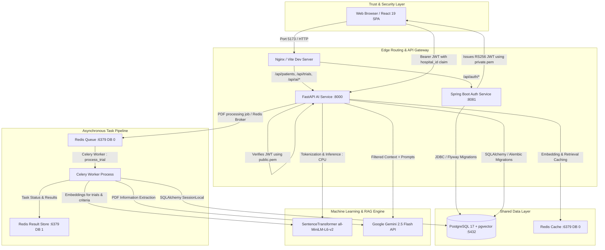

# MedMatch Architecture Baseline

**Document ID:** ARCH-BASE-001  
**Phase:** Phase 0 Baseline  
**Scope:** Runtime Architecture, Microservices, Security, APIs, and Infrastructure

---

## 1. Runtime Architecture Overview

The MedMatch platform follows a distributed microservice pattern separating enterprise authentication/authorization from AI-intensive clinical document processing and semantic search.



---

## 2. Service Inventory & Responsibilities

### 2.1. Authentication Service (`auth-service`)
- **Technology:** Java 21, Spring Boot 4.1.0, Spring Security 6, Hibernate / Spring Data JPA, Nimbus JOSE+JWT, Flyway.
- **Entry Point:** `com.medmatch.auth.AuthServiceApplication.main()`
- **Default Port:** `8081`
- **Primary Responsibility:** User lifecycle management, hospital tenant administration, authentication, asymmetric JWT token issuance, security audit logging, system metrics dashboard.
- **Dependencies:** PostgreSQL (via JDBC `org.postgresql.Driver`).
- **Database Interaction:** Manages `hospitals`, `roles`, `users`, and `audit_logs` tables.
- **Communication Type:** Synchronous REST API.

### 2.2. AI Service (`ai-service`)
- **Technology:** Python 3.13, FastAPI 0.115+, SQLAlchemy 2.0, Alembic, PyMuPDF (fitz), Celery 5.4, Redis, PyJWT, Google GenAI SDK (`google-genai`).
- **Entry Point:** `app.main:app` (via Uvicorn)
- **Default Port:** `8000`
- **Primary Responsibility:** Clinical trial document upload and metadata management, patient records and clinical notes management, local text embedding generation, vector similarity search, and RAG-based eligibility evaluation.
- **Dependencies:** PostgreSQL with `pgvector`, Redis (caching and Celery broker), Google Gemini API.
- **Database Interaction:** Manages `patients`, `patient_notes`, `patient_note_embeddings`, `trials`, `trial_criteria`, `criteria_embeddings`, `trial_embeddings`, and `matches` (schema only).
- **Communication Type:** Synchronous REST API for clients; asynchronous job dispatching to Celery.

### 2.3. Celery Background Worker (`celery-worker`)
- **Technology:** Python 3.13, Celery, PyMuPDF, SentenceTransformers, Google GenAI.
- **Entry Point:** `celery -A app.celery.celery_app worker -l info -c 2`
- **Primary Responsibility:** Offloading long-running, CPU/network heavy trial PDF extraction, LLM parsing, embedding generation, and atomic database persistence from the API event loop.
- **Queue Configuration:** Broker `redis://redis:6379/0`, Backend `redis://redis:6379/1`, `task_acks_late=True`, `task_reject_on_worker_lost=True`.

### 2.4. Frontend Client (`frontend/medmatch-ui`)
- **Technology:** React 19, TypeScript, Vite 8, Tailwind CSS v4, Axios, React Hook Form, Zod, Recharts, Lucide React.
- **Entry Point:** `src/main.tsx`
- **Default Port:** `5173` (Vite dev) / Nginx container listening on `5173`.
- **Primary Responsibility:** Interactive UI for hospital administrators, doctors, and research coordinators. Displays statistics, patient rosters, clinical trials, PDF upload modals, and the AI matching workspace.

---

## 3. Authentication, RBAC, and Multi-Tenancy Baseline

```text
Authentication: IMPLEMENTED
RBAC: IMPLEMENTED
Multi-tenancy: IMPLEMENTED (Application-level)
Service authentication: IMPLEMENTED (Shared asymmetric trust)
```

### 3.1. Asymmetric Token Cryptography
The system uses asymmetric RS256 cryptography to decouple token signing from token verification:
- **Private Key (`private.pem`):** Known exclusively to `auth-service`. Used by `JwtService.java` to sign JWT tokens.
- **Public Key (`public.pem`):** Shared with `ai-service`. Used by `app.config.security.verify_token` via PyJWT to verify token authenticity and claim signatures without needing network calls back to `auth-service`.
- **Expiration:** Default `3600000 ms` (1 hour).

### 3.2. Token Claims Contract
Tokens generated at `/auth/login` contain the following mandatory claims:
```json
{
  "sub": "UUID (user_id)",
  "email": "user@hospital.org",
  "role": "ROLE_NAME",
  "hospital_id": "UUID (hospital_id)",
  "iat": 1727520000,
  "exp": 1727523600
}
```

### 3.3. Role-Based Access Control (RBAC) Mapping
Roles exist across both services with the following access mapping:

| Role Identifier | Auth Service Permissions | AI Service Permissions | Description |
| :--- | :--- | :--- | :--- |
| `SYSTEM_ADMIN` | Full access: all hospitals, all users, system dashboard | Full access across all clinical trials and patients | Global platform superuser |
| `HOSPITAL_ADMIN` | Hospital users, view own hospital | Full hospital access: manage patients, trials, run matching | Administrator of a specific tenant |
| `PHYSICIAN` / `DOCTOR` | View own user profile (`/users/me`) | Create/view patients, add clinical notes | Attending physician |
| `RESEARCH_COORDINATOR` / `RESEARCHER` | View own user profile (`/users/me`) | Upload/manage trials, run matching and evaluation | Clinical trial coordinator |
| `TRIAL_SPONSOR` | View own user profile (`/users/me`) | Read-only access to trial statistics | External trial sponsor |
| `PATIENT` | View own user profile (`/users/me`) | Restricted view | Patient portal user |

> [!WARNING]
> **Role Naming Divergence:** In `services/auth-service/src/main/resources/db/migration/V2__create_roles.sql`, role names were seeded as `ADMIN`, `DOCTOR`, `RESEARCHER`, `PATIENT`. In Java `RoleType.java`, enum values are `SYSTEM_ADMIN`, `HOSPITAL_ADMIN`, `PHYSICIAN`, `RESEARCH_COORDINATOR`, `TRIAL_SPONSOR`, `PATIENT`. FastAPI's `app/api/deps.py` strips `ROLE_` prefixes and handles aliases dynamically.

### 3.4. Multi-Tenant Hospital Isolation
- **Mechanism:** Multi-tenancy is enforced entirely at the **application and query layer**.
- **Hospital Scoping:** Every patient and trial query explicitly joins on `hospital_id = :hospital_id`.
- **Defensive Invariant:** In `MatchingService._validate_user_hospital`, if a user provides a hospital ID that does not match their JWT `hospital_id` claim, the system rejects the operation immediately with `ValueError("Hospital access mismatch")`.
- **Database Level:** PostgreSQL Row Level Security (RLS) is **not enabled**. Tenant isolation relies completely on correct `WHERE hospital_id = ...` application logic.

---

## 4. Complete API Inventory

The inventory below reflects the verified endpoints implemented across both microservices.

### 4.1. Auth Service Endpoints (`services/auth-service`)

| Method | Endpoint | Purpose | Required Auth / Role | Implementation File |
| :--- | :--- | :--- | :--- | :--- |
| `POST` | `/auth/login` | Authenticate user credentials and return JWT | Public (Unauthenticated) | `AuthController.java` |
| `POST` | `/auth/register` | Create a new user account | `SYSTEM_ADMIN`, `HOSPITAL_ADMIN` | `AuthController.java` |
| `GET` | `/users/me` | Fetch authenticated user profile | Authenticated (Any role) | `UserController.java` |
| `POST` | `/users` | Create user with specific hospital | `SYSTEM_ADMIN`, `HOSPITAL_ADMIN` | `UserController.java` |
| `GET` | `/users/{id}` | Fetch user by UUID | `SYSTEM_ADMIN`, `HOSPITAL_ADMIN` | `UserController.java` |
| `GET` | `/users/hospital/{hospitalId}`| List all users for a hospital | `SYSTEM_ADMIN`, `HOSPITAL_ADMIN` | `UserController.java` |
| `DELETE`| `/users/{id}` | Soft/hard delete user | `SYSTEM_ADMIN`, `HOSPITAL_ADMIN` | `UserController.java` |
| `POST` | `/hospitals` | Provision new hospital tenant | `SYSTEM_ADMIN` | `HospitalController.java` |
| `GET` | `/hospitals/{id}` | Get hospital details | `SYSTEM_ADMIN`, `HOSPITAL_ADMIN` | `HospitalController.java` |
| `GET` | `/hospitals` | List all hospital tenants | `SYSTEM_ADMIN` | `HospitalController.java` |
| `GET` | `/hospitals/active` | List active hospitals only | `SYSTEM_ADMIN` | `HospitalController.java` |
| `PUT` | `/hospitals/{id}` | Update hospital record | `SYSTEM_ADMIN`, `HOSPITAL_ADMIN` | `HospitalController.java` |
| `DELETE`| `/hospitals/{id}` | Deactivate hospital tenant | `SYSTEM_ADMIN` | `HospitalController.java` |
| `GET` | `/audit-logs/user/{userId}` | List security audit logs for user | `SYSTEM_ADMIN`, `HOSPITAL_ADMIN` | `AuditController.java` |
| `GET` | `/dashboard/system` | Platform metrics & hospital stats | `SYSTEM_ADMIN` | `DashboardController.java` |
| `GET` | `/actuator/health` | Healthcheck indicator | Public | Spring Boot Actuator |
| `GET` | `/actuator/prometheus`| Prometheus metrics scraper | Public / Configured | Spring Boot Actuator |

### 4.2. AI Service Endpoints (`services/ai-service`)

| Method | Endpoint | Purpose | Required Auth / Role | Implementation File |
| :--- | :--- | :--- | :--- | :--- |
| `GET` | `/health` | Basic liveness probe (`{"status": "healthy"}`) | Public (Unauthenticated) | `app/main.py` |
| `GET` | `/api/health` | Liveness healthcheck router | Public | `app/api/routes/health.py` |
| `GET` | `/api/health/db` | Database readiness check | Public | `app/api/routes/health.py` |
| `GET` | `/api/health/redis`| Redis connectivity check | Public | `app/api/routes/health.py` |
| `GET` | `/metrics` | Prometheus metrics scrape endpoint | Public | `app/main.py` (Instrumentator) |
| `POST` | `/api/patients` | Create patient profile in tenant | `ADMIN`, `DOCTOR` | `app/api/routes/patients.py` |
| `GET` | `/api/patients` | List patients for tenant hospital | `ADMIN`, `DOCTOR` | `app/api/routes/patients.py` |
| `GET` | `/api/patients/{patient_id}`| Get patient profile by ID | `ADMIN`, `DOCTOR` | `app/api/routes/patients.py` |
| `PUT` | `/api/patients/{patient_id}`| Update patient demographics/status | `ADMIN`, `DOCTOR` | `app/api/routes/patients.py` |
| `DELETE`| `/api/patients/{patient_id}`| Delete patient record | `SYSTEM_ADMIN`, `HOSPITAL_ADMIN`| `app/api/routes/patients.py` |
| `POST` | `/api/patients/{patient_id}/notes`| Create clinical note and generate embedding | `ADMIN`, `DOCTOR` | `app/api/routes/patients.py` |
| `GET` | `/api/patients/{patient_id}/notes`| List notes for patient | `ADMIN`, `DOCTOR` | `app/api/routes/patients.py` |
| `POST` | `/api/trials` | Manually create clinical trial | `ADMIN`, `RESEARCHER` | `app/api/routes/trial.py` |
| `GET` | `/api/trials` | List trials for tenant hospital | `ADMIN`, `RESEARCHER` | `app/api/routes/trial.py` |
| `GET` | `/api/trials/{trial_id}`| Get clinical trial details | `ADMIN`, `RESEARCHER` | `app/api/routes/trial.py` |
| `PATCH`| `/api/trials/{trial_id}`| Partially update trial record | `ADMIN`, `RESEARCHER` | `app/api/routes/trial.py` |
| `DELETE`| `/api/trials/{trial_id}`| Delete trial record | `ADMIN`, `RESEARCHER` | `app/api/routes/trial.py` |
| `POST` | `/api/trials/upload` | Upload PDF and queue async extraction | `ADMIN`, `RESEARCHER` | `app/api/routes/trial.py` |
| `GET` | `/api/trials/upload/status/{task_id}`| Poll Celery PDF extraction status | `ADMIN`, `RESEARCHER` | `app/api/routes/trial.py` |
| `POST` | `/api/matching/search`| Semantic vector search for trials | `ADMIN`, `RESEARCHER` | `app/api/routes/matching.py` |
| `POST` | `/api/matching/evaluate`| Run full Gemini RAG eligibility evaluation | `ADMIN`, `RESEARCHER` | `app/api/routes/matching.py` |
| `GET` | `/api/tasks/{task_id}`| Generic Celery task status endpoint | Public (Unauthenticated) | `app/api/routes/tasks.py` *(Unmounted)* |

> [!IMPORTANT]
> **Unmounted Route Finding:** `app/api/routes/tasks.py` defines a generic task-polling endpoint `@router.get("/{task_id}")`, but it is **not included** in `app/api/routes/__init__.py:api_router`. Only the dedicated `/api/trials/upload/status/{task_id}` in `trial.py` is currently reachable.

---

## 5. Asynchronous Processing & Caching Architecture

### 5.1. Background Task Pipeline
```text
PDF Upload Request
  ↓
FastAPI saves PDF to uploads/{uuid}.pdf
  ↓
Celery delay: process_trial.delay(file_path, hospital_id)
  ↓
FastAPI returns HTTP 202 Accepted {"task_id": "...", "status": "queued"}
  ↓
Redis Broker (Queue DB 0)
  ↓
Celery Worker pulls job
  ↓
PyMuPDF extracts text -> TextCleaner normalizes text
  ↓
LLMService calls Gemini 2.5 Flash -> Extracts TrialExtraction JSON
  ↓
Database transaction commits: Trial + Criteria + Criteria Embeddings + Trial Embedding + AuditLog
  ↓
Worker deletes temporary PDF from disk
  ↓
Celery Result Backend stores final state in Redis DB 1
```

### 5.2. Caching Hierarchy
MedMatch utilizes Redis for three distinct operational caching layers via `app/cache/cache_service.py`:
1. **Embedding Cache:**
   - Key: `CacheKeys.embedding(text)`
   - TTL: 7 days (`60 * 60 * 24 * 7` seconds)
   - Scope: Avoids recomputing SentenceTransformer embeddings for previously seen clinical notes or criteria.
2. **Retrieval Cache:**
   - Key: `CacheKeys.retrieval(f"{hospital_id}:{patient_note}", limit)`
   - TTL: 1 hour (`3600` seconds)
   - Scope: Tenant-isolated caching of the vector similarity candidate list.
3. **LLM Evaluation Cache:**
   - Key: `CacheKeys.llm(f"{hospital_id}:{prompt}")`
   - TTL: 30 minutes (`1800` seconds)
   - Scope: Caches validated Gemini eligibility responses for identical patient notes against identical trial sets.

---

## 6. Docker, Kubernetes, and Monitoring Baseline

### 6.1. Docker Compose Configuration
The repository includes a comprehensive `docker-compose.yml` defining:
- `postgres`: `pgvector/pgvector:pg17` mapped on `5434:5432`.
- `redis`: `redis:8-alpine` mapped on `6380:6379`.
- `auth-migrate`: One-shot Flyway container running SQL migrations.
- `ai-migrate`: One-shot Alembic container running `alembic upgrade head`.
- `auth-service`: Spring Boot container on `8081`.
- `ai-service`: FastAPI container on `8000`.
- `celery-worker`: Celery worker container.
- `frontend`: React SPA behind Nginx on `5173`.

### 6.2. Kubernetes Manifests
The `infra/kubernetes/` directory provides production deployment definitions:
- **Deployments:** `ai-service`, `auth-service`, `frontend`, `worker`.
- **StatefulSets:** `postgres` (with `pgvector`), `redis`.
- **Autoscaling:** `hpa.yaml` configured for CPU/memory-based pod scaling.
- **Ingress:** Ingress routing for `/api/auth`, `/api/ai`, `/api/trials`, `/api/patients`, and frontend static assets.
- **Network Policies:** Pod isolation policies limiting traffic between database and application pods.
- **Storage:** `PersistentVolumeClaim` configured for trial PDF uploads (`uploads-pvc.yaml`).

### 6.3. Monitoring Architecture
- **Metrics Scraping:** `prometheus_fastapi_instrumentator` instruments HTTP request duration, status codes, and latency in FastAPI. Spring Boot Actuator exports Prometheus metrics at `/actuator/prometheus`.
- **Custom Business Metrics:** `MATCH_REQUESTS`, `MATCH_SUCCESS`, `MATCH_FAILURE`, `MATCH_DURATION`, `RETRIEVAL_CACHE_HITS`, `RETRIEVAL_CACHE_MISSES`, `LLM_CACHE_HITS`, `LLM_CACHE_MISSES`, `EMBEDDING_REQUESTS`.
- **Alerting Rules:** `infra/monitoring/prometheus/alerts.yaml` defines alerting thresholds for high error rates, slow LLM latency, and high queue backlogs.
