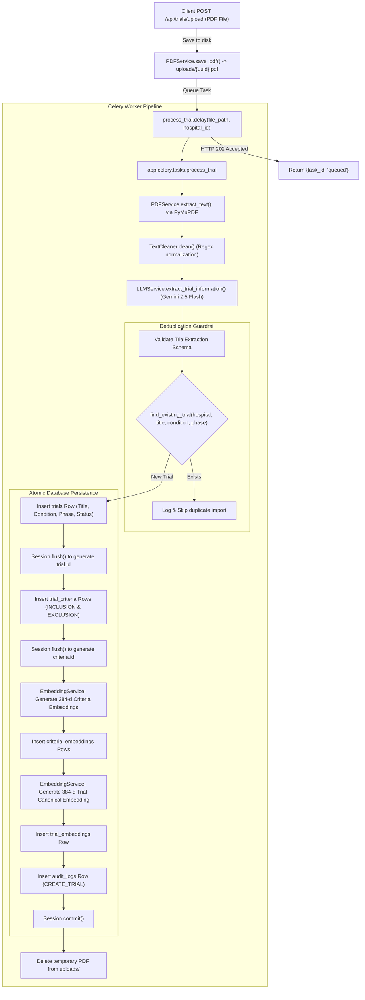

# MedMatch Data Pipeline & Database Baseline

**Document ID:** DATA-BASE-001  
**Phase:** Phase 0 Baseline  
**Scope:** Trial Ingestion, Patient Data Modeling, Relational Schema, and Vector Storage

---

## 1. Clinical Trial Ingestion Pipeline

The clinical trial ingestion pipeline transforms unstructured PDF protocols into structured database records, segmented criteria, and vector embeddings.



### 1.1. Ingestion Pipeline Stage Details

| Stage | Source File & Function | Input | Output | Tables Touched | Error Handling & Retries |
| :--- | :--- | :--- | :--- | :--- | :--- |
| **1. Upload & Storage** | `app.services.pdf_service:PDFService.save_pdf` | `UploadFile` (multipart/form-data) | `Path` (`uploads/{uuid}.pdf`) | None | Validates extension (`.pdf`), magic byte (`%PDF-`), max size (20MB). Deletes on failure. |
| **2. Task Dispatch** | `app.api.routes.trial:upload_trial_pdf` | File path, `hospital_id` | Celery `AsyncResult` (`task_id`) | None | Catches broker submission failures; deletes file; returns HTTP 503. |
| **3. Text Extraction** | `app.services.pdf_service:PDFService.extract_text` | `file_path` (`str`) | Raw document text (`str`) | None | `pymupdf.open()`; iterates pages; validates non-empty extracted text. |
| **4. Text Cleaning** | `app.services.text_cleaner:TextCleaner.clean` | Raw text (`str`) | Cleaned text (`str`) | None | Regex cleans multiple blank lines, multiple spaces, page numbers, line-break whitespace. |
| **5. Information Extraction**| `app.services.llm_service:LLMService.extract_trial_information` | Cleaned text (`str`) | `TrialExtraction` Pydantic model | None | Gemini 2.5 Flash (`temperature=0.0`); validated Pydantic parsing; 3 Tenacity retries. |
| **6. Deduplication Check** | `app.repositories.trial_repository:TrialRepository.find_existing_trial` | `hospital_id`, `title`, `condition`, `phase` | Existing `Trial` or `None` | `trials` (SELECT) | Skips import if duplicate found to prevent redundant embeddings. |
| **7. Trial & Criteria Save**| `app.services.trial_service:TrialService.process_pdf` | `TrialExtraction`, `hospital_id` | Created `Trial` and `TrialCriteria` entities | `trials`, `trial_criteria` (INSERT) | Full rollback on error. Criteria are parsed and stored as individual rows. |
| **8. Criteria Embedding** | `app.services.embedding_service:EmbeddingService.create_trial_embedding` | `criteria_id`, `description` | `CriteriaEmbedding` entity | `criteria_embeddings` (INSERT) | Normalizes text, generates 384-d vector via local SentenceTransformer, writes to pgvector. |
| **9. Trial-Level Embedding**| `app.services.embedding_service:EmbeddingService.create_or_update_trial_embedding`| `trial_id`, concatenated trial summary text | `TrialEmbedding` entity | `trial_embeddings` (INSERT) | Builds canonical text (Title + Condition + Summary + Phase + Status + Criteria) and embeds. |
| **10. Audit Logging** | `app.services.audit_service:AuditService.log` | Action details, `hospital_id`, `trial.id` | None | `audit_logs` (INSERT) | Committed in the same atomic database transaction. |
| **11. Cleanup** | `app.celery.tasks:_delete_uploaded_file` | `file_path` | None | None | Temporary PDF is deleted from disk after success or permanent failure. |

> [!IMPORTANT]
> **Criteria Storage Verification:** Inclusion and exclusion criteria are **stored individually as structured rows** in the `trial_criteria` table with column `criteria_type` (`INCLUSION` or `EXCLUSION`) and individual `criteria_embeddings`. They are NOT stored merely as an unparsed raw text block.

---

## 2. Patient Pipeline & Workflow

### 2.1. Patient Lifecycle & Data Model
Patients are provisioned and managed within a tenant hospital via `app/services/patient_service.py`:
1. **Creation (`POST /api/patients`):** Doctor or administrator inputs structured demographic and clinical information:
   - `mrn` (Medical Record Number, string, unique per hospital)
   - `first_name`, `last_name`
   - `age` (integer)
   - `gender` (`MALE`, `FEMALE`, `OTHER`)
   - `diagnosis` (primary diagnostic string, e.g., `"Non-Small Cell Lung Cancer"`)
   - `cancer_type` (specific oncology category)
   - `stage` (e.g., `"Stage IIIA"`, `"Stage IV"`)
   - `phone`, `email`, `status` (`ACTIVE`, `INACTIVE`)
2. **Clinical Notes (`POST /api/patients/{patient_id}/notes`):**
   - Attending doctors append unstructured narrative clinical notes to a patient profile.
   - Upon note creation, `EmbeddingService.create_patient_note_embedding()` encodes the note narrative into a 384-dimensional vector stored in `patient_note_embeddings`.

### 2.2. Critical Patient Pipeline Disconnects
While the patient data management subsystem is cleanly built, it exhibits **three major architectural disconnects**:
1. **No Patient-to-Matching API Linkage:** The matching endpoints (`POST /api/matching/search` and `POST /api/matching/evaluate`) accept only `{ patient_note: string, limit: int }`. They do **not** take a `patient_id`. The user must manually select a note in the frontend, which merely pastes its raw text into the input field.
2. **No Structured Profile Utilization:** The matching engine does not accept or reason over the patient's structured attributes (`age`, `gender`, `cancer_type`, `stage`). Eligibility reasoning relies entirely on whatever text happens to be written in the freeform note.
3. **No Clinical NLP / Normalization:**
   - No Named Entity Recognition (NER) for medical conditions, drugs, or anatomical sites.
   - No negation detection (e.g., NegEx or MedSpaCy).
   - No lab value or biomarker status extraction.
   - No mapping to standard medical ontologies (UMLS, SNOMED CT, ICD-10, RxNorm).

---

## 3. Database Entity-Relationship & Schema Audit

The database schema is partitioned across Flyway migrations (for `auth-service`) and Alembic migrations (for `ai-service`), sharing a single PostgreSQL database (`medmatch`).

| Entity / Table | Managing Service | Purpose | Important Fields | Relationships & Foreign Keys |
| :--- | :--- | :--- | :--- | :--- |
| **`hospitals`** | `auth-service` (Flyway V1/V2) | Tenant boundaries / hospital organizations | `id` (UUID PK), `code` (Unique), `name`, `address`, `active`, `created_at`, `updated_at` | Referenced by `users`, `patients`, `trials`, `audit_logs`, `matches`. |
| **`roles`** | `auth-service` (Flyway V1/V2) | System role definitions | `id` (UUID PK), `name` (VARCHAR Unique: `SYSTEM_ADMIN`, etc.), `created_at` | Referenced by `users.role_id`. |
| **`users`** | `auth-service` (Flyway V3) | User accounts & credentials | `id` (UUID PK), `hospital_id`, `role_id`, `email` (Unique), `password` (BCrypt), `first_name`, `last_name`, `status` | FK to `hospitals.id` (RESTRICT), FK to `roles.id` (RESTRICT). |
| **`audit_logs`** | `auth-service` & `ai-service` | Immutable compliance and security audit trail | `id` (UUID PK), `hospital_id`, `action`, `resource_type`, `resource_id`, `performed_by_id`, `performed_by_username`, `details`, `created_at` | FK to `hospitals.id` (RESTRICT). |
| **`patients`** | `ai-service` (Alembic 0001) | Patient profiles | `id` (UUID PK), `hospital_id`, `mrn`, `first_name`, `last_name`, `age`, `gender`, `diagnosis`, `cancer_type`, `stage`, `status` | FK to `hospitals.id` (RESTRICT). Referenced by `patient_notes`, `matches`. |
| **`patient_notes`** | `ai-service` (Alembic 0003) | Narrative clinical notes | `id` (UUID PK), `patient_id`, `note` (TEXT), `created_at`, `updated_at` | FK to `patients.id` (CASCADE). Referenced by `patient_note_embeddings`. |
| **`patient_note_embeddings`**| `ai-service` (Alembic 0006) | Vector embeddings of clinical notes | `id` (UUID PK), `note_id`, `embedding` (`vector(384)`), `model_name`, `created_at` | FK to `patient_notes.id` (CASCADE). |
| **`trials`** | `ai-service` (Alembic 0002) | Clinical trial protocols | `id` (UUID PK), `hospital_id`, `title`, `brief_summary`, `condition`, `phase`, `status`, `created_at`, `updated_at` | FK to `hospitals.id` (RESTRICT). Referenced by `trial_criteria`, `trial_embeddings`, `matches`. |
| **`trial_criteria`** | `ai-service` (Alembic 0004) | Individual criteria segmented by type | `id` (UUID PK), `trial_id`, `criteria_type` (`INCLUSION`/`EXCLUSION`), `description` (TEXT), `created_at` | FK to `trials.id` (CASCADE). Referenced by `criteria_embeddings`. |
| **`criteria_embeddings`** | `ai-service` (Alembic 0005) | Vector embeddings of criteria | `id` (UUID PK), `criteria_id`, `embedding` (`vector(384)`), `model_name`, `created_at` | FK to `trial_criteria.id` (CASCADE). |
| **`trial_embeddings`** | `ai-service` (Alembic 0007) | Canonical trial-level vector embeddings | `id` (UUID PK), `trial_id` (Unique), `embedding` (`vector(384)`), `model_name`, `created_at` | FK to `trials.id` (CASCADE). |
| **`matches`** | `ai-service` (Alembic 0008) | Persisted patient-trial matching outcomes *(Schema only; unwritten)* | `id` (UUID PK), `patient_id`, `trial_id`, `hospital_id`, `confidence`, `overall_status`, `matched_criteria` (JSONB), `failed_criteria` (JSONB), `missing_information` (JSONB), `explanation`, `model_version` | FK to `patients.id` (RESTRICT), FK to `trials.id` (RESTRICT), FK to `hospitals.id` (RESTRICT). |

---

## 4. Database Defects & Critical Observations

### 4.1. Flyway Migration Version Collision
In `services/auth-service/src/main/resources/db/migration`, duplicate version files were detected:
- `V1__create_hospitals.sql` vs `V1__create_roles_table.sql`
- `V2__create_roles.sql` vs `V2__create_hospitals_table.sql`
- `V3__create_users.sql` vs `V3__create_users_table.sql`
- `V4__create_audit_logs.sql` vs `V4__create_audit_logs_table.sql`

Flyway enforces unique prefix versions. When running against a clean database, this collision causes Flyway startup failure (`FlywayException: Found more than one migration with version 1`). This is a **high-priority deployment bug** that must be resolved prior to production container deployment.

### 4.2. Missing Vector Indexing
None of the vector embedding tables (`trial_embeddings`, `criteria_embeddings`, `patient_note_embeddings`) declare an approximate nearest neighbor (ANN) index such as:
```sql
CREATE INDEX ix_trial_embeddings_embedding ON trial_embeddings USING hnsw (embedding vector_cosine_ops);
```
All vector queries currently perform full sequential table scans with cosine distance calculation.
