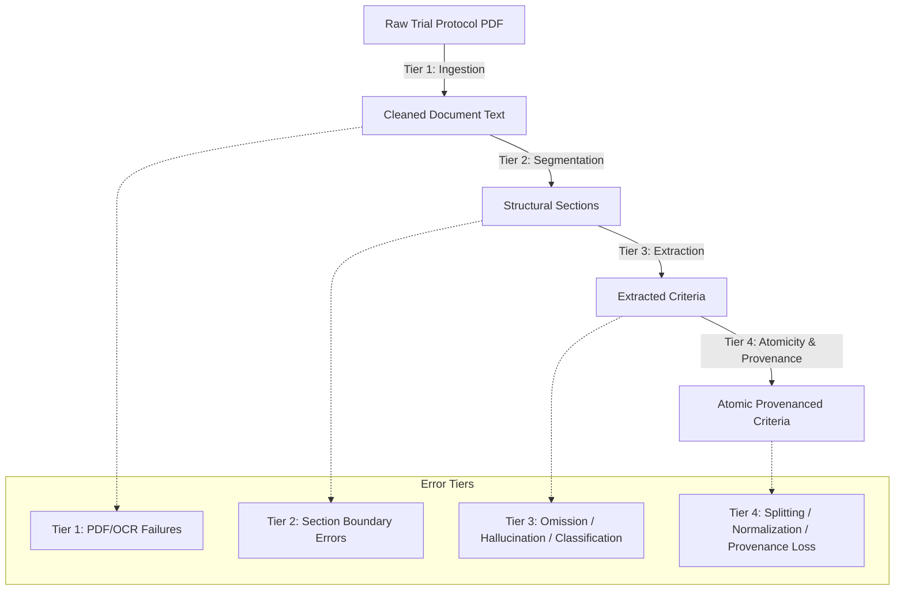

# Clinical Trial Document Extraction — Error Taxonomy

## Scope & Methodological Notice

> [!WARNING]
> **TAXONOMIC CLASSIFICATION NOTICE:**
> The error categories defined in this document represent a comprehensive structural and semantic failure catalog for clinical trial document intelligence.
>
> **NO EMPIRICAL FAILURE RATES ARE CLAIMED.**
> In accordance with research integrity standards, error incidence rates can only be reported once measured against a verified, double-annotated gold-standard benchmark corpus.

---

## Error Classification Matrix

Document extraction failures are organized into four sequential tiers:
1. **Tier 1: Document & Ingestion Failures** (File-level and parsing faults)
2. **Tier 2: Structural & Segmentation Failures** (Section and boundary faults)
3. **Tier 3: Criterion Extraction & Semantic Failures** (Extraction, splitting, classification)
4. **Tier 4: Atomicity & Provenance Failures** (Constraint normalization, offsets, attribution)

---

## Detailed Error Categories

### Tier 1: Document & Ingestion Failures

| Error Code | Error Name | Clinical & Technical Description | Failure Impact |
| :--- | :--- | :--- | :--- |
| `ERR_INGEST_PDF_PARSING` | **PDF Parsing Failure** | Corruption in PDF object stream, non-standard font encodings (ToUnicode CMap missing), encryption, or syntax errors preventing text extraction. | Complete trial ingestion failure; zero text extracted. |
| `ERR_INGEST_OCR_DEGRADATION` | **OCR Failure / Degradation** | Low resolution scans, character confusion (e.g., `l` vs `1`, `O` vs `0`, `>` vs `<`), misread subscript/superscript ($10^9/L \to 109/L$). | Numeric threshold distortion; false exclusions. |
| `ERR_INGEST_LAYOUT_BLEED` | **Multi-Column Layout Bleeding** | Two-column protocol text read horizontally across columns rather than vertically, interweaving unrelated sentences. | Scrambled criteria; syntax corruption. |

---

### Tier 2: Structural & Segmentation Failures

| Error Code | Error Name | Clinical & Technical Description | Failure Impact |
| :--- | :--- | :--- | :--- |
| `ERR_STRUCT_SECTION_BOUNDARY` | **Section Boundary Error** | Header regex or ML segmenter fails to identify true start/end of section, truncating criteria or swallowing subsequent sections. | Truncation of protocol rules; missing criteria. |
| `ERR_STRUCT_ORPHAN_SECTION` | **Orphan Section** | Section identified structurally but contains zero parsed criteria due to extraction filter dropout. | Incomplete document ingestion; silent omission. |
| `ERR_STRUCT_HEADER_MISCLASSIFICATION` | **Header Misclassification** | Non-eligibility header (e.g., "Statistical Population") classified as Eligibility or vice versa. | Unrelated protocol prose treated as eligibility rules. |

---

### Tier 3: Criterion Extraction & Semantic Failures

| Error Code | Error Name | Clinical & Technical Description | Failure Impact |
| :--- | :--- | :--- | :--- |
| `ERR_SEM_POLARITY_MISCLASS` | **Inclusion / Exclusion Misclassification** | An exclusion criterion categorized as inclusion, or vice versa (e.g., misreading "Exclusion: Active hepatitis" as an inclusion requirement). | **Critical safety hazard:** Contraindicated patient matched to trial. |
| `ERR_SEM_CRITERION_OMISSION` | **Criterion Omission (False Negative)** | A valid eligibility requirement present in the protocol is entirely omitted from the extraction output. | Under-constrained matching; ineligible patient enrolled. |
| `ERR_SEM_CRITERION_HALLUCINATION` | **Criterion Hallucination (False Positive)** | Extraction engine synthesizes or extrapolates a requirement that is not present in the source text. | Over-constrained matching; eligible patient falsely excluded. |
| `ERR_SEM_AMBIGUITY_COLLAPSE` | **Ambiguity Collapse** | Forcing a subjective clinical discretion clause ("In the opinion of the investigator") into a rigid deterministic rule, or vice versa. | Distorts trial eligibility semantics. |

---

### Tier 4: Atomicity, Normalization & Provenance Failures

| Error Code | Error Name | Clinical & Technical Description | Failure Impact |
| :--- | :--- | :--- | :--- |
| `ERR_ATOM_INCORRECT_SPLITTING` | **Incorrect Criterion Splitting** | Prematurely decomposing a dependent clinical condition (e.g., splitting "LVEF >= 50% only if prior doxorubicin > 300 mg/m2" into independent rules). | Decouples clinical dependencies; causes false evaluation. |
| `ERR_ATOM_UNDER_SPLITTING` | **Under-Splitting Multi-Intent Criteria** | Failing to separate independent criteria joined by conjunctions (e.g., "Age >= 18 and ECOG <= 1" kept as one monolith). | Obstructs modular atomic matching and attribution. |
| `ERR_NORM_NUMERIC_INTERP` | **Numeric Interpretation Error** | Inverting comparator ($>=$ to $<=$), dropping decimal places ($1.5$ to $15$), or misinterpreting ranges ($18-65$ to $>65$). | Severely invalidates patient cohort eligibility. |
| `ERR_NORM_TEMPORAL_INTERP` | **Temporal Window Interpretation Error** | Misinterpreting washout windows, duration intervals, or anchor events (e.g., "within 28 days" vs "prior to 28 days"). | Timing eligibility mismatch for active therapies. |
| `ERR_NORM_UNIT_MISMATCH` | **Unit Normalization Error** | Failure to standardize or convert units (e.g., mistaking $\mu\text{mol/L}$ for $\text{mg/dL}$ without scalar conversion). | Systematic threshold calculation errors. |
| `ERR_PROV_PROVENANCE_LOSS` | **Provenance Loss / Drift** | Character offsets $[s, e]$ or page numbers lost, drifting due to text cleaning, or pointing to incorrect spans. | Inability to audit or trace criteria to source PDF. |
| `ERR_SCHEMA_MALFORMED_OUTPUT` | **Malformed Structured Output** | Extraction payload violates Pydantic schema, missing required keys, or containing duplicate IDs. | Downstream ingestion service crash. |

---

## Actionable Diagnostic Strategy

The `DocumentExtractionValidator` (`scripts/validate_document_extraction.py`) implemented in Phase 3 actively catches all deterministically verifiable failure modes at ingest time:
- Duplicate IDs (`DUPLICATE_CRITERION_ID`, `DUPLICATE_SECTION_ID`)
- Missing IDs (`MISSING_TRIAL_ID`, `MISSING_DOCUMENT_ID`)
- Offset ranges and boundary violations (`INVALID_CHARACTER_OFFSET_RANGE`, `OFFSET_EXCEEDS_SECTION_LENGTH`, `OFFSET_TEXT_MISMATCH`)
- Decomposition rationale absence (`MISSING_DECOMPOSITION_BLOCK_REASON`)
- Operator and type inconsistencies (`UNSUPPORTED_OPERATOR`, `INCONSISTENT_SECTION_CRITERION_TYPE`)

Non-deterministic semantic failures (omissions, hallucinations, clinical interpretations) are cataloged above to guide the annotation and scoring of future empirical benchmarks.
