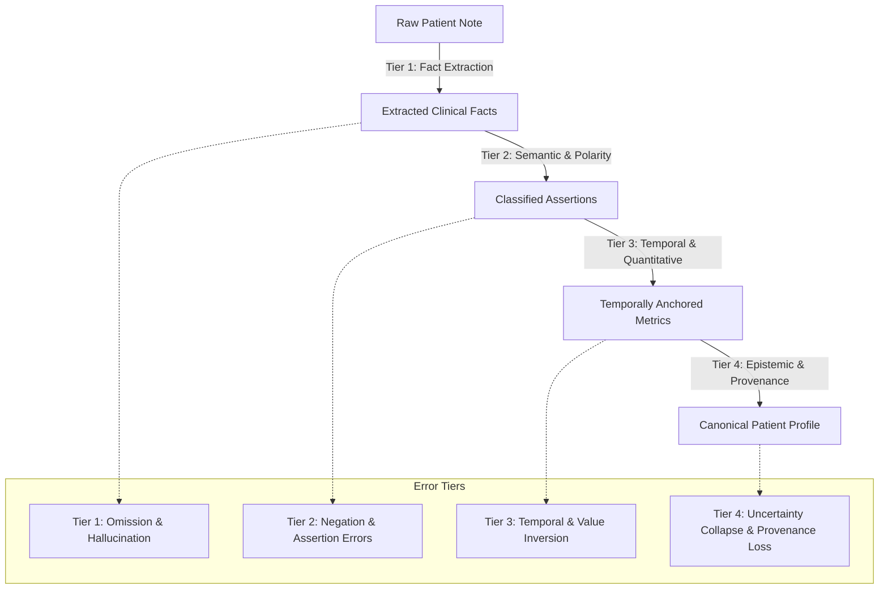

# Patient Clinical Information Extraction — Error Taxonomy

## Scope & Methodological Notice

> [!WARNING]
> **TAXONOMIC CLASSIFICATION NOTICE:**
> The error categories defined in this document represent a comprehensive structural and semantic failure catalog for clinical information extraction from patient medical records.
>
> **NO EMPIRICAL FAILURE RATES ARE CLAIMED.**
> In accordance with research integrity standards, error incidence rates can only be reported once measured against a verified, double-annotated gold-standard clinical benchmark corpus.

---

## Error Classification Matrix

Patient information extraction failures are categorized into four functional tiers:

---

## Detailed Error Categories

### Tier 1: Fact Identification Failures

| Error Code | Error Name | Clinical & Technical Description | Clinical Safety Impact |
| :--- | :--- | :--- | :--- |
| `ERR_FACT_OMISSION` | **Fact Omission (False Negative)** | A clinically relevant finding (e.g., diagnosis, prior therapy, biomarker, lab value) in the text is missed by the extractor. | Critical criteria cannot be evaluated; eligible patients missed or contraindicated patients enrolled. |
| `ERR_FACT_HALLUCINATION` | **Fact Hallucination (False Positive)** | Extractor synthesizes a clinical condition or biomarker that does not exist in the patient narrative. | Falsely disqualifies or qualifies patient based on non-existent clinical traits. |
| `ERR_FACT_DUPLICATION` | **Duplicate Fact Extraction** | Same clinical fact extracted multiple times with different IDs without merging. | Distorts fact counts and downstream confidence calculations. |

---

### Tier 2: Assertion & Polarity Failures

| Error Code | Error Name | Clinical & Technical Description | Clinical Safety Impact |
| :--- | :--- | :--- | :--- |
| `ERR_POL_NEGATION_INVERSION` | **Negation Inversion Error** | An explicitly negated finding (e.g., "denies chest pain", "no brain metastases") is extracted as affirmed. | **Severe Safety Risk:** Contraindicated patient flagged as eligible. |
| `ERR_POL_AFFIRMATION_INVERSION` | **Affirmation Inversion Error** | A confirmed positive finding (e.g., "positive for EGFR L858R") is extracted as negated. | Inappropriately disqualifies patient from targeted therapy trials. |
| `ERR_POL_ASSERTION_COLLAPSE` | **Assertion Ambiguity Collapse** | Suspected, unconfirmed, or differential diagnoses (`possible`) converted to confirmed facts (`affirmed`). | Evaluates unproven conditions as diagnostic eligibility criteria. |

---

### Tier 3: Temporal & Quantitative Normalization Failures

| Error Code | Error Name | Clinical & Technical Description | Clinical Safety Impact |
| :--- | :--- | :--- | :--- |
| `ERR_TEMP_HISTORICAL_CONFUSION` | **Historical vs. Current Confusion** | Historical resolved condition (e.g., "childhood asthma 15 years ago") treated as active exclusion. | Disqualifies eligible patients due to resolved historical conditions. |
| `ERR_TEMP_WASHOUT_MISCALC` | **Relative Interval / Washout Error** | Misinterpreting elapsed time (e.g., reading "chemo 27 days ago" as > 28 days or failing to anchor the interval). | Permits patient enrollment before protocol-mandated drug clearance. |
| `ERR_TEMP_ANCHOR_DRIFT` | **Anchor Event Drift** | Misassociating a date with the wrong clinical event (e.g., associating biopsy date with surgery date). | Distorts longitudinal treatment timeline. |
| `ERR_NORM_VALUE_INVERSION` | **Quantitative Value Extraction Error** | Extracted numerical value inverted or corrupted (e.g., dropping decimal, reading 1.5 as 15). | Severely distorts laboratory organ reserve criteria. |
| `ERR_NORM_UNIT_MISMATCH` | **Unit Normalization Error** | Failure to standardize or convert units (e.g., mistaking cells/$\mu\text{L}$ for $10^9/\text{L}$). | Induces false pass/fail on laboratory thresholds. |

---

### Tier 4: Epistemic & Provenance Failures

| Error Code | Error Name | Clinical & Technical Description | Clinical Safety Impact |
| :--- | :--- | :--- | :--- |
| `ERR_EPIST_UNCERTAINTY_COLLAPSE` | **Uncertainty Collapse (Absence Fallacy)** | Treating an unmentioned variable (`NOT_MENTIONED`) as a negative clinical fact (`NEGATED`). | Inappropriately assumes absence of contraindications or mutations. |
| `ERR_EPIST_CONFLICT_OVERWRITE` | **Conflicting Evidence Overwrite** | Overwriting or averaging discrepant diagnostic findings instead of preserving both. | Conceals clinical diagnostic discrepancies from trial investigators. |
| `ERR_EPIST_SOURCE_CONFUSION` | **Patient-Reported vs Documented Confusion** | Treating unverified patient recall as definitive clinician documentation. | May enroll patients on protocol without diagnostic confirmation. |
| `ERR_PROV_SPAN_DRIFT` | **Provenance Loss / Offset Drift** | Character offsets $[s, e]$ point to the wrong text span or are corrupted during text cleaning. | Breaks clinical auditability and source data verification (SDV). |
| `ERR_PROV_FABRICATION` | **Offset Fabrication** | Pipeline fabricates character offsets when source mapping is unavailable. | Violates regulatory integrity rules (21 CFR Part 11). |

---

## Actionable Diagnostic Strategy

The `PatientProfileValidator` (`scripts/validate_patient_profile.py`) actively enforces structural rules at ingest time:
- Duplicate fact IDs (`DUPLICATE_FACT_ID`)
- Missing patient IDs (`MISSING_PATIENT_ID`)
- Inconsistent negation/values (`INCONSISTENT_NEGATION_VALUE`)
- Negative durations (`NEGATIVE_DURATION_DAYS`)
- Offset ranges and inversions (`INVALID_CHARACTER_OFFSET_RANGE`, `NEGATIVE_CHARACTER_OFFSET`)
- Demographic bounds (`INVALID_DEMOGRAPHIC_AGE`)
- Provenance mismatches (`PROVENANCE_PATIENT_ID_MISMATCH`)
