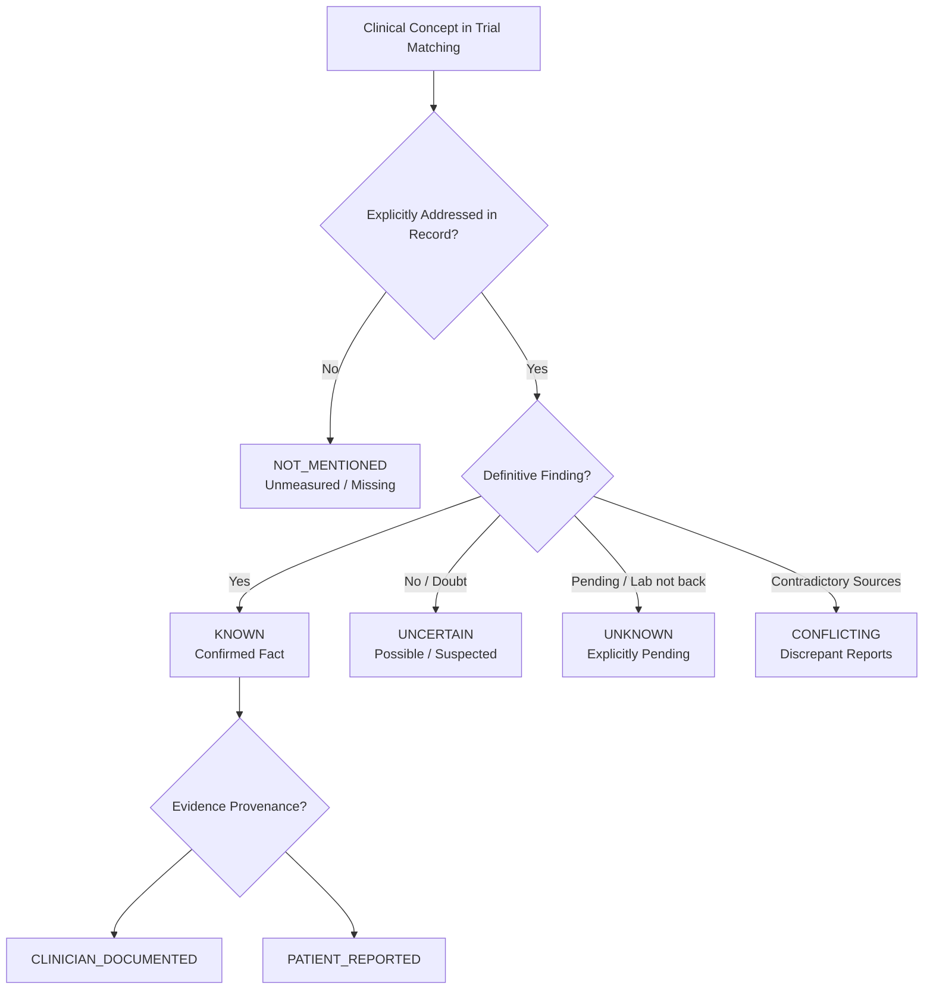

# MedMatch Capstone — Patient Uncertainty & Negation Specification

## 1. Executive Summary & Epistemic Foundations

In automated clinical trial eligibility matching, conflating **absence of evidence** with **evidence of absence** is one of the most dangerous and pervasive errors in clinical NLP.

For example:
- A note stating **"Patient has no EGFR mutation on sequencing"** represents a confirmed negative clinical finding: `assertion=NEGATED`, `uncertainty=KNOWN`.
- A note that **never mentions EGFR testing** represents an unmeasured variable: `assertion=UNKNOWN`, `uncertainty=NOT_MENTIONED`.

If an automated extraction pipeline converts the unmentioned EGFR status into "EGFR negative", an EGFR-mutant targeted trial could incorrectly disqualify the patient, or an EGFR-wildtype trial could improperly enroll them.

---

## 2. Non-Collapsing Uncertainty Taxonomy

The MedMatch framework defines seven distinct epistemic states under `UncertaintyStatus`:



| Uncertainty Status | Semantic Meaning | Clinical Trial Reasoning Impact | Example |
| :--- | :--- | :--- | :--- |
| `KNOWN` | Definitive, verified clinical fact documented in medical chart. | Can directly satisfy or fail inclusion/exclusion criteria. | "Histology confirmed adenocarcinoma." |
| `UNKNOWN` | Clinician explicitly noted that status is unknown or pending. | Triggers `missing_information` in trial eligibility output. | "HER2 IHC pending reflex FISH." |
| `NOT_MENTIONED` | Concept is completely unreferenced in available patient records. | Cannot be assumed absent; flags informational gap. | EGFR not stated in clinic note. |
| `UNCERTAIN` | Suspected, differential diagnosis, or clinician doubt expressed. | Cannot definitively satisfy strict inclusion; requires clinician review. | "Suspicious pulmonary nodule, possible malignancy." |
| `CONFLICTING` | Opposing evidence documented across different reports or dates. | Requires manual clinician adjudication; automated match blocked. | Chest CT says "No effusion", CXR next day says "Moderate effusion". |
| `PATIENT_REPORTED` | Information provided verbally by patient without formal diagnostic proof. | Subject to verification for biomarker/pathology criteria. | "Patient states they were told cancer is Stage III." |
| `CLINICIAN_DOCUMENTED` | Verified and entered by licensed healthcare practitioner. | High evidentiary weight for protocol qualification. | "Oncologist exam notes ECOG performance status 1." |

---

## 3. Negation & Assertion Semantics

The assertion status of every clinical fact is explicitly tracked via `AssertionType`:

```python
class AssertionType(str, Enum):
    AFFIRMED = "affirmed"      # Clinically confirmed / present
    NEGATED = "negated"        # Explicitly absent, denied, or ruled out
    POSSIBLE = "possible"      # Suspected, differential diagnosis, unconfirmed
    HISTORICAL = "historical"  # Prior condition, resolved or past episode
    UNKNOWN = "unknown"        # Indeterminate, unmentioned, or ambiguous
```

### Negation Handling Rules
1. **Explicit Denial (Negation Scope):**
   - "Patient denies chest pain, shortness of breath, and palpitations."
   - Produces three discrete facts:
     - `concept="chest_pain"`, `value=False`, `assertion=NEGATED`
     - `concept="shortness_of_breath"`, `value=False`, `assertion=NEGATED`
     - `concept="palpitations"`, `value=False`, `assertion=NEGATED`
2. **Negative Medical History:**
   - "No prior history of diabetes mellitus."
   - Produces: `concept="diabetes_mellitus"`, `value=False`, `assertion=NEGATED`, `temporality=HISTORICAL`.
   - **Must NEVER be parsed as:** `diabetes_mellitus = present`.
3. **Double Negatives & Complex Clinical Logic:**
   - "Cannot exclude recurrent disease" $\to$ `assertion=POSSIBLE`, `uncertainty=UNCERTAIN`.
   - "Unremarkable brain MRI" $\to$ `concept="cns_metastases"`, `assertion=NEGATED`, `evidence_source=IMAGING_REPORT`.

---

## 4. Preservation of Conflicting Evidence

When two clinical documents within the patient record provide conflicting evidence:
- **Rule:** The system **MUST NOT** average the values or pick one source arbitrarily.
- Both facts must be retained with `uncertainty=CONFLICTING`, referencing their distinct provenance records (`note_id_1` vs `note_id_2`).
- The patient clinical profile flags `conflicting_count >= 1`, signaling downstream reasoning engines to trigger safe abstention or clinician review.
