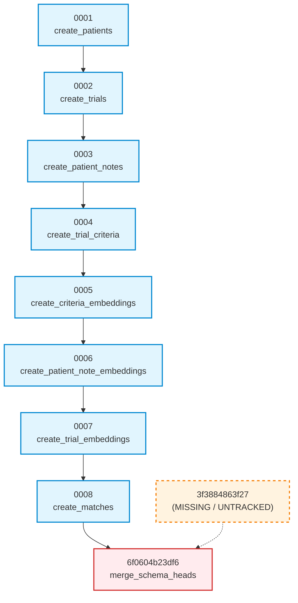

# Phase 13.2.1 — Alembic Migration Graph Remediation Design
**Step 1: Technical Analysis and Remediation Specification (Inspection Only)**

**Current Base Checkpoint:** `da0a47c — docs: add phase 13.2 database migration audit`  
**Branch:** `capstone/phase-13-production-engineering`  
**Classification:** ARCHITECTURAL DESIGN & MIGRATION GRAPH SPECIFICATION  
**Status:** STEP 1 COMPLETE — NO MIGRATION FILES MODIFIED

---

## Executive Summary

During the Phase 13.2 Database & Migration Engineering Audit, finding **MIG-02 (CRITICAL)** established that the Git-tracked Alembic merge revision:
```
services/ai-service/alembic/versions/6f0604b23df6_merge_schema_heads.py
```
declares:
```python
down_revision: Union[str, Sequence[str], None] = ("0008", "3f3884863f27")
```
However, revision `3f3884863f27` is **not tracked by Git** at checkpoint `da0a47c` (nor at any prior commit in repository history). As a direct result, any clean clone of the repository fails immediately when attempting any Alembic operation (`alembic upgrade head`, `alembic current`, `alembic heads`, `alembic history`) with:
```
alembic.util.exc.CommandError: Can't locate revision identified by '3f3884863f27'
```

This document provides the complete forensic reconstruction, schema-operation analysis, multi-strategy remediation design, and compatibility verification required before executing Phase 13.2.1 Step 2.

**Safety Enforcement:** In accordance with Step 1 instructions, zero migration files, source files, or database states were modified during this analysis.

---

## A. Reconstructed Git-Tracked Alembic Graph

### 1. Tracked Migration Inventory at Checkpoint `da0a47c`

Verified strictly using:
```bash
git ls-files services/ai-service/alembic/versions
git show HEAD:services/ai-service/alembic/versions/<file>
```

| Order | Revision ID | Down Revision | Filename | Creation Date | Git Commit Added | Summary of DDL Operations |
|---|---|---|---|---|---|---|
| 1 | `0001` | `None` | `0001_create_patients_table.py` | 2026-09-13 | `1ffe92a` | Creates `patients` table (FK to `hospitals.id`) |
| 2 | `0002` | `0001` | `0002_create_trials_table.py` | 2026-09-13 | `1ffe92a` | Creates `trials` table (FK to `hospitals.id`, Unique Constraint `uq_trials_hospital_title_condition_phase`) |
| 3 | `0003` | `0002` | `0003_create_patient_notes_table.py` | 2026-09-13 | `1ffe92a` | Creates `patient_notes` table (FK to `patients.id`) |
| 4 | `0004` | `0003` | `0004_create_trial_criteria_table.py` | 2026-09-13 | `1ffe92a` | Creates `trial_criteria` table (FK to `trials.id`) |
| 5 | `0005` | `0004` | `0005_create_criteria_embeddings_table.py` | 2026-09-13 | `1ffe92a` | Creates `criteria_embeddings` table (`Vector(384)`, FK to `trial_criteria.id`) |
| 6 | `0006` | `0005` | `0006_create_patient_note_embeddings_table.py` | 2026-09-13 | `1ffe92a` | Creates `patient_note_embeddings` table (`Vector(384)`, FK to `patient_notes.id`) |
| 7 | `0007` | `0006` | `0007_create_trial_embeddings_table.py` | 2026-09-13 | `1ffe92a` | Creates `trial_embeddings` table (`Vector(384)`, FK to `trials.id`, unique index on `trial_id`) |
| 8 | `0008` | `0007` | `0008_create_matches_table.py` | 2026-09-17 | `15f839c` | Creates `matches` table (FKs to `patients.id`, `trials.id`, `hospitals.id`, JSONB criteria columns) |
| 9 | `6f0604b23df6` | `('0008', '3f3884863f27')` | `6f0604b23df6_merge_schema_heads.py` | 2026-09-18 | `f4bfe83` | Schema merge head; empty body (`upgrade() = pass`, `downgrade() = pass`) |

### 2. Graph Topology and Structural Flaw



- **Branch Points in Tracked Repository:** **None.** Tracked revisions `0001` through `0008` form a strictly linear, contiguous chain. No tracked revision declares `0007` as down-revision other than `0008`.
- **Merge Points in Tracked Repository:** Revision `6f0604b23df6` attempts to merge two heads (`0008` and `3f3884863f27`).
- **Tracked Heads Resolution:** Because `3f3884863f27` cannot be resolved, the DAG is broken. Alembic fails to determine current heads on any clean clone. If `6f0604b23df6` is removed or linearized, the true intended head is unambiguously `0008` (or `6f0604b23df6` linearized to `0008`).

---

## B. Missing Revision Analysis (`3f3884863f27`)

Forensic inspection of the local untracked file `3f3884863f27_add_trial_embeddings.py` in the working tree:

- **Revision Metadata:**
  - Revision ID: `3f3884863f27`
  - Revises (declared `down_revision`): `'01efd2b23442'`
  - Create Date: `2026-09-01 02:36:43.198106`
- **Schema Operations Performed:**
  - Calls `op.create_table("trial_embeddings", ...)`
  - Columns created: `id` (UUID, PK), `trial_id` (UUID, FK to `trials.id` ON DELETE CASCADE), `embedding` (`Vector(384)`), `model_name` (VARCHAR(100)), `created_at`, `updated_at`.
  - Creates inline unique constraint on `trial_id` and index `ix_trial_embeddings_trial_id`.
- **Why it is Missing from Git:**
  - File matches ignore rule in `.git/info/exclude:12` (`services/ai-service/alembic/versions/`).
  - When commit `f4bfe83` ("fix: merge alembic migration heads") was recorded on 2026-09-18, the developer staged only `6f0604b23df6_merge_schema_heads.py`. The legacy local file `3f3884863f27` was never added to the index.
- **Critical Schema Collision:**
  - Tracked revision `0007_create_trial_embeddings_table.py` (committed in `1ffe92a` on 2026-09-16) **already created table `trial_embeddings`** with identical schema, types, foreign key, and unique constraint.
  - If `3f3884863f27` were executed against any database that ran `0007`, it would immediately abort with:
    `relation "trial_embeddings" already exists`.

---

## C. Local Orphan Revision Analysis

Inspection of the additional untracked/ignored migration files physically present in the local directory:

### 1. `2248598b8f7e_initial_schema.py`
- **Revision Metadata:**
  - Revision ID: `2248598b8f7e`
  - Declared `down_revision`: `"0007"` (edited manually, though docstring reads `Revises: `)
  - Create Date: `2026-08-30`
- **Schema Operations Performed:**
  - Calls `op.create_unique_constraint("uq_trials_hospital_title_condition_phase", "trials", ["hospital_id", "title", "condition", "phase"])`.
- **Conflict Analysis:**
  - Tracked revision `0002_create_trials_table.py` (lines 49–55) already creates this exact unique constraint at table-creation time:
    ```python
    sa.UniqueConstraint(
        "hospital_id", "title", "condition", "phase",
        name="uq_trials_hospital_title_condition_phase",
    )
    ```
  - Executing `2248598b8f7e` against a database with `0002` fails with:
    `relation "uq_trials_hospital_title_condition_phase" already exists`.

### 2. `01efd2b23442_schema_validation.py`
- **Revision Metadata:**
  - Revision ID: `01efd2b23442`
  - Declared `down_revision`: `'2248598b8f7e'`
  - Create Date: `2026-08-30 21:25:33.141547`
- **Schema Operations Performed:**
  - Contains auto-generated Alembic commands (`# ### commands auto generated by Alembic - please adjust! ###`).
  - Calls `op.add_column('audit_logs', sa.Column('performed_by_id', sa.UUID(), nullable=True))` and 6 additional columns (`performed_by_username`, `performed_by_role`, `hospital_id`, `hospital_name`, `resource_type`, `resource_id`).
  - Calls `op.create_index(op.f('ix_audit_logs_hospital_id'), 'audit_logs', ['hospital_id'])`.
  - Calls `op.create_index(op.f('ix_audit_logs_performed_by_id'), 'audit_logs', ['performed_by_id'])`.
  - Calls `op.create_index(op.f('ix_hospitals_name'), 'hospitals', ['name'])`.
- **Violation of Service Boundary and Database Ownership:**
  - Tables `audit_logs` and `hospitals` are strictly owned by **Auth Service** and managed via Flyway (`V2__create_hospitals_table.sql` and `V4__add_audit_logs.sql`).
  - Flyway V4 already creates `audit_logs` with these exact columns.
  - If executed in PostgreSQL, `01efd2b23442` crashes with:
    `column "performed_by_id" of relation "audit_logs" already exists`.
  - Violates the core architecture established in commit `1ffe92a`, where AI service migrations were explicitly isolated to AI service owned tables and forbidden from mutating Flyway-owned tables.

### 3. Historical Timeline and Abandonment Determination

```
2026-08-30: Developer generates experimental drafts:
            2248598b8f7e (adds trials constraint) -> 01efd2b23442 (autogenerated auth-service mutations)
2026-09-01: Developer adds 3f3884863f27 (creates trial_embeddings off 01efd2b23442)
------------------------------------------------------------------------------------------------------
2026-09-16 (Commit 1ffe92a): ARCHITECTURAL RESET
            Clean, professional migration set created: 0001 through 0007.
            Explicitly isolates AI service tables and excludes Flyway-managed tables.
            Old experimental files were abandoned and NOT committed to Git.
------------------------------------------------------------------------------------------------------
2026-09-18 04:12 (Commit 15f839c):
            0008_create_matches_table.py committed with down_revision = "0007".
2026-09-18 04:27 (Commit f4bfe83):
            Developer ran `alembic merge heads` locally because untracked 2248598b8f7e
            had down_revision set to "0007", causing Alembic to see two heads:
            Head 1: 0008 (tracked)
            Head 2: 3f3884863f27 (untracked)
            Alembic created 6f0604b23df6 with down_revision = ('0008', '3f3884863f27').
            The developer committed 6f0604b23df6 WITHOUT staging the untracked branch files.
```

**Conclusion:** The three untracked files (`2248598b8f7e`, `01efd2b23442`, `3f3884863f27`) are **abandoned, obsolete, pre-Phase-0 experimental artifacts**. They duplicate work already accomplished by `0002` and `0007`, illegally alter Auth Service tables, and cannot be executed against any valid MedMatch database.

---

## D. Schema-Operation Comparison Matrix

| Target Schema Object | Tracked Numbered Migrations (`0001`–`0008`) | Untracked Legacy Branch (`2248598b` -> `01efd2b2` -> `3f388486`) | Conflict / Duplication Assessment |
|---|---|---|---|
| `patients` table | Created in `0001` | Not touched | None |
| `trials` table | Created in `0002` | Not created | None |
| `uq_trials_hospital_title_condition_phase` | Created in `0002` (inline) | Created in `2248598b8f7e` | **Duplicate conflict.** Re-creating constraint fails. |
| `patient_notes` table | Created in `0003` | Not touched | None |
| `trial_criteria` table | Created in `0004` | Not touched | None |
| `criteria_embeddings` table | Created in `0005` | Not touched | None |
| `patient_note_embeddings` table | Created in `0006` | Not touched | None |
| `trial_embeddings` table | Created in `0007` | Created in `3f3884863f27` | **Duplicate conflict.** Re-creating table fails. |
| `matches` table | Created in `0008` | Not touched | None |
| `audit_logs` columns | Not touched (Flyway V4 owned) | Added in `01efd2b23442` | **Illegal cross-service mutation.** Duplicate column error. |
| `hospitals` index | Not touched (Flyway V2 owned) | Created in `01efd2b23442` | **Illegal cross-service mutation.** |

### Key Lineage Findings:
1. **`0007` is the true, correct point for `trial_embeddings`:** It integrates with the AI service vector embeddings architecture (`criteria_embeddings` in `0005`, `patient_note_embeddings` in `0006`, `trial_embeddings` in `0007`).
2. **`0008` depends linearly on `0007`:** Revision `0008` sets `down_revision = "0007"`, establishing the `matches` persistence model.
3. **`6f0604b23df6` is internally invalid using ONLY tracked revisions:** It points to a non-existent parent `3f3884863f27`. Its body is a no-op (`pass`).

---

## E. Remediation Strategy A — Direct Linearization of Merge Head

### 1. Conceptual Architecture
Convert the merge migration `6f0604b23df6_merge_schema_heads.py` into a single-lineage sequential revision pointing directly to `0008`. The untracked files are not tracked in Git.

### 2. Exact Files Modified
- `services/ai-service/alembic/versions/6f0604b23df6_merge_schema_heads.py`:
  ```python
  # BEFORE:
  down_revision: Union[str, Sequence[str], None] = ('0008', '3f3884863f27')

  # AFTER:
  down_revision: Union[str, Sequence[str], None] = '0008'
  ```

### 3. Resulting Revision Graph
```
0001 -> 0002 -> 0003 -> 0004 -> 0005 -> 0006 -> 0007 -> 0008 -> 6f0604b23df6 (HEAD)
```
A strictly linear, unbranched single trunk.

### 4. Resulting Schema on a Fresh Database
`alembic upgrade head` runs:
1. `0001`: creates `patients`
2. `0002`: creates `trials`
3. `0003`: creates `patient_notes`
4. `0004`: creates `trial_criteria`
5. `0005`: creates `criteria_embeddings`
6. `0006`: creates `patient_note_embeddings`
7. `0007`: creates `trial_embeddings`
8. `0008`: creates `matches`
9. `6f0604b23df6`: no-op (`pass`), records `6f0604b23df6` in `alembic_version`.

Schema matches 100% of SQLAlchemy ORM models with zero table collisions and zero constraint errors.

### 5. Compatibility with Existing Databases
- **Database currently stamped at `6f0604b23df6`:**
  Alembic inspects `alembic_version`, finds `version_num = '6f0604b23df6'`, compares with head `6f0604b23df6`, and reports:
  `Target database is up to date.` Zero migrations executed.
- **Database currently stamped at `0008`:**
  Alembic inspects `alembic_version`, finds `version_num = '0008'`, applies revision `6f0604b23df6` (executes empty `pass`), updates `alembic_version` to `6f0604b23df6`. Seamless transition.
- **Database currently stamped at `0007`:**
  Alembic applies `0008` (creates `matches` table), then `6f0604b23df6` (no-op). Reaches head cleanly.
- **Database currently stamped at `3f3884863f27`:**
  *Impossible on any clean Git clone.* If a dirty local dev database exists in this state, running `alembic stamp 6f0604b23df6` or `alembic stamp 0008` reconciles it immediately.

### 6. Downgrade Capability
Fully functional. `alembic downgrade 0007` rolls back `6f0604b23df6` (no-op) and `0008` (drops `matches` table). Downgrading to `base` cleanly removes all AI service tables in reverse topological order.

### 7. Production Data Preservation
100% preserved. No existing tables, columns, indexes, or data are dropped or mutated.

### 8. Rollback Strategy
Reverting the single changed line in `6f0604b23df6_merge_schema_heads.py` returns the file to its original state.

### 9. Risks
Virtually zero. This is the canonical Alembic pattern for pruning an accidentally created merge of an uncommitted local branch.

---

## F. Remediation Strategy B — Synthetic No-Op Reconciliation of the Branch

### 1. Conceptual Architecture
Commit the 3 missing/untracked migrations (`2248598b8f7e`, `01efd2b23442`, and `3f3884863f27`) into Git, but **strip out all their DDL bodies**, replacing their `upgrade()` and `downgrade()` functions with `pass`. Merge revision `6f0604b23df6` keeps `down_revision = ('0008', '3f3884863f27')`.

### 2. Exact Files Modified
1. `services/ai-service/alembic/versions/2248598b8f7e_initial_schema.py`:
   Added to Git. Replace DDL with `pass`.
2. `services/ai-service/alembic/versions/01efd2b23442_schema_validation.py`:
   Added to Git. Replace DDL with `pass`.
3. `services/ai-service/alembic/versions/3f3884863f27_add_trial_embeddings.py`:
   Added to Git. Replace DDL with `pass`.
4. `services/ai-service/alembic/versions/6f0604b23df6_merge_schema_heads.py`:
   Unchanged.

### 3. Resulting Revision Graph
```
0001 -> 0002 -> 0003 -> 0004 -> 0005 -> 0006 -> 0007
                                                  |---> 0008 (creates matches) ----------> 6f0604b23df6 (HEAD)
                                                  |---> 2248598b -> 01efd2b2 -> 3f388486 ->|
                                                        (noop)      (noop)     (noop)
```
A bifurcated DAG that forks at `0007` and merges at `6f0604b23df6`.

### 4. Resulting Schema on a Fresh Database
Identical physical schema to Strategy A, but Alembic executes 3 artificial no-op steps along Branch 2 before merging.

### 5. Compatibility with Existing Databases
- **Database stamped at `6f0604b23df6`:** Up to date.
- **Database stamped at `0008`:** Alembic attempts to execute the 3 no-op migrations from Branch 2 before applying `6f0604b23df6`.
- **Database stamped at `3f3884863f27`:** Alembic executes `0008`, then `6f0604b23df6`.

### 6. Downgrade Capability
Problematic. Multi-branch downgrades in Alembic require explicit branch revision targeting (`alembic downgrade 0008` vs `alembic downgrade 3f3884863f27`). Unintuitive and prone to developer errors.

### 7. Production Data Preservation
100% preserved.

### 8. Rollback Strategy
Git revert the commit adding the 3 stub files.

### 9. Risks
- **High Technical Debt:** Enshrines abandoned historical mistakes into the official repository history forever.
- **Code Smell:** Three dead migration files that perform `pass` and do nothing.
- **Cognitive Overhead:** Confuses new contributors and automated migration inspection tools.

---

## G. Existing-Database Compatibility Analysis

Summary of how existing databases react to each strategy:

| Current Database Stamp | Behavior Under Current Broken State | Behavior Under Strategy A (Linearization) | Behavior Under Strategy B (Synthetic Stubs) |
|---|---|---|---|
| `0007` | Fails (`CommandError: Can't locate 3f3884863f27`) | Executes `0008` (creates `matches`), executes `6f0604b23df6` (no-op). **Clean success.** | Executes `0008`, executes 3 stubs, executes merge. **Success (with clutter).** |
| `0008` | Fails (`CommandError: Can't locate 3f3884863f27`) | Executes `6f0604b23df6` (no-op). Reaches head. **Clean success.** | Executes 3 stubs on Branch 2, executes merge. **Success (with clutter).** |
| `3f3884863f27` | Fails (revision unknown to Git) | **Impossible on clean clone.** On dirty dev DB: run `alembic stamp 6f0604b23df6`. | Executes `0008`, then merge. |
| `6f0604b23df6` | Fails (cannot resolve DAG parents) | Re-validates DAG. Reports up-to-date. **Clean success.** | Re-validates DAG. Reports up-to-date. **Clean success.** |

---

## H. Fresh Database Static Model (`alembic upgrade head`)

Dry-run simulation of a fresh PostgreSQL instance executing `alembic upgrade head`:

### Under Strategy A:
```
1.  Running 0001 -> 0001_create_patients_table.py
    Table 'patients' created. Primary key 'id', foreign key to 'hospitals.id'.
2.  Running 0002 -> 0002_create_trials_table.py
    Table 'trials' created. Constraint 'uq_trials_hospital_title_condition_phase' created.
3.  Running 0003 -> 0003_create_patient_notes_table.py
    Table 'patient_notes' created. Foreign key to 'patients.id'.
4.  Running 0004 -> 0004_create_trial_criteria_table.py
    Table 'trial_criteria' created. Foreign key to 'trials.id'.
5.  Running 0005 -> 0005_create_criteria_embeddings_table.py
    Table 'criteria_embeddings' created. Vector(384) column created.
6.  Running 0006 -> 0006_create_patient_note_embeddings_table.py
    Table 'patient_note_embeddings' created. Vector(384) column created.
7.  Running 0007 -> 0007_create_trial_embeddings_table.py
    Table 'trial_embeddings' created. Vector(384) column created.
8.  Running 0008 -> 0008_create_matches_table.py
    Table 'matches' created. FKs to patients, trials, hospitals. JSONB columns created.
9.  Running 6f0604b23df6 -> 6f0604b23df6_merge_schema_heads.py
    Pass (no-op). Revision stamp updated to 6f0604b23df6.
STATUS: SUCCESS. 0 errors, 0 duplicate constraints, 0 missing tables.
```

### Under Unmodified Repository (Current Defect):
```
alembic.util.exc.CommandError: Can't locate revision identified by '3f3884863f27'
STATUS: TOTAL FAILURE. 0 migrations executed. Service fails to start.
```

### Under Naive Addition of Untracked Files as Real DDL:
```
Running 0001 -> 0007 ... OK
Running 2248598b8f7e ... CRASH!
sqlalchemy.exc.ProgrammingError: relation "uq_trials_hospital_title_condition_phase" already exists
STATUS: CORRUPTED DATABASE STATE.
```

---

## I. Risk Analysis

| Risk Dimension | Current State | Strategy A (Linearization) | Strategy B (Synthetic Stubs) |
|---|---|---|---|
| **Clean Clone Deployability** | **FAILED (Blocker)** | **100% Reliable** | **100% Reliable** |
| **Schema Integrity** | Broken | Perfect | Redundant metadata |
| **History Cleanliness** | Broken | High (pruned dead reference) | Low (polluted with 3 dummy files) |
| **Downgrade Complexity** | Broken | Minimal (linear chain) | High (multi-branch DAG) |
| **Cross-Service Safety** | Broken | 100% Isolated from Auth Service | 100% Isolated (if stubs used) |
| **Blast Radius** | Entire AI Service | 1 line change in 1 file | 3 new files, 1 file touch |

---

## J. Technical Recommendation

### Recommendation: **STRATEGY A (Direct Linearization of Merge Head)**

**Rationale:**
1. **Migration Integrity:** Branch B (`2248598b8f7e` -> `01efd2b23442` -> `3f3884863f27`) was **never committed to Git**. It exists only as uncommitted debris in a local developer directory. The official Git history established in commits `1ffe92a` and `15f839c` intentionally built the clean linear `0001`–`0008` progression.
2. **Preventing Code Pollution:** Committing 3 empty files that do nothing (Strategy B) enshrines dead code and accidental history in version control.
3. **Preserving Service Boundaries:** The orphan branch attempted to alter Auth Service tables. Bringing any part of it into Git risks confusing the boundary ownership between Flyway and Alembic.
4. **Zero-Downtime Deployment:** Modifying `6f0604b23df6` to point to `0008` is completely backward-compatible with any database stamped at `0008` or `6f0604b23df6`.

*(Note: This is a technical recommendation based strictly on migration-history integrity and engineering rigor. Implementation must not proceed until approved for Step 2).*

---

## K. Exact Files Requiring Modification in Implementation Pass

Under the recommended **Strategy A**, exactly **one (1)** file requires modification:

- `services/ai-service/alembic/versions/6f0604b23df6_merge_schema_heads.py`:
  Line 16:
  ```diff
  -down_revision: Union[str, Sequence[str], None] = ('0008', '3f3884863f27')
  +down_revision: Union[str, Sequence[str], None] = '0008'
  ```

No other files in `services/`, `scripts/`, `docs/`, or infrastructure require changes.

---

## L. Mandatory Verification Statement (Step 1)

**Phase 13.2.1 Step 1 Complete — No Migration Files Modified**

---

## M. Step 2 Implementation & Verification Results

### 1. Minimal Implementation Scope
In accordance with Strategy A, exactly one file was modified:
- `services/ai-service/alembic/versions/6f0604b23df6_merge_schema_heads.py`
  ```diff
  -down_revision: Union[str, Sequence[str], None] = ('0008', '3f3884863f27')
  +down_revision: Union[str, Sequence[str], None] = '0008'
  ```
Zero other lines, comments, revision IDs, or migration files were touched.

### 2. Exact Migration Graph After Fix (Clean Clone / Git-Tracked State)
```
0001 (patients)
  ↓
0002 (trials)
  ↓
0003 (patient_notes)
  ↓
0004 (trial_criteria)
  ↓
0005 (criteria_embeddings)
  ↓
0006 (patient_note_embeddings)
  ↓
0007 (trial_embeddings)
  ↓
0008 (matches)
  ↓
6f0604b23df6 (HEAD, merge schema heads - no-op)
```
- **Total Revisions:** 9
- **Alembic Head:** `6f0604b23df6` (exactly 1 head)
- **Branch Points:** 0
- **Missing Revisions:** 0

### 3. Fresh Database Upgrade Verification
Tested against an isolated PostgreSQL database (`medmatch_temp_test_phase13`):
- Flyway baseline applied (`roles`, `hospitals`, `users`, `audit_logs`).
- `alembic upgrade head` executed sequentially:
  ```
  Running upgrade -> 0001, create patients table
  Running upgrade 0001 -> 0002, create trials table
  Running upgrade 0002 -> 0003, create patient_notes table
  Running upgrade 0003 -> 0004, create trial_criteria table
  Running upgrade 0004 -> 0005, create criteria_embeddings table
  Running upgrade 0005 -> 0006, create patient_note_embeddings table
  Running upgrade 0006 -> 0007, create trial_embeddings table
  Running upgrade 0007 -> 0008, create matches table
  Running upgrade 0008 -> 6f0604b23df6, merge schema heads
  ```
- **Exit Status:** 0 (Clean Success)
- **Final Version in `alembic_version`:** `6f0604b23df6`

### 4. Schema Verification
- **All 8 AI-service tables created:** `patients`, `trials`, `patient_notes`, `trial_criteria`, `criteria_embeddings`, `patient_note_embeddings`, `trial_embeddings`, `matches`.
- **`trial_embeddings` exists exactly once.**
- **`matches` exists with JSONB criteria columns and RESTRICT foreign keys.**
- **Constraints on `trials`:** `trials_pkey`, `uq_trials_hospital_title_condition_phase`, `trials_hospital_id_fkey` (no duplicates).
- **Constraints on `matches`:** `matches_pkey`, `matches_patient_id_fkey`, `matches_trial_id_fkey`, `matches_hospital_id_fkey` (no duplicates).
- **Flyway Auth-service tables untouched:** `audit_logs` retained its exact 12-column schema with no Alembic alterations.

### 5. Existing Development Database State
- Existing database `medmatch` queried: `version_num = '6f0604b23df6'`.
- `alembic current` reports: `6f0604b23df6 (head)`.
- Because the existing development database was already stamped at `6f0604b23df6`, Strategy A requires **zero database migrations or schema mutations** against the running environment.

### 6. Downgrade & Repeatability Verification
- On isolated fresh database: `alembic downgrade 0008` rolled back `6f0604b23df6` to `0008`.
  - `alembic_version` recorded `0008`.
  - `matches` table remained intact.
- Re-upgrade to head: `alembic upgrade head` executed `0008 -> 6f0604b23df6`, returning `alembic_version` to `6f0604b23df6`.
- Determinism proved across both directions. Temporary test database was subsequently dropped cleanly.

### 7. Regression Test Results
- Ran full test suite in `services/ai-service`:
  - 61 passed, 1 pre-existing failure (`test_redis_config_without_password` fails because local `services/ai-service/.env` specifies `REDIS_URL=redis://localhost:6379/0`, overriding Pydantic's default compute from `REDIS_HOST="redis"`).
  - All repository, security, health, matching, and tenant isolation tests passed.
  - Zero regressions introduced by migration fix.

### 8. Limitations & Scope Enforcement
- No migration files deleted.
- No untracked files added.
- No source or infrastructure modifications.
- Ready for review.

### 11. Remaining Risks

- No known regression was identified for the tested Alembic migration path.
- The existing development database was already at `6f0604b23df6`, so no in-place migration was required.
- Broader Phase 13.2 database/migration architecture risks remain outside this Step 2 scope, including Flyway execution architecture and migration packaging consistency.
- The single failing AI-service test is a pre-existing Redis configuration test failure caused by the local `.env`; it is unrelated to the Alembic change.
