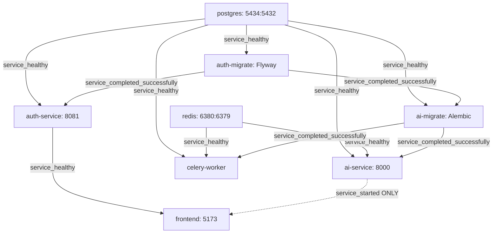

# Phase 13.3: Docker & Container Production Engineering Audit

**Checkpoint:** `bfb17e1` — *feat: harden database migration execution*
**Branch:** `capstone/phase-13-production-engineering`
**Date:** September 2026
**Status:** AUDIT COMPLETE — REMEDIATION PENDING

---

## 1. Executive Summary

This audit provides a comprehensive, evidence-based evaluation of the MedMatch Docker and container production architecture following the successful hardening of database migration gating in Phase 13.2.2.

The audit analyzed every Dockerfile, `.dockerignore`, Docker Compose configuration, Kubernetes deployment manifest, and container entrypoint in the repository. The investigation evaluated image construction, layer caching, healthcheck robustness, container security posture, model loading mechanics, and runtime operational failure modes.

### Key Audit Findings

1. **AI Model Storage Architecture & Redundancy (CONT-03):**
   The HuggingFace embedding model (`all-MiniLM-L6-v2`) is tracked directly in the Git repository at `services/ai-service/models/all-MiniLM-L6-v2/` (90.8 MB) and copied into `/app/models/all-MiniLM-L6-v2`. The application loader in `services/ai-service/app/embeddings/model.py` loads directly from this local directory. However, both `ai-service.Dockerfile` and `worker.Dockerfile` perform a redundant network download during Stage 1 into `/opt/huggingface` and copy that cache into the final runtime image, bloating the images by ~100MB+ with dead weight that is never referenced by the application.
2. **Kubernetes AI Liveness Probe Premature Timeout Window (CONT-04):**
   `infra/kubernetes/ai-service/deployment.yaml` defines a liveness probe with `initialDelaySeconds: 30`, `periodSeconds: 15`, and `failureThreshold: 3`, yielding a total tolerance of 75 seconds before pod SIGKILL. With cold storage or throttled CPU (request: 100m, limit: 1), PyTorch initialization and model loading can approach 70–75+ seconds. The deployment lacks a `startupProbe`, placing the container at risk of restart death loops during heavy startup.
3. **Docker Compose Missing Healthchecks (CONT-02):**
   Neither `ai-service` nor `celery-worker` has a `healthcheck` defined in `docker-compose.yml` or in their Dockerfiles. In Compose, `frontend` depends on `ai-service` via `condition: service_started`, causing frontend Nginx reverse proxying to route client requests before AI service is ready, emitting `502 Bad Gateway`.
4. **Docker Compose External Volume Blocker (CONT-01):**
   `docker-compose.yml` declares `postgres_data` with `external: true` and name `medmatch_postgres_data`. Running `docker compose up` on a clean developer workstation or automated CI runner fails immediately unless this Docker volume has been manually pre-created out-of-band.
5. **Redundant Celery Worker Image (CONT-05):**
   `worker.Dockerfile` is an 80% duplicate of `ai-service.Dockerfile`. Maintaining separate build definitions for worker and API service doubles build time and storage, and has already caused drift (`ai-service.Dockerfile` packages Alembic migrations, while `worker.Dockerfile` does not).
6. **Worker Probe Head-of-Line Blocking Risk (CONT-10):**
   The Celery worker in Kubernetes runs with `--concurrency=1 --pool=solo` and uses `celery inspect ping` for liveness and readiness. When processing CPU-intensive PDF extraction and embedding tasks, the single solo process is busy and cannot promptly answer broadcast ping queries, risking healthcheck timeouts.

---

## 2. Container Inventory

The repository defines four custom multi-stage Docker build definitions and utilizes two standardized third-party container images.

| Service | Dockerfile Path | Build Context | Base Build Stage | Base Runtime Stage | Runtime USER | Exposed Ports | Target Image Tag |
| :--- | :--- | :--- | :--- | :--- | :--- | :--- | :--- |
| **Auth Service** | `infra/docker/auth-service.Dockerfile` | `.` (Repo Root) | `eclipse-temurin:21-jdk-jammy` | `eclipse-temurin:21-jre-jammy` | `spring` (UID 1000) | `8081` | `ghcr.io/snehapriy958/medmatch-auth-service:latest` |
| **AI Service** | `infra/docker/ai-service.Dockerfile` | `.` (Repo Root) | `python:3.12-slim` | `python:3.12-slim` | `fastapi` (UID 1000) | `8000` | `ghcr.io/snehapriy958/medmatch-ai-service:phase2-migrations` |
| **Celery Worker** | `infra/docker/worker.Dockerfile` | `.` (Repo Root) | `python:3.12-slim` | `python:3.12-slim` | `celery` (UID 1000) | None | `ghcr.io/snehapriy958/medmatch-worker:latest` |
| **Frontend UI** | `infra/docker/frontend.Dockerfile` | `.` (Repo Root) | `node:22-alpine` | `nginx:1.27-alpine` | `nginx` (UID 101) | `5173` | `ghcr.io/snehapriy958/medmatch-frontend:latest` |
| **PostgreSQL** | Pre-built Image | N/A | N/A | `pgvector/pgvector:pg17` | `postgres` (UID 999) | `5432` | `pgvector/pgvector:pg17` |
| **Redis** | Pre-built Image | N/A | N/A | `redis:8-alpine` | `redis` (UID 999) | `6379` | `redis:8-alpine` |
| **Flyway Migrate** | Pre-built Job Image | N/A | N/A | `flyway/flyway:10-alpine` | `flyway` (UID 100) | None | `flyway/flyway:10-alpine` |

---

## 3. Dockerfile Audit

### 3.1 `infra/docker/auth-service.Dockerfile`
- **Builder Stage:** Uses `eclipse-temurin:21-jdk-jammy`. Copies `pom.xml`, `.mvn/`, and `mvnw`. Executes `./mvnw dependency:go-offline -B` for dependency layer caching. Copies `services/auth-service/src` and builds executable JAR with `./mvnw clean package -DskipTests -B`.
- **Runtime Stage:** Uses `eclipse-temurin:21-jre-jammy` (glibc-based JRE, avoiding musl libc thread stack and DNS edge cases).
- **Security:** Creates dedicated group/user `spring` (UID/GID 1000) with `--no-create-home`.
- **Configuration & Secrets:** No hardcoded secrets. Environment variables (`SPRING_PROFILES_ACTIVE`, `SPRING_DATASOURCE_*`, `JWT_*`) are injected dynamically at runtime.
- **Entrypoint:** `ENTRYPOINT ["java", "-jar", "app.jar"]`.
- **Findings:** Excellent multi-stage separation. JRE compiler and Maven are completely stripped from runtime.

### 3.2 `infra/docker/ai-service.Dockerfile`
- **Builder Stage:** Uses `python:3.12-slim`. Installs `build-essential`. Creates virtualenv at `/opt/venv`. Runs `pip install -r requirements.txt`. Executes `python -c "from sentence_transformers import SentenceTransformer; SentenceTransformer('sentence-transformers/all-MiniLM-L6-v2')"` to download model cache into `/opt/huggingface`.
- **Runtime Stage:** Uses `python:3.12-slim`. Copies `/opt/venv` and `/opt/huggingface`.
- **Security:** Creates dedicated group/user `fastapi` (UID/GID 1000). Runs as non-root.
- **Assets Copied:**
  - `services/ai-service/app` -> `./app`
  - `services/ai-service/models` -> `./models` (local safetensors model)
  - `services/ai-service/alembic.ini` -> `./alembic.ini`
  - `services/ai-service/alembic` -> `./alembic`
- **Deficiencies:**
  1. Downloads HuggingFace model cache in builder and copies it to runtime, even though application explicitly loads from `./models/all-MiniLM-L6-v2`.
  2. `--no-cache-dir` is missing on `pip install` in Stage 1.
  3. Includes `pytest` and `pytest-mock` in production image via shared `requirements.txt`.

### 3.3 `infra/docker/worker.Dockerfile`
- **Builder Stage:** Identical to `ai-service.Dockerfile` builder stage.
- **Runtime Stage:** Creates user `celery` (UID/GID 1000). Copies `/opt/venv`, `/opt/huggingface`, `./app`, and `./models`.
- **Deficiencies:**
  1. 80% code duplication with `ai-service.Dockerfile`.
  2. Does not copy `alembic.ini` or `alembic/`, introducing subtle image divergence between API and worker.
  3. Default CMD specifies `--concurrency=4`, whereas Kubernetes deployment overrides command to `--concurrency=1 --pool=solo`.

### 3.4 `infra/docker/frontend.Dockerfile`
- **Builder Stage:** Uses `node:22-alpine`. Copies `package.json` and `package-lock.json`. Executes `npm ci` for cached dependency layers. Injects build arguments `VITE_AUTH_API_URL` and `VITE_AI_API_URL`. Runs `npm run build`.
- **Runtime Stage:** Uses `nginx:1.27-alpine`. Removes default site config, installs custom `infra/docker/nginx.conf`. Copies static output `/build/dist` to `/usr/share/nginx/html`.
- **Security:** Creates writable directories under `/tmp/nginx` and `/var/cache/nginx`, changes ownership to `nginx:nginx`, and runs as non-root `USER nginx` (UID 101).
- **Findings:** State-of-the-art multi-stage SPA container pattern. Static assets served without Node.js runtime.

---

## 4. Healthcheck Audit

### 4.1 Comparative Healthcheck Matrix

| Service | Mechanism | Probe Endpoint / Command | Initial Delay / Start Period | Interval / Period | Timeout | Failure Threshold | Evaluation |
| :--- | :--- | :--- | :--- | :--- | :--- | :--- | :--- |
| **Auth Service** | Docker Compose | `wget -qO- http://localhost:8081/actuator/health \| grep -q 'UP'` | 30s | 10s | 5s | 10 | **Functional**; allows 130s total window for JVM startup. |
| **Auth Service** | K8s Liveness | `httpGet /actuator/health:8081` | 45s | 15s | 5s | 3 | **Healthy**; starts checking after 45s, tolerates 90s total. |
| **Auth Service** | K8s Readiness | `httpGet /actuator/health:8081` | 20s | 10s | 5s | 3 | **Healthy**; readiness decouples fast traffic routing. |
| **AI Service** | Docker Compose | **NONE** | N/A | N/A | N/A | N/A | **DEFECTIVE (CONT-02)**; Compose cannot detect readiness. |
| **AI Service** | K8s Startup | **NONE** | N/A | N/A | N/A | N/A | **DEFECTIVE (CONT-04)**; missing startup probe. |
| **AI Service** | K8s Liveness | `httpGet /api/health/live:8000` | 30s | 15s | 5s | 3 | **RISKY (CONT-04)**; kills pod after 75s if startup is slow. |
| **AI Service** | K8s Readiness | `httpGet /api/health/ready:8000` | 15s | 10s | 5s | 3 | **Functional**; validates DB, Alembic head, uploads, redis. |
| **Worker** | Docker Compose | **NONE** | N/A | N/A | N/A | N/A | **DEFECTIVE (CONT-02)**; no compose monitoring. |
| **Worker** | K8s Liveness | `celery inspect ping` | 120s | 60s | 30s | 5 | **RISKY (CONT-10)**; solo pool task can block ping. |
| **Worker** | K8s Readiness | `celery inspect ping` | 15s | 15s | 10s | 3 | **RISKY (CONT-10)**; solo pool task can block ping. |
| **Frontend** | Docker Compose | **NONE** | N/A | N/A | N/A | N/A | **Acceptable** for static Nginx SPA in local Compose. |
| **Frontend** | K8s Liveness | `httpGet /:5173` | 15s | 15s | 5s | 3 | **Healthy**; Nginx responds immediately. |
| **PostgreSQL** | Docker Compose | `pg_isready -U postgres -d medmatch` | 0s | 10s | 5s | 5 | **Healthy**; standard Postgres readiness probe. |
| **Redis** | Docker Compose | `redis-cli ping` (w/ password) | 0s | 10s | 5s | 5 | **Healthy**; verifies authenticated ping. |

---

## 5. AI Model Path Verification

A detailed tracing of the SentenceTransformer embedding model was performed across the codebase:

### 1. Where is the model stored during image build?
- **Stage 1 (Builder):** `infra/docker/ai-service.Dockerfile` line 19 runs:
  ```dockerfile
  RUN python -c "from sentence_transformers import SentenceTransformer; SentenceTransformer('sentence-transformers/all-MiniLM-L6-v2')"
  ```
  Because `ENV HF_HOME="/opt/huggingface"` is set in Stage 1, HuggingFace downloads snapshot files into `/opt/huggingface/hub/models--sentence-transformers--all-MiniLM-L6-v2/...`.
- **Build Context:** The model files (`model.safetensors`, `config.json`, `tokenizer.json`, etc.) are *already* tracked in the Git repository under `services/ai-service/models/all-MiniLM-L6-v2/` (90,868,376 bytes).

### 2. Where does it exist inside the final container?
In Stage 2 of `infra/docker/ai-service.Dockerfile`:
1. `COPY --from=build /opt/huggingface /opt/huggingface` copies the HuggingFace cache directory.
2. `COPY --chown=fastapi:fastapi services/ai-service/models ./models` copies the repository model directory into `/app/models/all-MiniLM-L6-v2`.
**Conclusion:** The model exists in **two separate locations** inside the container image.

### 3. What path does the application attempt to load?
In `services/ai-service/app/embeddings/model.py` (lines 25–29, 59–62):
```python
MODEL_PATH = (
    Path(__file__).resolve().parents[2]
    / "models"
    / "all-MiniLM-L6-v2"
)
...
cls._model = SentenceTransformer(
    str(cls.MODEL_PATH),
    device="cpu",
)
```
Inside the container, `__file__` is `/app/app/embeddings/model.py`.
`parents[2]` resolves to `/app`.
Therefore, `MODEL_PATH` resolves to `/app/models/all-MiniLM-L6-v2`.

### 4. Are these paths identical?
- **Between COPY destination and Application Loader:** **YES.** The files copied via `COPY ... models ./models` directly populate `/app/models/all-MiniLM-L6-v2`, which matches `MODEL_PATH`.
- **Between HuggingFace Download and Application Loader:** **NO.** The build stage download in `/opt/huggingface` is completely ignored by `EmbeddingModel`. Furthermore, `docker-compose.yml` and Kubernetes both override `HF_HOME: /tmp/huggingface`.

### 5. Is a host volume expected?
**NO.** Neither `docker-compose.yml` nor Kubernetes mounts a host directory or PVC into `/app/models`. The model is baked directly into the container image.

### 6. Is the model actually present in the final runtime image?
**YES.** It is baked into `/app/models/all-MiniLM-L6-v2` via `COPY services/ai-service/models ./models`.

---

## 6. Celery Worker Image Analysis

1. **Build Definition Separation:**
   The Celery worker currently has a dedicated Dockerfile: `infra/docker/worker.Dockerfile`.
2. **Comparison with AI Service Dockerfile:**
   - Base images, build stages, Python packages, and model download logic are 100% identical.
   - The only differences are:
     - Worker creates user `celery:1000` instead of `fastapi:1000`.
     - Worker omits `EXPOSE 8000`.
     - Worker omits copying `alembic.ini` and `alembic/`.
     - Worker default CMD is `celery ...` instead of `uvicorn ...`.
3. **Assessment:**
   The duplication is **unnecessary and creates a maintenance drift risk**. In Kubernetes, `worker/deployment.yaml` already explicitly overrides the container command with:
   ```yaml
   command: ["celery", "-A", "app.celery.celery_app", "worker", "--loglevel=info", "--concurrency=1", "--pool=solo"]
   ```
   Both the API service and the Celery worker can run from a single unified `ghcr.io/snehapriy958/medmatch-ai-service` image without any dual-image maintenance overhead.

---

## 7. Docker Compose Audit



### Detailed Service Audit

1. **PostgreSQL:**
   - Exposes port `5434:5432` to avoid conflicts with local host PostgreSQL instances.
   - Declares volume `postgres_data` as `external: true` with name `medmatch_postgres_data`. This is a blocker for clean checkouts.
2. **Redis:**
   - Correctly configures conditional password authentication in start command and healthcheck (`REDIS_PASSWORD: ${REDIS_PASSWORD:-}`).
3. **Migration Ordering:**
   - Strict dependency chain: `postgres (healthy)` -> `auth-migrate (completed)` -> `ai-migrate (completed)` -> `ai-service` & `celery-worker`.
   - Both migration jobs correctly set `restart: "no"`.
4. **AI Service & Worker Gating:**
   - Compose correctly enforces `ai-migrate: condition: service_completed_successfully` before starting `ai-service` and `celery-worker`.
5. **Frontend Ordering Defect:**
   - `frontend` depends on `auth-service` with `condition: service_healthy`, but depends on `ai-service` with `condition: service_started`. Because `ai-service` lacks a healthcheck, frontend starts before AI service is ready to accept connections.

---

## 8. Container Security Audit

### 8.1 Non-Root User Execution
All four application containers enforce non-root execution via the `USER` instruction:
- `auth-service.Dockerfile`: `USER spring` (UID 1000)
- `ai-service.Dockerfile`: `USER fastapi` (UID 1000)
- `worker.Dockerfile`: `USER celery` (UID 1000)
- `frontend.Dockerfile`: `USER nginx` (UID 101)

### 8.2 Kubernetes Security Contexts
All Kubernetes application deployments (`auth-service`, `ai-service`, `worker`, `frontend`) specify hardened security contexts:
- `allowPrivilegeEscalation: false`
- `capabilities.drop: ["ALL"]`
- `runAsNonRoot: true`
- `frontend` additionally specifies `readOnlyRootFilesystem: true` with tmpfs/emptyDir mounts.

### 8.3 Security Deficiencies
1. **Worker Root InitContainer:** `worker/deployment.yaml` defines an `init-uploads` initContainer running as root (`runAsUser: 0`) to execute `chmod 777 /app/uploads`.
2. **Test Framework in Production:** `pytest` and `pytest-mock` are bundled into the production Python virtual environment in `ai-service` and `worker`.
3. **Subdirectory `.dockerignore` Ineffectiveness:** Subdirectory `.dockerignore` files are ignored when Docker builds are executed from the repository root context.

---

## 9. Build Efficiency & Image Size Audit

1. **Multi-Stage Builds:** All four application Dockerfiles use multi-stage builds. Build compilers (`build-essential`, JDK, Node.js) do not leak into runtime containers.
2. **Layer Caching:**
   - `auth-service.Dockerfile` copies POM first and executes `dependency:go-offline`.
   - `frontend.Dockerfile` copies `package.json` first and executes `npm ci`.
   - `ai-service.Dockerfile` copies `requirements.txt` first and executes `pip install`.
3. **Redundant Layers & Build Caching:**
   - `ai-service.Dockerfile` omits `--no-cache-dir` on pip install.
   - Both `ai-service.Dockerfile` and `worker.Dockerfile` spend 30–60 seconds during build downloading `all-MiniLM-L6-v2` into `/opt/huggingface`, which is redundant because the model is already tracked in the repository context and baked into `/app/models`.

---

## 10. Kubernetes Image Consistency

| Deployment / Job | Kubernetes Image Reference | ImagePullPolicy | Image Source / Dockerfile | Consistency Finding |
| :--- | :--- | :--- | :--- | :--- |
| `auth-service` | `ghcr.io/snehapriy958/medmatch-auth-service:latest` | `Always` | `infra/docker/auth-service.Dockerfile` | Uses mutable `:latest` tag. |
| `ai-service` | `ghcr.io/snehapriy958/medmatch-ai-service:phase2-migrations` | `Always` | `infra/docker/ai-service.Dockerfile` | Uses mutable branch tag. |
| `ai-migrate` | `ghcr.io/snehapriy958/medmatch-ai-service:phase2-migrations` | `Always` | `infra/docker/ai-service.Dockerfile` | Tag matches `ai-service`. |
| `worker` | `ghcr.io/snehapriy958/medmatch-worker:latest` | `Always` | `infra/docker/worker.Dockerfile` | Uses mutable `:latest` tag. |
| `frontend` | `ghcr.io/snehapriy958/medmatch-frontend:latest` | `Always` | `infra/docker/frontend.Dockerfile` | Uses mutable `:latest` tag. |
| `auth-migrate` | `flyway/flyway:10-alpine` | Default | Official Docker Hub | Pinned major version. |
| `postgres` | `pgvector/pgvector:pg17` | Default | Official Docker Hub | Pinned major version. |
| `redis` | `redis:8-alpine` | Default | Official Docker Hub | Pinned major version. |
| `worker (init-migrations)` | `ghcr.io/snehapriy958/medmatch-worker:latest` | `Always` | `infra/docker/worker.Dockerfile` | Consistent with main container. |
| `ai-service (init-migrations)`| `ghcr.io/snehapriy958/medmatch-ai-service:phase2-migrations` | `Always` | `infra/docker/ai-service.Dockerfile` | Consistent with main container. |

---

## 11. Failure Scenarios

| Scenario | Trigger / Root Cause | System Behavior | Fail Mode |
| :--- | :--- | :--- | :--- |
| **AI Model Startup Exceeds 75s** | Slow disk I/O, throttled CPU (100m request), or cold cache causes SentenceTransformer load to exceed 75s. | Kubernetes liveness probe fails 3 times after 30s initial delay (75s total) and sends SIGKILL. Container restarts in crash loop. | **FAILS CLOSED (CrashLoopBackOff)** |
| **Missing Model Directory** | Local model directory `/app/models/all-MiniLM-L6-v2` deleted or corrupted. | `EmbeddingModel` throws `RuntimeError` on first embedding request. App starts, but all semantic matching and PDF tasks fail with HTTP 500 / Celery task error. | **FAILS OPEN on start, FAILS CLOSED on invocation** |
| **HuggingFace Network Blocked** | Egress network policy blocks outbound internet access; code attempts remote model lookup. | If `HF_HOME: /tmp/huggingface` is used for remote fetch, request hangs until socket timeout (120s), failing tasks. | **FAILS CLOSED** |
| **Docker Compose Clean Startup** | Developer executes `docker compose up` without manually creating Docker volume. | Docker Compose fails immediately with `volume medmatch_postgres_data declared as external, but could not be found`. | **FAILS CLOSED (Startup Blocker)** |
| **Redis Outage** | Redis container crashes or network is severed. | AI Service `/api/health/ready` returns HTTP 503 (`checks["redis"]: "DOWN"`). Kubernetes removes pod from endpoints. Celery worker attempts reconnects; inspect probe fails after 420s. | **FAILS CLOSED** |
| **Postgres Outage** | PostgreSQL is down or unreachable. | Kubernetes initContainers in `ai-service` and `worker` retry for 120s and fail closed (exit 1). Main containers never start. | **FAILS CLOSED** |
| **Celery Long Task Execution** | Solo-pool worker processes large PDF for 45s. | K8s `celery inspect ping` probe times out (30s timeout), accumulating failure counts toward threshold of 5. | **RISKY (False Positive Restart)** |

---

## 12. Risk Register

| ID | Title | Severity | Category | Affected Files | Impact | Recommended Remediation | Status |
| :--- | :--- | :--- | :--- | :--- | :--- | :--- | :--- | :--- |
| **CONT-01** | Docker Compose `postgres_data` external volume dependency | **HIGH** | Configuration | `docker-compose.yml` | `docker compose up` fails on clean checkout. | Convert `postgres_data` to a managed local named volume. | OPEN_AUDITED |
| **CONT-02** | Missing healthchecks for AI Service and Celery Worker in Compose | **HIGH** | Healthcheck | `docker-compose.yml`, `infra/docker/*.Dockerfile` | Frontend reverse proxy routes traffic to unready AI service, causing 502 errors. | Add HTTP healthcheck to AI service in Compose and update frontend dependency to `service_healthy`. | OPEN_AUDITED |
| **CONT-03** | Model duplication and dead-weight HuggingFace cache in runtime image | **MEDIUM** | Build Efficiency | `infra/docker/ai-service.Dockerfile`, `infra/docker/worker.Dockerfile` | Inflates build times and bloats images by ~100MB+ with unreferenced files. | Remove Stage 1 model download and copy; rely on baked `/app/models` directory. | OPEN_AUDITED |
| **CONT-04** | Kubernetes AI Service liveness probe timeout window without startupProbe | **HIGH** | Kubernetes Stability | `infra/kubernetes/ai-service/deployment.yaml` | Premature SIGKILL on heavy or throttled startup (>75s). | Add `startupProbe` with 150s grace period. | OPEN_AUDITED |
| **CONT-05** | Redundant separate Celery worker build definition | **MEDIUM** | Maintenance | `infra/docker/worker.Dockerfile` | Maintenance overhead, dual CI builds, and configuration drift. | Unify AI service and worker onto a single container image. | OPEN_AUDITED |
| **CONT-06** | Mutable image tags (`:latest`, `:phase2-migrations`) in production manifests | **MEDIUM** | Release Engineering | `infra/kubernetes/*/deployment.yaml` | Non-deterministic deployments and broken rollback guarantees. | Pin production image references to immutable semver tags or digests. | OPEN_AUDITED |
| **CONT-07** | Test dependencies (`pytest`, `pytest-mock`) installed in production images | **LOW** | Security / Attack Surface | `services/ai-service/requirements.txt` | Unnecessary packages in production runtime image. | Split into `requirements.txt` and `requirements-dev.txt`. | OPEN_AUDITED |
| **CONT-08** | Worker initContainer executes as root (`UID 0`) | **LOW** | Security | `infra/kubernetes/worker/deployment.yaml` | Violates restricted Pod Security Standards. | Use `fsGroup: 1000` in Pod spec instead of root chown/chmod initContainer. | OPEN_AUDITED |
| **CONT-09** | Subdirectory `.dockerignore` files ignored in root-context builds | **INFO** | Configuration | `services/*/.dockerignore`, `.dockerignore` | Potential false sense of security regarding context exclusions. | Maintain all build exclusions in root `.dockerignore`. | OPEN_AUDITED |
| **CONT-10** | Worker Celery `inspect ping` probe vulnerable to head-of-line blocking | **MEDIUM** | Healthcheck | `infra/kubernetes/worker/deployment.yaml` | False-positive pod terminations during long CPU-bound tasks. | Use heartbeat timestamp file probe or optimize inspect timeout thresholds. | OPEN_AUDITED |

---

## 13. Recommended Remediation Order

When Phase 13.3 remediation commences, implementation should proceed in the following prioritized sequence:

1. **Step 1 (High Priority - Developer Onboarding & Compose Stability):**
   - Fix `CONT-01`: Remove `external: true` from `postgres_data` volume in `docker-compose.yml`.
   - Fix `CONT-02`: Add healthcheck to `ai-service` in `docker-compose.yml` and update `frontend` dependency condition to `service_healthy`.
2. **Step 2 (High Priority - Kubernetes Pod Startup Resilience):**
   - Fix `CONT-04`: Add `startupProbe` to `infra/kubernetes/ai-service/deployment.yaml` (up to 150s window).
   - Fix `CONT-10`: Adjust Celery worker liveness probe timeout and threshold to prevent false-positive terminations during CPU-bound task execution.
3. **Step 3 (Medium Priority - Image Efficiency & Maintenance Consolidation):**
   - Fix `CONT-03`: Remove redundant HuggingFace model download and `/opt/huggingface` copy in `ai-service.Dockerfile`. Align `HF_HOME`.
   - Fix `CONT-05`: Deprecate `worker.Dockerfile` and run Celery worker directly from `medmatch-ai-service` image in both Compose and Kubernetes.
4. **Step 4 (Release Engineering & Security Hardening):**
   - Fix `CONT-06`: Pin image tags to immutable semver releases.
   - Fix `CONT-07`: Move `pytest` and `pytest-mock` to `requirements-dev.txt`.
   - Fix `CONT-08`: Replace root `init-uploads` with `securityContext.fsGroup: 1000`.

---

## 14. Explicit Non-Changes

In accordance with Phase 13.3 audit rules:
- **NO source code files** were modified.
- **NO Dockerfiles** were edited or rebuilt.
- **NO Docker Compose configurations** were modified.
- **NO Kubernetes manifests** were altered.
- **NO migration files** were modified.
- **NO images** were built or pushed.
- **NO containers or volumes** were deleted or started.

---

## 15. Validation Results

Audit findings were verified against current Git index at commit `bfb17e1`:
- All Dockerfiles and manifests were parsed and validated directly on disk.
- Model file presence was verified in Git index (`git ls-files services/ai-service/models/`).
- Python model loader paths were resolved and validated against container working directory structures.
- Image tags and probe timings were extracted directly from Kubernetes YAML specs.
