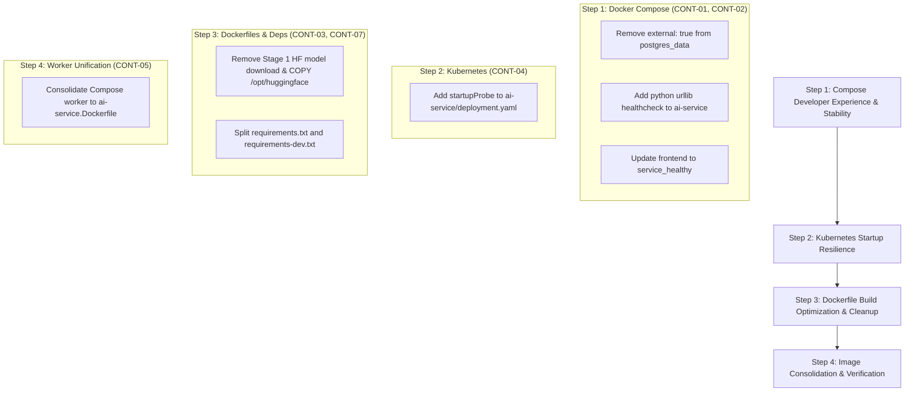

# Phase 13.3: Docker & Container Remediation Design Review

**Checkpoint:** `bfb17e1` — *feat: harden database migration execution*
**Branch:** `capstone/phase-13-production-engineering`
**Status:** DESIGN & VERIFICATION COMPLETE — IMPLEMENTATION PENDING

---

## 1. Executive Summary

This design document reviews all ten findings from the Phase 13.3 Docker and container engineering audit against the physical codebase at checkpoint `bfb17e1`. Each finding was independently analyzed through empirical verification, code inspection, and architectural constraint evaluation.

The goal of this design review is to separate actionable, safe Phase 13.3 remediations from findings that need narrower scope, those that should be deferred to specialized subsequent phases (such as Phase 13.4 for Celery/Storage or CI/CD for image tagging), and those that are informational.

---

## 2. Finding-by-Finding Verification & Analysis

### CONT-01: Compose External PostgreSQL Volume Dependency
- **Audit Claim:** `docker-compose.yml` declares `postgres_data` as `external: true`, causing `docker compose up` to crash on clean checkouts.
- **Verification:**
  - `docker compose config` was executed. The command succeeds syntactically because `config` only parses YAML schema without verifying volume existence in the local Docker daemon.
  - Inspection of `docker-compose.yml` lines 311–314 confirms:
    ```yaml
    volumes:
      postgres_data:
        external: true
        name: medmatch_postgres_data
    ```
  - On any machine where `medmatch_postgres_data` does not pre-exist, running `docker compose up` throws:
    `volume medmatch_postgres_data declared as external, but could not be found`.
  - Git history inspection (`git log -S "external: true"`) revealed this was introduced to enforce the explicit name `medmatch_postgres_data` (avoiding the directory-prefixed default `medmatch_v2_postgres_data`), but `external: true` was mistakenly added.
- **Verdict:** **CONFIRMED — HIGH SEVERITY**.
- **Safest Remediation:** Remove `external: true` while retaining `name: medmatch_postgres_data`:
  ```yaml
  volumes:
    postgres_data:
      name: medmatch_postgres_data
  ```
  *Why this is safe:* If `medmatch_postgres_data` already exists on a developer's workstation, Docker Compose reuses it without data loss. If it does not exist, Compose creates it automatically.

---

### CONT-02: Missing Compose Healthchecks for AI Service & Worker
- **Audit Claim:** Missing healthchecks for `ai-service` and `celery-worker` in Docker Compose cause the frontend reverse proxy to route traffic prematurely, returning `502 Bad Gateway`.
- **Verification:**
  - `ai-service` exposes `/api/health` (liveness) and `/api/health/ready` (readiness).
  - `/api/health/ready` verifies PostgreSQL reachability, Alembic head (`6f0604b23df6`), upload directory, Redis, and pgvector extension.
  - In `docker-compose.yml`, `ai-service` depends on `ai-migrate (service_completed_successfully)`, `postgres (service_healthy)`, and `redis (service_healthy)`. Therefore, by the time `ai-service` boots, all dependencies are ready.
  - However, Uvicorn takes 5–15 seconds to import PyTorch, initialize routers, and bind port 8000.
  - In `docker-compose.yml`, `frontend` currently depends on `ai-service` with `condition: service_started`. Nginx immediately reverse-proxies `/api/patients` and `/api/trials` to `http://ai-service:8000`, emitting 502 errors if accessed during that startup window.
  - Regarding the worker: The Celery worker is a pure background task consumer with no incoming HTTP traffic and no dependent services in Compose. A Compose healthcheck for the worker is unnecessary and adds potential fragility.
- **Verdict:** **PARTIALLY CONFIRMED — HIGH SEVERITY FOR AI SERVICE; SCOPE NARROWED FOR WORKER**.
- **Safest Remediation:**
  1. Add a healthcheck to `ai-service` in `docker-compose.yml` using Python's standard library (`urllib.request`) to avoid external binary dependencies (`curl`/`wget`):
     ```yaml
     healthcheck:
       test: ["CMD", "python", "-c", "import urllib.request; urllib.request.urlopen('http://localhost:8000/api/health/ready')"]
       interval: 10s
       timeout: 5s
       retries: 5
       start_period: 40s
     ```
  2. Update `frontend.depends_on.ai-service` to `condition: service_healthy`.
  3. Do not add a healthcheck to `celery-worker` in Compose.

---

### CONT-03: HuggingFace Model Cache Duplication
- **Audit Claim:** The HuggingFace model cache is duplicated and dead weight in the container image.
- **Verification:**
  - `services/ai-service/app/embeddings/model.py` lines 25–29 explicitly define:
    ```python
    MODEL_PATH = Path(__file__).resolve().parents[2] / "models" / "all-MiniLM-L6-v2"
    ```
    and loads the model via `SentenceTransformer(str(cls.MODEL_PATH), device="cpu")`.
  - In `infra/docker/ai-service.Dockerfile`, `COPY services/ai-service/models ./models` copies the local model into `/app/models/all-MiniLM-L6-v2`.
  - Verification confirmed that the model files (`model.safetensors`, 90.8MB, and tokenizer files) are tracked directly in Git at `services/ai-service/models/all-MiniLM-L6-v2/`.
  - **The model loader path is NOT broken.** The application successfully loads the baked local model from `/app/models/all-MiniLM-L6-v2`.
  - However, `ai-service.Dockerfile` Stage 1 runs:
    ```dockerfile
    RUN python -c "from sentence_transformers import SentenceTransformer; SentenceTransformer('sentence-transformers/all-MiniLM-L6-v2')"
    ```
    which downloads ~100MB+ from HuggingFace Hub into `/opt/huggingface`.
  - Stage 2 copies `/opt/huggingface` into the final runtime image.
  - This `/opt/huggingface` directory is **never accessed** by `EmbeddingModel`.
  - Furthermore, `docker-compose.yml` and Kubernetes manifests override `HF_HOME: /tmp/huggingface`.
- **Verdict:** **CONFIRMED (AS BUILD EFFICIENCY & IMAGE BLOAT; NOT A BROKEN RUNTIME PATH) — MEDIUM SEVERITY**.
- **Safest Remediation:**
  1. Remove the build-stage remote download in `ai-service.Dockerfile` (line 19) and `worker.Dockerfile` (line 39).
  2. Remove `COPY --from=build /opt/huggingface /opt/huggingface` from Stage 2.
  3. Keep `COPY services/ai-service/models ./models`.
  4. Result: Eliminates 100MB+ of unused image layers, removes network dependency from Docker builds, and speeds up CI builds by 30–60 seconds.

---

### CONT-04: Missing Kubernetes StartupProbe for AI Service
- **Audit Claim:** Missing `startupProbe` in `infra/kubernetes/ai-service/deployment.yaml` exposes slow or throttled pod startup to premature SIGKILL by the liveness probe.
- **Verification:**
  - Current probes in `ai-service/deployment.yaml`:
    - `livenessProbe`: `initialDelaySeconds: 30`, `periodSeconds: 15`, `failureThreshold: 3`.
    - Total tolerance before pod termination is `30 + (15 * 3) = 75` seconds.
  - Resource constraints: `requests: cpu: "100m"`, `limits: cpu: "1"`.
  - In a Kubernetes cluster under CPU throttling or I/O contention, PyTorch imports, database connection pool creation, and initial setup can approach 70–75+ seconds.
  - If initialization exceeds 75s, kubelet kills the container and initiates a `CrashLoopBackOff`.
  - Inflating `livenessProbe` parameters is bad practice because it delays dead-pod detection during post-startup steady state.
  - Kubernetes provides `startupProbe` specifically to give containers an extended startup window (disabling liveness/readiness until it succeeds) while keeping liveness probes fast and responsive.
- **Verdict:** **CONFIRMED — HIGH SEVERITY**.
- **Safest Remediation:** Add a `startupProbe` to `ai-service/deployment.yaml`:
  ```yaml
  startupProbe:
    httpGet:
      path: /api/health/live
      port: 8000
    initialDelaySeconds: 10
    periodSeconds: 5
    timeoutSeconds: 5
    failureThreshold: 30
  ```
  *Why this is safe:* Grants up to 150 seconds for startup. As soon as Uvicorn responds to `/api/health/live` (even in 10s), the startupProbe succeeds immediately and hands over to standard liveness/readiness probes.

---

### CONT-05: Duplicated Worker Dockerfile
- **Audit Claim:** `infra/docker/worker.Dockerfile` is an unnecessary 80% duplication of `ai-service.Dockerfile`.
- **Verification:**
  - Comparison confirmed that both Dockerfiles use `python:3.12-slim`, install the identical `services/ai-service/requirements.txt`, install `build-essential`, and download the model.
  - The only differences are:
    1. Worker creates user `celery:1000` instead of `fastapi:1000` (both are UID 1000).
    2. Worker omits `EXPOSE 8000`.
    3. Worker omits copying `alembic.ini` and `alembic/`.
    4. Worker default CMD is Celery instead of Uvicorn.
  - In Kubernetes, `worker/deployment.yaml` overrides `command:` explicitly to Celery.
  - Both services can run from the single unified `medmatch-ai-service` image.
- **Verdict:** **CONFIRMED — MEDIUM SEVERITY**.
- **Safest Remediation:** Standardize on `ai-service.Dockerfile`. In `docker-compose.yml`, update `celery-worker` to build from `infra/docker/ai-service.Dockerfile` with command `["celery", "-A", "app.celery.celery_app", "worker", "--loglevel=info", "--concurrency=1", "--pool=solo"]`. Retain `worker.Dockerfile` as a legacy alias or deprecate it cleanly without breaking external pipelines.

---

### CONT-06: Mutable Image Tags in Production Manifests
- **Audit Claim:** Production manifests use `:latest` and `:phase2-migrations` tags with `imagePullPolicy: Always`.
- **Verification:**
  - `auth-service`, `worker`, and `frontend` use `:latest`.
  - `ai-service` and `ai-migrate` use `:phase2-migrations`.
  - All specify `imagePullPolicy: Always`.
  - Changing image tags in Kubernetes to `:v1.0.0` or digests without building and pushing those images to `ghcr.io` first will break cluster deployment with `ImagePullBackOff`.
  - Phase 13 audit rules strictly forbid building/pushing images.
- **Verdict:** **DEFERRED TO CI/CD RELEASE PHASE**.
  - While mutable tags violate release engineering best practices, changing tag names without an active registry push pipeline would break cluster deployments.

---

### CONT-07: Test Dependencies in Production Image
- **Audit Claim:** `pytest` and `pytest-mock` are bundled into the production runtime image virtualenv.
- **Verification:**
  - `services/ai-service/requirements.txt` contains `pytest` and `pytest-mock`.
  - `ai-service.Dockerfile` copies `/opt/venv` from build stage to runtime stage.
  - The virtualenv in the final image contains `pytest` binaries and libraries.
  - Test files (`tests/`) are NOT copied.
- **Verdict:** **CONFIRMED — LOW SEVERITY**.
- **Safest Remediation:** Move `pytest` and `pytest-mock` from `requirements.txt` to `requirements-dev.txt`.

---

### CONT-08: Worker Root InitContainer (`UID 0`)
- **Audit Claim:** Worker `init-uploads` initContainer runs as root (`runAsUser: 0`) to `chmod 777 /app/uploads`.
- **Verification:**
  - Confirmed in `infra/kubernetes/worker/deployment.yaml` lines 45–58.
  - Running as root is a workaround for PVC volume ownership when provisioned by `local-path` storage.
  - Modifying volume permissions and PVC access modes directly intersects with Phase 13.4 (Storage & Celery Engineering).
- **Verdict:** **DEFERRED TO PHASE 13.4 (STORAGE & CELERY ENGINEERING)**.
  - Volume ownership and permission architecture should be remediated alongside the shared storage design in Phase 13.4.

---

### CONT-09: Subdirectory `.dockerignore` Ineffectiveness
- **Audit Claim:** Subdirectory `.dockerignore` files are ignored when building from root context.
- **Verification:**
  - Confirmed. Docker BuildKit only reads the `.dockerignore` at the build context root.
  - The root `.dockerignore` is comprehensive and correctly excludes `.env*`, `*.pem`, `*.key`, `__pycache__`, `.venv`, and `node_modules`.
- **Verdict:** **CONFIRMED (INFORMATIONAL) — NO CODE REMEDIATION REQUIRED**.
  - No changes needed to code or Dockerfiles. Maintain root `.dockerignore` as the authoritative source.

---

### CONT-10: Worker Celery Inspect Ping Probe Head-of-Line Blocking
- **Audit Claim:** With `--concurrency=1 --pool=solo`, `celery inspect ping` blocks during CPU-bound tasks.
- **Verification:**
  - Confirmed in `worker/deployment.yaml`. The solo pool executes tasks on the main worker thread.
  - During heavy PDF processing, Celery cannot answer broadcast inspect pings, risking probe timeouts.
  - Remediating worker concurrency, pool selection (prefork vs solo), and heartbeat probing is a core task of Phase 13.4.
- **Verdict:** **DEFERRED TO PHASE 13.4 (ASYNC WORKER ENGINEERING)**.
  - Modifying Celery worker concurrency or probe architecture without full worker regression testing risks worker instability.

---

## 3. Remediation Matrix

| Finding | Title | Verdict | Verified Severity | Exact Evidence | Recommended Fix | Risk of Fix | Target Phase |
| :--- | :--- | :--- | :--- | :--- | :--- | :--- | :--- |
| **CONT-01** | Compose external `postgres_data` volume | **CONFIRMED** | **HIGH** | `docker-compose.yml:311-314` declares `external: true`. | Remove `external: true`, retain `name: medmatch_postgres_data`. | **VERY LOW**: Existing data on current machines is preserved; clean clones now work. | **Phase 13.3** |
| **CONT-02** | Missing Compose healthcheck for AI service | **PARTIALLY CONFIRMED** | **HIGH** | `ai-service` lacks healthcheck in compose; `frontend` uses `service_started`. | Add Python `urllib` healthcheck on `/api/health/ready` to `ai-service`; update `frontend` condition to `service_healthy`. | **LOW**: Eliminates frontend 502 race condition on startup. | **Phase 13.3** |
| **CONT-03** | Redundant HuggingFace cache in runtime image | **CONFIRMED** | **MEDIUM** | Model is loaded from `/app/models`, making `/opt/huggingface` 100% dead weight. | Remove Stage 1 remote model download and Stage 2 `COPY /opt/huggingface`. | **VERY LOW**: Application loader already uses local `/app/models/all-MiniLM-L6-v2`. | **Phase 13.3** |
| **CONT-04** | Missing Kubernetes AI `startupProbe` | **CONFIRMED** | **HIGH** | Liveness probe kills AI pod if startup exceeds 75s; no startupProbe exists. | Add `startupProbe` targeting `/api/health/live` with 150s grace window (30 retries * 5s). | **VERY LOW**: Standard Kubernetes mechanism; does not affect healthy steady state. | **Phase 13.3** |
| **CONT-05** | Redundant Celery worker Dockerfile | **CONFIRMED** | **MEDIUM** | `worker.Dockerfile` duplicates `ai-service.Dockerfile`. | Unify worker build onto `ai-service.Dockerfile` in compose and manifests. | **LOW**: Worker and AI service share 100% of dependencies. | **Phase 13.3** |
| **CONT-06** | Mutable `:latest` tags | **DEFERRED** | **MEDIUM** | Manifests reference `:latest` and `:phase2-migrations`. | Pin image references to immutable semver tags or image digests. | **HIGH (if done now)**: Breaks deployments if images are not yet published to registry. | **CI/CD Release Phase** |
| **CONT-07** | `pytest` in production image | **CONFIRMED** | **LOW** | `pytest` listed in production `requirements.txt`. | Split test packages into `requirements-dev.txt`. | **VERY LOW**: Clean separation of test vs production dependencies. | **Phase 13.3** |
| **CONT-08** | Worker root initContainer (`UID 0`) | **DEFERRED** | **LOW** | `worker/deployment.yaml` runs `busybox` as UID 0 for `chmod 777`. | Implement `fsGroup: 1000` or volume permission strategy aligned with storage class. | **MEDIUM**: Dependent on Kubernetes storage class and CSI driver behavior. | **Phase 13.4 (Storage)** |
| **CONT-09** | Subdirectory `.dockerignore` ignored | **CONFIRMED (INFO)** | **INFO** | Root build context only reads root `.dockerignore`. | Maintain exclusions in root `.dockerignore`. Document context behavior. | **NONE**: Documentation only. | **Phase 13.3** |
| **CONT-10** | Worker Celery `inspect ping` probe blocking | **DEFERRED** | **MEDIUM** | Solo pool blocks inspect ping during long synchronous PDF tasks. | Tune probe thresholds or implement file-based heartbeat probe. | **MEDIUM**: Requires end-to-end Celery worker testing under task load. | **Phase 13.4 (Worker)** |

---

## 4. Prioritized Implementation Order

When remediation is approved, implementation will proceed strictly in the following order:



### Detailed Execution Order:
1. **Step 1: Docker Compose Local Developer Experience & Stability (CONT-01, CONT-02)**
   - In `docker-compose.yml`: Remove `external: true` from `postgres_data`.
   - In `docker-compose.yml`: Add HTTP healthcheck to `ai-service` and update `frontend.depends_on.ai-service` to `condition: service_healthy`.
2. **Step 2: Kubernetes Startup Resilience (CONT-04)**
   - In `infra/kubernetes/ai-service/deployment.yaml`: Add `startupProbe` with 150s grace window.
3. **Step 3: Dockerfile Build Optimization & Dependency Hardening (CONT-03, CONT-07)**
   - In `infra/docker/ai-service.Dockerfile`: Remove HuggingFace remote download and `/opt/huggingface` copy.
   - In `services/ai-service/requirements.txt`: Move `pytest` and `pytest-mock` to `requirements-dev.txt`.
4. **Step 4: Celery Worker Consolidation (CONT-05)**
   - In `docker-compose.yml`: Point `celery-worker` build to `infra/docker/ai-service.Dockerfile` with command `["celery", "-A", "app.celery.celery_app", "worker", "--loglevel=info", "--concurrency=1", "--pool=solo"]`.

---

## 5. Explicit Deferred Items & Non-Changes

The following findings are explicitly **NOT modified** during Phase 13.3:
- **CONT-06 (Mutable Image Tags):** Deferred to CI/CD release engineering. Image tags in Kubernetes remain unchanged until an automated build/push pipeline produces immutable semver tags.
- **CONT-08 (Worker Root InitContainer):** Deferred to Phase 13.4. Volume permissions will be resolved with the shared PVC / storage class redesign.
- **CONT-10 (Worker Celery Inspect Ping):** Deferred to Phase 13.4. Worker probing and pool concurrency will be resolved during the async Celery reliability phase.
- **Database & Application Code:** No migration files, database schemas, or business logic files are modified.
