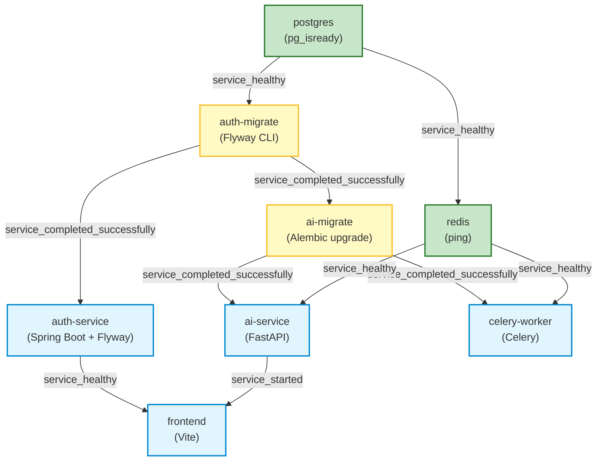

# Phase 13.2.2 — Database Migration Execution Architecture Audit & Design Specification
**Step 1: Architectural Audit, Failure Modeling, and Execution Design**

**Current Base Checkpoint:** `52bc0ad — fix: repair Alembic migration graph`  
**Branch:** `capstone/phase-13-production-engineering`  
**Classification:** PRODUCTION ENGINEERING AUDIT & ARCHITECTURE SPECIFICATION  
**Status:** PHASE 13.2.2 STEP 1 COMPLETE — MIGRATION EXECUTION ARCHITECTURE AUDITED; NO IMPLEMENTATION CHANGES MADE

---

## Executive Summary

Phase 13.2.1 resolved the critical Alembic Directed Acyclic Graph (DAG) break (**MIG-02**), establishing a clean, linear, unbranched single trunk (`0001` → ... → `0008` → `6f0604b23df6`). 

However, MedMatch employs a **dual-framework migration architecture** across a single shared PostgreSQL database with `pgvector`:
1. **Auth Service:** Java 21 / Spring Boot 3.5.x utilizing **Flyway** for authentication, multi-tenancy, and audit logs.
2. **AI Service & Celery Worker:** Python 3.12 / FastAPI utilizing **Alembic** for clinical patients, trials, embeddings, and matches.

Because AI service tables (`patients`, `trials`, `matches`) enforce strict physical **Foreign Key constraints** to Auth-service-owned `hospitals.id`, execution ordering, startup race conditions, multi-replica concurrency, and packaging drift represent structural production risks.

This document provides a comprehensive audit of the execution lifecycle across Docker Compose and Kubernetes, models eight catastrophic failure scenarios, evaluates three execution architectures, and specifies the production-ready target design.

---

## 1. Current Migration Ownership & Invocation Audit

### 1.1 Auth Service (Flyway)
- **Configuration Sources:** 
  - `services/auth-service/src/main/resources/application.yml` (`spring.flyway.enabled: true`, `locations: classpath:db/migration`)
  - `services/auth-service/src/main/resources/application-production.yml` (`spring.flyway.enabled: true`)
- **Migration Directory:** `services/auth-service/src/main/resources/db/migration`
- **Git-Tracked Migrations:** Exactly four (4) files:
  - `V1__create_roles_table.sql` (creates `roles`)
  - `V2__create_hospitals_table.sql` (creates `hospitals`)
  - `V3__create_users_table.sql` (creates `users`)
  - `V4__create_audit_logs_table.sql` (creates `audit_logs`)
- **Invocation Points:**
  - **Embedded Spring Boot Startup:** Spring Boot's `FlywayAutoConfiguration` executes Flyway migrations automatically during application context startup, before JPA `EntityManagerFactory` initializes (`ddl-auto: validate`).
  - **Docker Compose One-Shot Job:** Container `auth-migrate` runs `flyway/flyway:10-alpine` with `-locations=filesystem:/flyway/sql migrate`.
  - **Kubernetes Batch Job:** Kubernetes Job `auth-migrate` runs `flyway/flyway:10-alpine` with ConfigMap-mounted SQL files.
- **Authoritative Mechanism:** **Dual execution.** Flyway is executed both externally by a pre-rollout container/Job AND internally by the Spring Boot JVM process upon startup.

### 1.2 AI Service (Alembic)
- **Configuration Sources:**
  - `services/ai-service/alembic.ini`
  - `services/ai-service/alembic/env.py` (`AUTH_SERVICE_OWNED_TABLES = {"roles", "hospitals", "users", "audit_logs"}`)
- **Migration Directory:** `services/ai-service/alembic/versions`
- **Git-Tracked Migrations:** Exactly nine (9) files:
  - `0001` through `0008` (creating `patients`, `trials`, `patient_notes`, `trial_criteria`, `criteria_embeddings`, `patient_note_embeddings`, `trial_embeddings`, `matches`)
  - `6f0604b23df6` (linearized merge head; no-op `pass`)
- **Invocation Points:**
  - **FastAPI Application Startup:** **None.** Inspection of `app/main.py` and `app/db/init_db.py` confirms that `init_db()` is a no-op log statement (`logger.info("Database schema is managed by Alembic migrations.")`). FastAPI lifespan does NOT run Alembic.
  - **Docker Compose One-Shot Job:** Container `ai-migrate` runs `alembic upgrade head`.
  - **Kubernetes Batch Job:** Kubernetes Job `ai-migrate` runs `alembic upgrade head`.
  - **Celery Worker:** Neither Dockerfile nor runtime command executes Alembic.
- **Authoritative Mechanism:** **External Job only.** Alembic is executed strictly via external one-shot containers; application processes assume migrations have already completed.

---

## 2. Comprehensive Database Ownership Matrix

| Table Name | Owning Service | Migration Framework | Migration File | Runtime Read Access | Runtime Write Access | Foreign Key Relationships |
|---|---|---|---|---|---|---|
| `roles` | Auth Service | Flyway | `V1__create_roles_table.sql` | `auth-service` | `auth-service` | None |
| `hospitals` | Auth Service | Flyway | `V2__create_hospitals_table.sql` | `auth-service`, `ai-service` (read-only tenant lookup) | `auth-service` | None |
| `users` | Auth Service | Flyway | `V3__create_users_table.sql` | `auth-service` | `auth-service` | `hospital_id` → `hospitals.id` (RESTRICT), `role_id` → `roles.id` (RESTRICT) |
| `audit_logs` | Auth Service | Flyway | `V4__create_audit_logs_table.sql` | `auth-service` | `auth-service`, `ai-service` (shared logging) | None (denormalized UUIDs) |
| `flyway_schema_history` | Auth Service | Flyway | Internal | Flyway engine | Flyway engine | None |
| `patients` | AI Service | Alembic | `0001_create_patients_table.py` | `ai-service`, `auth-service` (Dashboard JDBC) | `ai-service` | `hospital_id` → `hospitals.id` (RESTRICT) |
| `trials` | AI Service | Alembic | `0002_create_trials_table.py` | `ai-service`, `auth-service` (Dashboard JDBC) | `ai-service` | `hospital_id` → `hospitals.id` (RESTRICT) |
| `patient_notes` | AI Service | Alembic | `0003_create_patient_notes_table.py` | `ai-service` | `ai-service` | `patient_id` → `patients.id` (CASCADE) |
| `trial_criteria` | AI Service | Alembic | `0004_create_trial_criteria_table.py` | `ai-service` | `ai-service` | `trial_id` → `trials.id` (CASCADE) |
| `criteria_embeddings` | AI Service | Alembic | `0005_create_criteria_embeddings_table.py` | `ai-service` | `ai-service` | `criteria_id` → `trial_criteria.id` (CASCADE) |
| `patient_note_embeddings` | AI Service | Alembic | `0006_create_patient_note_embeddings_table.py` | `ai-service` | `ai-service` | `note_id` → `patient_notes.id` (CASCADE) |
| `trial_embeddings` | AI Service | Alembic | `0007_create_trial_embeddings_table.py` | `ai-service` | `ai-service` | `trial_id` → `trials.id` (CASCADE) |
| `matches` | AI Service | Alembic | `0008_create_matches_table.py` | `ai-service`, `worker` | `ai-service`, `worker` | `patient_id` → `patients.id` (RESTRICT), `trial_id` → `trials.id` (RESTRICT), `hospital_id` → `hospitals.id` (RESTRICT) |
| `alembic_version` | AI Service | Alembic | Internal | Alembic engine | Alembic engine | None |

### Cross-Service DDL Analysis
- **Alembic mutating Auth tables:** **Negative.** `services/ai-service/alembic/env.py` enforces `AUTH_SERVICE_OWNED_TABLES = {"roles", "hospitals", "users", "audit_logs"}` and excludes them from inspection.
- **Flyway mutating AI tables:** **Negative.** Flyway migrations `V1`–`V4` contain strictly Auth Service DDL.
- **Cross-Service Runtime Reads:** `DashboardServiceImpl.java` in Auth Service issues raw JDBC queries (`SELECT COUNT(*) FROM patients`, `SELECT COUNT(*) FROM trials`). If `ai-service` tables do not exist, the Auth dashboard endpoint degrades or throws exceptions.

---

## 3. Docker Compose Startup & Orchestration Analysis



### Technical Findings on Compose:
1. **Postgres Readiness:** `postgres` utilizes `test: ["CMD-SHELL", "pg_isready -U postgres -d medmatch"]`. `auth-migrate` and `ai-migrate` declare `condition: service_healthy`. Postgres is fully ready before migrations execute.
2. **Flyway Completion:** `auth-service` declares `depends_on: auth-migrate: condition: service_completed_successfully`. The `auth-migrate` container runs to completion before `auth-service` starts.
3. **Alembic Completion:** `ai-service` and `celery-worker` both declare `depends_on: ai-migrate: condition: service_completed_successfully`. Neither starts until Alembic completes.
4. **Celery Worker Race:** Prevented by Compose dependencies. Worker starts only after `ai-migrate` completes successfully.
5. **Premature Traffic Arrival:** `auth-service` has an Actuator healthcheck (`/actuator/health`). Frontend depends on `auth-service: condition: service_healthy`. However, `frontend` depends on `ai-service: condition: service_started` (not `service_healthy` because `ai-service` lacks a healthcheck block in Compose).
6. **Redundant Flyway Execution:** Flyway runs **twice**:
   - First in container `auth-migrate` via Flyway CLI 10.
   - Second inside container `auth-service` via Spring Boot's internal Flyway.
7. **Race Conditions:** None in Compose. The sequential dependency chain (`postgres` → `auth-migrate` → `ai-migrate` → `ai-service`) is fully deterministic.

---

## 4. Kubernetes Startup & Orchestration Analysis

### 4.1 Manifest Inspection (`infra/kubernetes/` and root `kustomization.yaml`)
- `infra/kubernetes/auth-service/migrate-job.yaml` defines batch Job `auth-migrate`.
- `infra/kubernetes/ai-service/migrate-job.yaml` defines batch Job `ai-migrate`.
- Root `kustomization.yaml` declares:
  ```yaml
  resources:
    - infra/kubernetes/auth-service/migrate-job.yaml
    - infra/kubernetes/ai-service/migrate-job.yaml
    - infra/kubernetes/auth-service/deployment.yaml
    - infra/kubernetes/ai-service/deployment.yaml
    - infra/kubernetes/worker/deployment.yaml
  ```

### 4.2 Critical Discrepancy: `kubectl apply -k .` vs `infra/scripts/deploy.sh`
- **Native Kubernetes Manifest Behavior (`kubectl apply -k .`):**
  - Kubernetes has **no declarative cross-Job or Job-to-Deployment dependency mechanism**.
  - Executing `kubectl apply -k .` applies Jobs and Deployments **simultaneously**.
  - Kubernetes schedules Pods for `auth-migrate`, `ai-migrate`, `auth-service`, `ai-service`, and `worker` concurrently.
  - **Race Condition 1 (`ai-migrate` vs `auth-migrate`):** If `ai-migrate` runs before `auth-migrate` creates `hospitals`, Alembic `0001` crashes with:
    `relation "hospitals" does not exist`. (Retried via `backoffLimit: 3`).
  - **Race Condition 2 (`ai-service` traffic vs `ai-migrate`):** `ai-service/deployment.yaml` has NO `initContainers`. Its readiness probe (`/api/health/ready`) performs only `SELECT 1` and checks `pgvector` extension existence. It does **not** verify schema tables. If `ai-service` pod starts before `ai-migrate` finishes, it passes readiness after 15 seconds, and Ingress routes live user traffic to an unmigrated schema, resulting in HTTP 500 errors.
  - **Race Condition 3 (`worker` vs `ai-migrate`):** `worker/deployment.yaml` has no initContainer waiting for migrations. The worker connects to Redis immediately and begins processing asynchronous jobs, crashing if target tables (`matches`, `trial_embeddings`) are absent.

- **Procedural Script Mitigation (`infra/scripts/deploy.sh`):**
  - The repository includes `infra/scripts/deploy.sh` which enforces sequential ordering procedurally:
    1. Waits for PostgreSQL readiness (`kubectl wait --for=condition=Ready pod -l component=postgres`).
    2. Deletes old Jobs and recreates them (`kubectl delete job auth-migrate ai-migrate`).
    3. Explicitly waits for `auth-migrate` (`kubectl wait --for=condition=complete job/auth-migrate`).
    4. Explicitly waits for `ai-migrate` (`kubectl wait --for=condition=complete job/ai-migrate`).
    5. Only then performs rolling restarts: `kubectl rollout restart deployment/auth-service`, `deployment/ai-service`, `deployment/worker`.
  - **Vulnerability:** If a cluster operator, CI/CD pipeline, GitOps engine (ArgoCD / Flux), or Helm chart applies manifests directly without executing `deploy.sh`, the race conditions trigger immediately.

---

## 5. Failure Scenario Matrix

| Scenario | Trigger / Condition | Current Compose Behavior | Current Kubernetes Behavior (Direct Apply) | Current Kubernetes Behavior (`deploy.sh`) | Fails Closed? | Auto Recovery? | Risk Severity |
|---|---|---|---|---|---|---|---|
| **Scenario A: Postgres Starts Slowly** | DB initialization takes >60s | Compose healthcheck retries up to 50s; fails if exceeded. | Pods crashloop; Jobs retry up to `backoffLimit: 3`. If DB ready within ~60s, recovers. | Script waits up to 120s; aborts cleanly if exceeded. | **Yes** | Yes (within timeout) | Medium |
| **Scenario B: Auth Starts Before DB Ready** | Pod boots before PG accepts TCP | Blocked by `service_healthy`. Container does not start. | Spring Boot fails HikariCP pool creation; pod crashes into `CrashLoopBackOff`. | Prevented by PostgreSQL wait gate. | **Yes** | Yes (K8s pod restart) | Low |
| **Scenario C: AI Starts Before Alembic Finishes** | `ai-service` starts before `ai-migrate` Job finishes | Blocked by `service_completed_successfully`. | Pod readiness probe executes `SELECT 1`, passes, and receives traffic; **queries crash with 500**. | Prevented by procedural rollout restart in script. | **NO (Fails Open)** | No (until Job completes) | **CRITICAL** |
| **Scenario D: Worker Starts Before Alembic Finishes** | Celery boots before tables exist | Blocked by `service_completed_successfully`. | Celery connects to Redis, consumes tasks, crashes on DB insert. | Prevented by script rollout restart. | **NO (Data Loss)** | Partial (task retry) | **HIGH** |
| **Scenario E: Auth Flyway OK, AI Alembic Fails** | DDL error or syntax flaw in Alembic revision | `ai-service` and `worker` blocked from starting. | `ai-migrate` enters `Error`; `ai-service` boots anyway and crashes on requests. | Script aborts at step 5; Deployments not restarted. | **Partial** | No (manual fix required) | **HIGH** |
| **Scenario F: AI Alembic OK, Auth Flyway Fails** | Flyway migration script fails | Blocked. `auth-migrate` fails, preventing `ai-migrate`. | `ai-migrate` fails on `0001` FK to `hospitals`. Both services blocked. | Script aborts at step 4; zero rollouts occur. | **Yes** | No (manual repair required) | Medium |
| **Scenario G: Migration Partially Applied** | Process killed or network drops mid-migration | Postgres rolls back transactional DDL for Alembic. Flyway marks failed row in history. | Same (Postgres transactional DDL). | Same. Flyway requires `flyway repair`. Alembic allows retry. | **Yes** | No for Flyway (repair needed) | Medium |
| **Scenario H: Concurrent Multi-Replica Migration** | Two pods boot simultaneously with auto-migrations | `auth-service` has 1 replica. | `auth-service` has `replicas: 2`. Both run embedded Flyway concurrently; table lock serializes. | Flyway lock serializes Spring pods. (Alembic does not run in app pods). | **Yes (Flyway)** | Yes | Low |

---

## 6. Multi-Replica Concurrency Analysis

### 6.1 Auth Service (`replicas: 2` in Kubernetes)
- `infra/kubernetes/auth-service/deployment.yaml` specifies `replicas: 2`.
- Both pods execute Spring Boot with `spring.flyway.enabled: true`.
- **Concurrency Mechanism:** Flyway acquires an exclusive database lock table (`flyway_schema_history` lock).
- **Behavior:**
  - Pod 1 acquires the lock and applies migrations.
  - Pod 2 polls and waits for lock release. Once released, Pod 2 validates checksums and completes boot.
- **Lock Contention Risk:** If `auth-migrate` (CLI) and two `auth-service` pods attempt migrations simultaneously during cluster rollout, three clients compete for the lock. If network latency or long-running DDL delays lock release beyond Hikari/Flyway timeout, Pod 2 crashes.

### 6.2 AI Service (`replicas: 1` currently; scaling risk if increased)
- `ai-service` does NOT run Alembic on startup.
- **Safety Assessment:** Safe under current configuration because migration execution is centralized in the singleton `ai-migrate` Job.
- **Warning:** If a developer ever enables auto-migration on FastAPI startup (`alembic upgrade head` inside `lifespan`), scaling `ai-service` to 2+ replicas would cause **immediate race conditions and DDL deadlocks**, as Alembic lacks built-in table locking by default.

---

## 7. Migration Packaging Analysis (Phase 13.2 Finding MIG-04 Verification)

### 7.1 Compose vs Kubernetes Packaging
- **Docker Compose:**
  ```yaml
  volumes:
    - ./services/auth-service/src/main/resources/db/migration:/flyway/sql:ro
  ```
  Compose mounts the physical filesystem directory directly into the Flyway container.
- **Kubernetes (`kustomization.yaml`):**
  ```yaml
  configMapGenerator:
    - name: auth-migration-sql
      files:
        - services/auth-service/src/main/resources/db/migration/V1__create_roles_table.sql
        - services/auth-service/src/main/resources/db/migration/V2__create_hospitals_table.sql
        - services/auth-service/src/main/resources/db/migration/V3__create_users_table.sql
        - services/auth-service/src/main/resources/db/migration/V4__create_audit_logs_table.sql
  ```
  Kubernetes explicitly enumerates each SQL file into a generated ConfigMap.

### 7.2 Clean Clone State Today
- On a clean Git clone at checkpoint `52bc0ad`:
  - Exactly `V1`, `V2`, `V3`, and `V4` exist in Git.
  - Compose mounts `V1`–`V4`.
  - Kubernetes packages `V1`–`V4`.
  - **Zero drift exists on a clean clone today.**

### 7.3 Future Staleness & Maintenance Risk
- If a developer adds `V5__add_new_feature.sql`:
  1. `auth-service` Maven build packages `V5` into `app.jar` automatically.
  2. Docker Compose mounts `V5` automatically.
  3. **Kubernetes `kustomization.yaml` will NOT package `V5`** unless the developer manually edits `kustomization.yaml` to add line `V5__add_new_feature.sql`.
  4. In Kubernetes, the `auth-migrate` Job will run only `V1`–`V4`. Then `auth-service` pods will boot and run `V5` via embedded Spring Boot, subverting the migration Job architecture completely.

---

## 8. Migration Execution Architecture Options

### Option A: Pure Application-Startup Migrations
- **Concept:** Disable dedicated migration containers/Jobs. `auth-service` runs Flyway on Spring Boot startup; `ai-service` runs Alembic in FastAPI `lifespan`.
- **Local Compose:** Simplest configuration; removes `auth-migrate` and `ai-migrate` services.
- **Kubernetes:** Deployments boot and run migrations in-pod.
- **Evaluation:**
  - *Pros:* Low manifest overhead.
  - *Cons:* Severe failure in multi-replica deployments. Cross-service race condition (`ai-service` cannot guarantee `auth-service` finished `hospitals` table before `ai-service` boots). Alembic lacks native distributed locking.
  - *Verdict:* **Unsuitable for production.**

### Option B: Dedicated Pre-Rollout Migration Jobs with Manifest-Level InitContainer Gating (Recommended)
- **Concept:** Maintain dedicated one-shot migration Jobs for Flyway and Alembic, but make application Deployments (`auth-service`, `ai-service`, `worker`) **fail-safe at the manifest level** using Kubernetes `initContainers` or database readiness checks.
- **Mechanism:**
  1. `auth-migrate` Job runs Flyway V1–V4.
  2. `ai-migrate` Job includes an initContainer waiting for `hospitals` table before executing `alembic upgrade head`.
  3. `ai-service` and `worker` Deployments include an `initContainer` verifying `alembic_version` is at HEAD before application containers boot.
  4. Spring Boot `spring.flyway.enabled` is set to `false` in production profile (or kept as validate-only).
- **Evaluation:**
  - *Pros:* Eliminates all race conditions, even if applied via direct `kubectl apply -k .` without `deploy.sh`. Prevents unmigrated pods from ever passing readiness. Safe for arbitrary replica scaling.
  - *Cons:* Slightly more verbose deployment manifests.
  - *Verdict:* **Industry standard for Kubernetes multi-service architectures.**

### Option C: CI/CD Pipeline Migration Stage
- **Concept:** Migrations are executed directly by the CI/CD runner (GitHub Actions) against the database before applying Kubernetes manifests.
- **Mechanism:** GitHub Actions workflow connects via VPN/Bastion to Cloud SQL / PostgreSQL, executes Flyway CLI and Alembic CLI sequentially, then applies manifests.
- **Evaluation:**
  - *Pros:* Zero cluster-side migration Job complexity.
  - *Cons:* Requires exposing database network ports to CI/CD runners or maintaining self-hosted runners. Developer Compose workflows remain disjoint from production.
  - *Verdict:* **High operational complexity without added reliability.**

---

## 9. Architectural Comparison Matrix

| Evaluation Dimension | Option A (In-App Startup) | Option B (Gated Jobs + InitContainers) | Option C (CI/CD Pipeline) |
|---|---|---|---|
| **Multi-Replica Safety** | Dangerous (DDL deadlocks) | **100% Safe (Single Job Runner)** | 100% Safe |
| **Cross-Service FK Safety** | High Race Risk | **Guaranteed (Gated Order)** | Guaranteed |
| **GitOps / Direct `kubectl` Safety** | Poor | **100% Safe (Manifest Self-Contained)** | Fails without CI runner |
| **Traffic Reaching Unmigrated DB** | Possible (during rollout) | **Impossible (InitContainers block boot)** | Impossible |
| **Compose Parity** | High | **High (Matches current Compose jobs)** | Low (Compose differs) |
| **Secret / Credential Surface** | High (All app pods hold DDL rights) | **Least Privilege (Only Jobs hold DDL rights)** | CI/CD holds production DDL |
| **Operational Complexity** | Low | **Moderate** | High (Network routing) |
| **Production Suitability** | Non-Compliant | **Production Grade** | Production Grade |

---

## 10. Technical Recommendation

### Categorized Findings & Recommendations

#### FACT:
1. `ai-service` tables (`patients`, `trials`, `matches`) enforce physical Foreign Key constraints to `hospitals.id` created by `auth-service`.
2. Docker Compose enforces strict execution ordering via `service_healthy` and `service_completed_successfully`.
3. Kubernetes manifests applied via `kubectl apply -k .` execute Jobs and Deployments concurrently without declarative gating.
4. `ai-service` readiness probe (`/api/health/ready`) verifies `SELECT 1`, not schema table presence.
5. In `kustomization.yaml`, Flyway SQL files are explicitly enumerated in `configMapGenerator`, creating a maintenance coupling.

#### OBSERVATION:
1. `infra/scripts/deploy.sh` correctly recognized this Kubernetes limitation and procedurally orchestrated Job completion before restarting Deployments.
2. Spring Boot currently executes Flyway twice in Compose (once via CLI Job, once on app boot).

#### RISK:
1. **Critical:** Direct application of Kubernetes manifests (bypassing `deploy.sh`) routes live user traffic to `ai-service` before Alembic migrations finish.
2. **High:** Celery worker consumes background tasks against an unmigrated database if started directly.
3. **Medium:** Adding a future `V5` Flyway migration without editing `kustomization.yaml` causes silent packaging drift.

#### RECOMMENDATION:
1. **Adopt Architecture Option B (Gated Pre-Rollout Execution).**
2. **Harden `ai-service` and `worker` Deployments** with an initContainer or readiness check ensuring `alembic_version` matches the expected head before accepting traffic.
3. **Harmonize Flyway Execution:** Set `spring.flyway.enabled: false` in `application-production.yml` so production relies solely on the authoritative `auth-migrate` Job, avoiding multi-replica lock contention.
4. **Automate Flyway ConfigMap Generation:** Configure `kustomization.yaml` to generate the ConfigMap from the migration directory directly or establish a pre-commit check preventing V-script packaging drift.

---

## 11. Implementation Plan (Phase 13.2.3 Roadmap)

```
Step 1: Manifest Gating Implementation
  ├── Add initContainer / wait script to ai-migrate Job ensuring hospitals table exists.
  ├── Add initContainer to ai-service & worker Deployments ensuring alembic_version reaches head.
  └── Update ai-service /api/health/ready to verify core table existence.

Step 2: Configuration Harmonization
  ├── Set spring.flyway.enabled: false in application-production.yml (Job becomes sole DDL authority).
  └── Retain spring.flyway.enabled: true in application-dev.yml for rapid local testing.

Step 3: Packaging Drift Elimination
  └── Document / validate kustomize configMapGenerator synchronization for future Flyway migrations.
```

---

## 12. Risks and Rollback Considerations

- **Rollback Feasibility:** All proposed Option B changes are declarative manifest adjustments. If an initContainer fails, rolling back the deployment manifest restores previous behavior instantly.
- **Blast Radius:** Zero code changes in application business logic, models, or repositories.
- **Fail-Safe Principle:** If migrations fail or hang, application pods fail closed (stay in `Init` state) rather than routing traffic to a corrupted or unmigrated schema.

---

## 13. Mandatory Completion Statement (Step 1)

**Phase 13.2.2 Step 1 Complete — Migration Execution Architecture Audited; No Implementation Changes Made.**

---

## 14. Step 2 Verification & Evidence Deep-Dive

This section documents the focused verification pass conducted to validate the empirical facts, risks, design options, and recommendations established in Step 1.

### 14.1 Flyway Double-Execution Verification

#### FACT:
1. **Container Job Execution:** `docker-compose.yml` (lines 94–115) defines `auth-migrate` using `image: flyway/flyway:10-alpine` with `command: -url=jdbc:postgresql://postgres:5432/medmatch ... -locations=filesystem:/flyway/sql migrate`. It mounts `./services/auth-service/src/main/resources/db/migration` and executes against PostgreSQL.
2. **Embedded Spring Boot Execution:** `services/auth-service/pom.xml` includes `spring-boot-starter-flyway` and `flyway-database-postgresql`.
3. **Configuration Activation:** Both `application.yml` (line 24) and `application-production.yml` (line 23) explicitly declare `spring.flyway.enabled: true`.
4. **Runtime Behavior:** When `auth-service` starts in Docker Compose, it targets the exact same database (`jdbc:postgresql://postgres:5432/medmatch`). Spring Boot's `FlywayAutoConfiguration` executes on application context startup. Because `auth-migrate` has already executed `V1`–`V4`, Spring Boot's internal Flyway acquires the PostgreSQL advisory lock on `flyway_schema_history`, validates the checksums of `classpath:db/migration/*.sql` against the database, records that the schema is up to date at version 4, and releases the lock.

#### RISK:
- In Docker Compose, the double-execution is sequential and harmless (validation only).
- In Kubernetes with `replicas: 2`, if `auth-migrate` Job and two `auth-service` pods boot concurrently, three independent Flyway clients compete for `flyway_schema_history` table locks, creating unnecessary lock contention and potential startup timeout crashes.

---

### 14.2 Compose Dependency Graph Verification

#### FACT:
Reconstruction of the exact `depends_on` declarations in `docker-compose.yml`:
- `postgres` &rarr; Healthcheck: `pg_isready -U postgres -d medmatch`. Zero dependencies.
- `redis` &rarr; Healthcheck: `redis-cli ping`. Zero dependencies.
- `auth-migrate` &rarr; `postgres: condition: service_healthy`.
- `ai-migrate` &rarr; `postgres: condition: service_healthy` AND `auth-migrate: condition: service_completed_successfully`.
- `auth-service` &rarr; `postgres: condition: service_healthy` AND `auth-migrate: condition: service_completed_successfully`.
- `ai-service` &rarr; `postgres: condition: service_healthy`, `redis: condition: service_healthy`, AND `ai-migrate: condition: service_completed_successfully`.
- `celery-worker` &rarr; `postgres: condition: service_healthy`, `redis: condition: service_healthy`, AND `ai-migrate: condition: service_completed_successfully`.
- `frontend` &rarr; `auth-service: condition: service_healthy` AND `ai-service: condition: service_started`.

```
               postgres (healthy)
                     │
                     ▼
                auth-migrate (completed_successfully)
               ┌─────┴────────────────┐
               ▼                      ▼
           ai-migrate (completed)   auth-service (starts)
           ┌───┴──────────┐           │
           ▼              ▼           ▼ (healthy)
       ai-service    celery-worker  frontend
           │                          ▲
           └──────(started)───────────┘
```

#### KEY OBSERVATIONS:
1. `celery-worker` does **not** depend on `ai-service`; both start in **parallel** once `ai-migrate` completes.
2. `auth-service` starts in **parallel** with `ai-migrate` as soon as `auth-migrate` finishes.
3. `ai-service` has no healthcheck block in Compose; `frontend` depends only on `ai-service: condition: service_started`, meaning the frontend container starts as soon as Uvicorn process launches, without waiting for application initialization.

---

### 14.3 Kubernetes Race Condition Verification

#### FACT:
1. **Manifest Direct Apply (`kubectl apply -k .`):**
   - Root `kustomization.yaml` declares `auth-migrate`, `ai-migrate`, `auth-service`, `ai-service`, and `worker` in a single flat list.
   - Standard Kubernetes API application schedules Pods for all five components concurrently.
   - `ai-service/deployment.yaml` has **zero** `initContainers`.
   - `worker/deployment.yaml` has only `init-uploads` (which runs `mkdir -p /app/uploads; chmod 777 /app/uploads`), with zero database checks.
2. **Procedural Script Wrapper (`infra/scripts/deploy.sh`):**
   - `deploy.sh` was explicitly designed to mitigate this gap procedurally:
     - Line 122: applies manifests.
     - Line 132: waits for PostgreSQL readiness.
     - Line 147: deletes existing completed Jobs and reapplies.
     - Line 151: explicitly executes `kubectl wait --for=condition=complete job/auth-migrate`.
     - Line 159: explicitly executes `kubectl wait --for=condition=complete job/ai-migrate`.
     - Line 171–173: executes `kubectl rollout restart deployment/auth-service deployment/ai-service deployment/worker`.

#### RISK:
- The deployment is safe **only** when executed through `infra/scripts/deploy.sh`.
- Any native deployment mechanism (e.g., CI/CD running `kubectl apply -k .`, GitOps engines like ArgoCD or Flux, or developers executing `kubectl apply`) bypasses the script, triggering pod startup before migrations complete.

---

### 14.4 Readiness Semantics Verification (`/api/health/ready`)

#### FACT:
Inspection of `services/ai-service/app/api/routes/health.py` (lines 91–220) proves the exact checks performed:
1. **Database:** Executes `connection.execute(text("SELECT 1"))`.
2. **Uploads:** Tests directory creation, writes `.readiness_check.tmp`, and deletes it.
3. **Redis:** Calls `RedisClient.ping()`.
4. **pgvector:** Queries `SELECT extversion FROM pg_extension WHERE extname = 'vector'` and calculates distance `'[0.1,0.2,0.3]'::vector <=> '[0.1,0.2,0.3]'::vector`.

#### VERIFICATION ANSWERS:
- Does `/api/health/ready` check the Alembic head? **NO.**
- Does `/api/health/ready` check required tables (`patients`, `trials`, `matches`)? **NO.**
- Does `/api/health/ready` check migration completion? **NO.**
- Does it only perform connection/extension checks? **YES.**

#### RISK:
If `ai-service` boots against an empty database where Postgres and Redis are reachable and pgvector is installed, `/api/health/ready` returns **HTTP 200 OK (`is_ready: True`)**. Kubernetes immediately marks the pod Ready and Ingress routes production traffic to an unmigrated schema, generating HTTP 500 errors on all application endpoints.

---

### 14.5 Migration Gate Design Comparison

To guarantee multi-replica safety and fail-closed semantics across all deployment methods (including GitOps and raw `kubectl`), four gating mechanisms were evaluated:

| Criterion | Mechanism A: `initContainer` Version Polling | Mechanism B: Readiness Probe Schema Check | Mechanism C: External Procedural Orchestration (`deploy.sh`) | Mechanism D: Hybrid Gated Architecture (Recommended) |
|---|---|---|---|---|
| **What happens if migration fails?** | InitContainer fails after timeout; pod stays in `CrashLoopBackOff`. Fails closed. | Pod stays in `Unready` state; traffic is blocked. Fails closed. | Script aborts before rolling restart. Fails closed. | InitContainer blocks pod boot; readiness probe verifies runtime schema. **Dual fail-closed.** |
| **What happens if PostgreSQL unavailable?** | InitContainer retries until timeout; app container never starts. | App container boots, loads models (~500MB), then fails readiness. | Script aborts at Postgres wait step. | InitContainer retries cleanly; zero memory wasted. |
| **Behavior during Pod restart / scaling** | Queries `alembic_version` once (~10ms), succeeds, boots immediately. | Queries on every probe interval (every 10s). | N/A (deploy-time only; does not protect restarts). | Instant start (<15ms check). Zero runtime overhead. |
| **Behavior during Rolling Deployment** | New pod waits in `Init:0/1` until Job finishes. Old pods continue serving. | New pod boots, sits unready. Old pods serve until new pod passes. | Script restarts deployments sequentially after Jobs complete. | Perfectly coordinated zero-downtime rolling update. |
| **Can a stale migration head pass?** | No. InitContainer checks for expected target revision. | No. Probe checks target revision. | Yes, if previous migration was applied and script restarted. | **No.** Targeted head verification. |
| **Deadlock risk?** | Zero. Read-only `SELECT` against `alembic_version`. | Zero. Read-only `SELECT`. | Script can hang if timeout is missing. | Zero deadlock risk. |
| **Multi-replica compatibility?** | 100% safe. Infinite replicas can poll concurrently without DDL locks. | 100% safe. | Safe. | **100% safe for horizontal scaling.** |
| **Protects Celery Worker?** | **YES.** Worker deployment can use identical initContainer. | **NO.** Worker has no HTTP endpoint for readiness probes. | Yes (via script restart). | **YES.** Protects API and background workers equally. |

#### DESIGN OPTION D (RECOMMENDED ARCHITECTURE):
1. **Authoritative DDL Execution:** Centralized in one-shot Jobs (`auth-migrate` and `ai-migrate`).
2. **Declarative Pod Gating:** `ai-service` and `worker` Deployments define an `initContainer` that polls PostgreSQL until `alembic_version` matches the expected head:
   ```yaml
   initContainers:
     - name: wait-for-migrations
       image: ghcr.io/snehapriy958/medmatch-ai-service:latest
       command:
         - sh
         - -c
         - |
           until python -c "
           import os, sys, psycopg2
           conn = psycopg2.connect(os.environ['DATABASE_URL'])
           cur = conn.cursor()
           cur.execute('SELECT version_num FROM alembic_version')
           row = cur.fetchone()
           sys.exit(0 if row and row[0] == '6f0604b23df6' else 1)
           "; do
             echo "Waiting for Alembic migration head 6f0604b23df6..."
             sleep 2
           done
   ```
3. **Runtime Secondary Defense:** Update `/api/health/ready` to verify essential table presence (`SELECT 1 FROM patients LIMIT 1`).

---

### 14.6 Production Flyway Behavior Verification

#### FACT:
1. `services/auth-service/src/main/resources/application-production.yml` currently declares:
   ```yaml
   spring:
     flyway:
       enabled: true
   ```
2. In Kubernetes, `auth-migrate` Job (`infra/kubernetes/auth-service/migrate-job.yaml`) is declared in root `kustomization.yaml` and executes the authoritative Flyway CLI migration.
3. In local development, `application-dev.yml` also sets `spring.flyway.enabled: true`.

#### RISK:
- Setting `spring.flyway.enabled: false` in production makes `auth-service` 100% dependent on `auth-migrate` Job having run. If the Job fails or is omitted from a deployment pipeline, the schema will be missing, and Spring Boot will fail on JPA validation (`ddl-auto: validate`).

#### RECOMMENDATION:
- **Set `spring.flyway.enabled: false` strictly in `application-production.yml`.**
- **Retain `spring.flyway.enabled: true` in `application-dev.yml` and `application.yml`** so standalone developer workflows (`mvn spring-boot:run`) and integration tests (`@SpringBootTest`) continue to auto-migrate seamlessly.
- In production, JPA validation (`hibernate.ddl-auto: validate`) serves as the gate: if `auth-migrate` Job failed to create tables, Spring Boot fails fast on boot without modifying the schema.

---

### 14.7 Cross-Service Ownership Verification (`DashboardServiceImpl`)

#### FACT:
Inspection of `services/auth-service/src/main/java/com/medmatch/auth/service/dashboard/DashboardServiceImpl.java`:
- Lines 356–381:
  ```java
  String sql = "SELECT COUNT(*) FROM patients WHERE hospital_id = ?";
  ```
- Lines 395–421:
  ```java
  String sql = "SELECT COUNT(*) FROM trials WHERE hospital_id = ? AND status = 'Recruiting'";
  ```
- Lines 379–381 & 419–421:
  ```java
  } catch (Exception ignored) {
      return 0L;
  }
  ```
- Docstring (lines 347–350):
  `Patients and trials are managed by the AI Service, so there are no JPA entities in the auth service. Rather than fail when these tables are not yet present or when testing with partial fixtures, we query through the existing DataSource.`

#### TECHNICAL ASSESSMENT:
1. **Intentional Read-Only Coupling:** The cross-service read is intentional, not accidental. It was implemented defensively with raw JDBC and swallows exceptions returning `0L` if the AI service tables do not exist.
2. **Microservice Boundary Status:** While querying another service's tables violates strict microservice data encapsulation, both services currently share a single PostgreSQL database instance.
3. **Architectural Dependency:** This read dependency is safe to retain for Phase 13 because it does not perform DDL and handles missing tables gracefully.
4. **Decoupling Candidate:** Flagged for Phase 14 / future roadmap to replace raw JDBC with an authenticated REST call (`GET /api/ai/internal/hospitals/{id}/metrics`).

---

## 15. Summary of Step 2 Verified Baseline

```
┌──────────────────────────────────────────────────────────────────────────────────┐
│                             VERIFIED BASELINE FINDINGS                           │
├──────────────────────────────────────────────────────────────────────────────────┤
│ 1. Flyway runs twice in Compose (CLI Job + Spring Boot startup).                 │
│ 2. Compose DAG: postgres -> auth-migrate -> [ai-migrate || auth-service] ->     │
│    [ai-service || celery-worker] -> frontend.                                    │
│ 3. Direct kubectl apply -k . runs Deployments and Jobs concurrently.             │
│ 4. deploy.sh mitigates this procedurally, but lacks manifest-level gating.       │
│ 5. /api/health/ready checks SELECT 1 and pgvector; does NOT check tables.        │
│ 6. Option B (Hybrid initContainer gating + Job execution) is the safest design. │
│ 7. spring.flyway.enabled=false in production profile safely isolates DDL.        │
│ 8. DashboardServiceImpl queries are intentional, defensive, and read-only.       │
└──────────────────────────────────────────────────────────────────────────────────┘
```

**Phase 13.2.2 Step 2 Complete — Architecture Findings Verified; Implementation Still Pending.**
