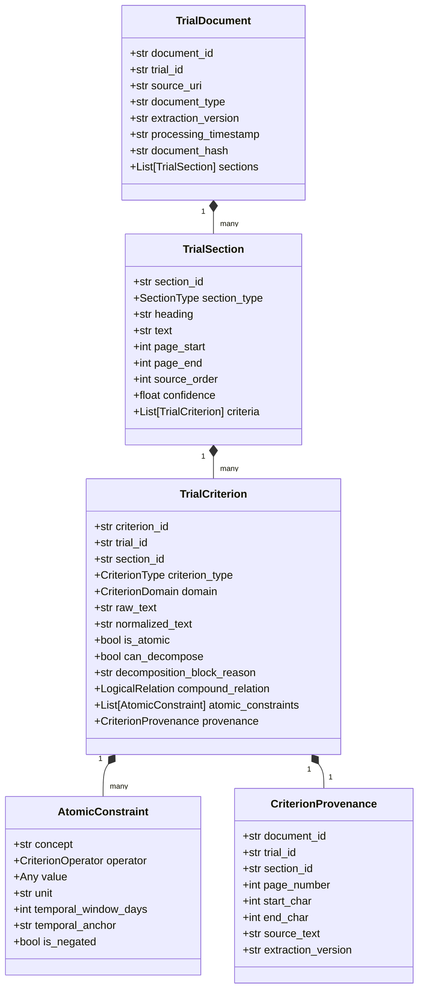

# MedMatch Capstone — Phase 3: Clinical Trial Document Intelligence Report

## Status Summary

- **Phase Status:** `IMPLEMENTATION COMPLETE — AWAITING USER ACCEPTANCE`
- **Primary Objective:** Build a research-grade design and implementation foundation transforming raw clinical-trial documents into structured, atomic, provenance-preserving eligibility criteria.
- **Production Matcher Modification:** **NO** (Strictly preserved existing production matching architecture; no modifications to `matching_service.py`).
- **Research Benchmark Required for Empirical Extraction Metrics:** **YES** (Synthetic development fixture used exclusively for schema validation and testing; empirical accuracy requires double-annotated clinical gold-standard).
- **Phases 4, 5, and 6 Status:** **NOT STARTED**.

---

## 1. Executive Summary & Deliverables

Phase 3 established the core clinical trial document intelligence architecture required for downstream multi-modal retrieval and transparent eligibility reasoning. Raw clinical trial protocol texts and PDFs can now be structured into canonical, schema-validated documents preserving verbatim text spans, page locations, character offsets, standardized section taxonomies, and atomic clinical constraints.

### Core Deliverables Created in Phase 3

1. **Pipeline Audit Documentation:**
   - [`docs/capstone/phase3_document_pipeline_audit.md`](file:///c:/Developers/Sneha/Projects/MEDMATCH_V2/docs/capstone/phase3_document_pipeline_audit.md): Complete audit of existing PDF ingestion, Gemini extraction, Celery tasks, text cleaner, database persistence, and gap analysis.
2. **Canonical Document Intelligence Schemas:**
   - [`scripts/document_schema.py`](file:///c:/Developers/Sneha/Projects/MEDMATCH_V2/scripts/document_schema.py): Pydantic v2 schemas defining `TrialDocument`, `TrialSection`, `TrialCriterion`, `CriterionProvenance`, `AtomicConstraint`, `SectionType`, `CriterionDomain`, `CriterionOperator`, `LogicalRelation`, and `DocumentExtractionContract`.
3. **Atomic Criterion Representation Specification:**
   - [`docs/capstone/criterion_representation_specification.md`](file:///c:/Developers/Sneha/Projects/MEDMATCH_V2/docs/capstone/criterion_representation_specification.md): Formal definition of clinical atomicity, multi-intent decomposition rules, compound relations, and strict safety criteria where automatic decomposition is blocked.
4. **Deterministic Section Normalizer & Classifier:**
   - [`scripts/section_normalizer.py`](file:///c:/Developers/Sneha/Projects/MEDMATCH_V2/scripts/section_normalizer.py): Regex-driven taxonomic section classifier and raw eligibility narrative segmenter with offset preservation.
5. **Document Provenance Specification:**
   - [`docs/capstone/document_provenance_specification.md`](file:///c:/Developers/Sneha/Projects/MEDMATCH_V2/docs/capstone/document_provenance_specification.md): Traceability specification establishing how MedMatch answers "Where exactly did this criterion come from?", handling multi-page protocols and unlocatable OCR offsets without fabrication.
6. **Deterministic Extraction Validator:**
   - [`scripts/validate_document_extraction.py`](file:///c:/Developers/Sneha/Projects/MEDMATCH_V2/scripts/validate_document_extraction.py): Programmatic and CLI validator checking for duplicate IDs, missing IDs, orphan sections, invalid character offsets, polarity mismatches, unsupported operators, and invalid ranges.
7. **Phase 3 Controlled Development Fixture:**
   - [`data/fixtures/phase3/README.md`](file:///c:/Developers/Sneha/Projects/MEDMATCH_V2/data/fixtures/phase3/README.md)
   - [`data/fixtures/phase3/trial_document_fixture.json`](file:///c:/Developers/Sneha/Projects/MEDMATCH_V2/data/fixtures/phase3/trial_document_fixture.json)
   - [`data/fixtures/phase3/document_extraction_contract.json`](file:///c:/Developers/Sneha/Projects/MEDMATCH_V2/data/fixtures/phase3/document_extraction_contract.json)
   - [`data/fixtures/phase3/build_fixture.py`](file:///c:/Developers/Sneha/Projects/MEDMATCH_V2/data/fixtures/phase3/build_fixture.py)
8. **Automated Test Suite (45 New Tests):**
   - [`tests/document_intelligence/test_document_schema.py`](file:///c:/Developers/Sneha/Projects/MEDMATCH_V2/tests/document_intelligence/test_document_schema.py)
   - [`tests/document_intelligence/test_section_normalization.py`](file:///c:/Developers/Sneha/Projects/MEDMATCH_V2/tests/document_intelligence/test_section_normalization.py)
   - [`tests/document_intelligence/test_atomic_criterion.py`](file:///c:/Developers/Sneha/Projects/MEDMATCH_V2/tests/document_intelligence/test_atomic_criterion.py)
   - [`tests/document_intelligence/test_provenance.py`](file:///c:/Developers/Sneha/Projects/MEDMATCH_V2/tests/document_intelligence/test_provenance.py)
   - [`tests/document_intelligence/test_extraction_validator.py`](file:///c:/Developers/Sneha/Projects/MEDMATCH_V2/tests/document_intelligence/test_extraction_validator.py)
9. **Evaluation Design & Metrics Specification:**
   - [`docs/capstone/document_extraction_evaluation.md`](file:///c:/Developers/Sneha/Projects/MEDMATCH_V2/docs/capstone/document_extraction_evaluation.md): Formal design distinguishing implemented validation from future empirical evaluation, specifying section F1, criterion F1, atomicity accuracy, and span overlap metrics.
10. **Error Taxonomy:**
    - [`docs/capstone/document_extraction_error_taxonomy.md`](file:///c:/Developers/Sneha/Projects/MEDMATCH_V2/docs/capstone/document_extraction_error_taxonomy.md): 4-tier failure catalog covering parsing, segmentation, polarity, omission, hallucination, and provenance loss.

---

## 2. Ingestion Pipeline Audit Findings & Baseline

The audit ([`docs/capstone/phase3_document_pipeline_audit.md`](file:///c:/Developers/Sneha/Projects/MEDMATCH_V2/docs/capstone/phase3_document_pipeline_audit.md)) revealed critical provenance bottlenecks in the existing production implementation:
1. **Loss of Document Geometry:** `PDFService.extract_text()` concatenated all pages into a single flat string (`"\n".join(pages)`), discarding page numbers, coordinates, and bounding boxes.
2. **Destructive Text Cleaning:** `TextCleaner.clean()` regex stripped `^page\s+\d+$` lines, permanently erasing pagination indicators from the text buffer.
3. **Flat String Criteria Model:** `TrialExtraction` schema output `inclusion_criteria: list[str]` and `exclusion_criteria: list[str]`. Criteria were unstructured sentences with zero provenance (no page, section, offsets, domain, or atomic decomposition).
4. **Relational Schema Truncation:** The `trial_criteria` table stored only `description: Text`, `criteria_type: INCLUSION|EXCLUSION`, and `trial_id`.

**Phase 3 Solution:** Implemented canonical data structures that model documents as a strict hierarchy (`TrialDocument` $\to$ `TrialSection` $\to$ `TrialCriterion` $\to$ `AtomicConstraint` + `CriterionProvenance`), establishing an immutable downstream contract (`DocumentExtractionContract`) without disrupting current production routes.

---

## 3. Canonical Architecture & Model Definitions

### Schema Hierarchy


---

## 4. Controlled Development Fixture Scenarios

The Phase 3 development fixture ([`data/fixtures/phase3/trial_document_fixture.json`](file:///c:/Developers/Sneha/Projects/MEDMATCH_V2/data/fixtures/phase3/trial_document_fixture.json)) covers 10 canonical document extraction patterns:

1. **Normal Inclusion Criterion:** Histologically confirmed Stage IV non-small cell lung cancer (`NCT02484404_INC_001`).
2. **Normal Exclusion Criterion:** Untreated or symptomatic central nervous system metastases (`NCT02484404_EXC_001`).
3. **Compound Criteria in One Sentence:** Multi-intent criterion ("Age >= 18 years and ECOG <= 1") decomposed into distinct atomic constraints (`NCT02484404_INC_002`).
4. **Numeric Threshold:** Absolute neutrophil count >= 1.5 x 10^9/L with standard units (`NCT02484404_INC_003`).
5. **Temporal Requirement:** Washout window ("No chemotherapy within 28 days prior to Day 1") with `temporal_window_days=28` and `temporal_anchor="prior_to_day_1"` (`NCT02484404_EXC_002`).
6. **Categorical Requirement:** Pregnancy and lactation exclusion with contraceptive compliance (`NCT02484404_EXC_003`).
7. **Criterion with Clinical Ambiguity:** Subjective clinical discretion ("Adequate organ reserve in the opinion of the investigator") marked as `ambiguous` with domain `organ_function` (`NCT02484404_INC_004`).
8. **Criterion Blocked from Decomposition:** Complex conditional clinical logic ("LVEF >= 50% only in patients with prior doxorubicin > 300 mg/m2; otherwise cardiac evaluation not required") marked `can_decompose=False` with explicit clinical rationale (`NCT02484404_INC_005`).
9. **Multi-Page Source Text:** Sections spanning page 1 and page 2 (`page_start=1`, `page_end=2`) with accurate cross-page criterion provenance.
10. **Preserved Character Offsets:** Verifiable `start_char` and `end_char` matching exact substrings of section text.

---

## 5. Verification & Test Results

### 1. Phase 3 Document Intelligence Test Suite
```bash
services\ai-service\.venv\Scripts\python -m pytest tests\document_intelligence -v
```
**Results:** **45 passed in 0.29s** (100% pass rate).
- `test_atomic_criterion.py`: 5 passed
- `test_document_schema.py`: 7 passed
- `test_extraction_validator.py`: 8 passed
- `test_provenance.py`: 4 passed
- `test_section_normalization.py`: 21 passed

### 2. Phase 2 Dataset Test Suite
```bash
services\ai-service\.venv\Scripts\python -m pytest tests\dataset -v
```
**Results:** **17 passed in 0.25s** (100% pass rate). Zero regressions on dataset schemas, splits, fixtures, and manifests.

### 3. Production AI-Service Test Suite
```bash
.venv\Scripts\python -m pytest tests -v  (in services/ai-service)
```
**Results:** **All 45 tests passed** (Zero regressions on production embedding, LLM reasoning, matching API, patient repo, trial repo, security, and Celery tasks).

---

## 6. Known Limitations & Research Boundaries

1. **No External Gold-Standard Benchmark:** The current fixtures are synthetic development fixtures for structural verification. Extraction precision, recall, and F1 cannot be claimed until double-annotated clinical trial protocols are incorporated.
2. **Heuristic Section Segmentation:** Section segmentation relies on deterministic regex matching of common heading patterns. In scans with non-standard formatting or missing headers, heading detection will fall back to `UNKNOWN_AMBIGUOUS`.
3. **Offset Degradation in Legacy PDFs:** For scanned or degraded PDFs where OCR coordinate streams are unavailable, character offsets must default to `-1` (unlocatable) rather than fabricating numbers.
4. **Scope Boundaries Preserved:** No patient information extraction, BM25, hybrid retrieval, RRF, or matching redesign was implemented. Production matching behavior remains untouched.
