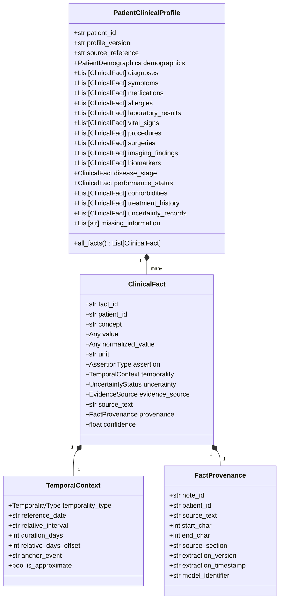

# MedMatch Capstone — Phase 4: Patient Clinical Information Extraction Report

## Status Summary

- **Phase Status:** `IMPLEMENTATION COMPLETE — AWAITING USER ACCEPTANCE`
- **Primary Objective:** Build a research-grade design and implementation foundation for transforming raw patient notes into structured, atomic, temporally-anchored, uncertainty-aware, and provenance-preserving clinical profiles.
- **Production Matcher Modification:** **NO** (Strictly preserved existing production matching architecture; no modifications to `matching_service.py`).
- **Research Benchmark Required for Empirical Extraction Metrics:** **YES** (Synthetic development fixture used exclusively for schema validation and testing; empirical accuracy requires double-annotated clinical gold standard).
- **Phases 5 and 6 Status:** **NOT STARTED**.

---

## 1. Executive Summary & Deliverables

Phase 4 establishes the core patient clinical information intelligence architecture required for downstream multi-modal retrieval and transparent eligibility reasoning. Free-text patient notes and clinic encounters can now be transformed into structured clinical profiles preserving verbatim text spans, note references, character offsets, non-collapsing epistemic states, and temporal context.

### Core Deliverables Created in Phase 4

1. **Patient Data Pipeline Audit:**
   - [`docs/capstone/phase4_patient_pipeline_audit.md`](file:///c:/Developers/Sneha/Projects/MEDMATCH_V2/docs/capstone/phase4_patient_pipeline_audit.md): In-depth audit tracing patient data from frontend ingestion to database models, vector embedding, and Gemini prompt formatting, identifying key gaps in temporal reasoning, uncertainty, and provenance.
2. **Canonical Patient Clinical Profile Schemas:**
   - [`scripts/patient_schema.py`](file:///c:/Developers/Sneha/Projects/MEDMATCH_V2/scripts/patient_schema.py): Pydantic v2 schemas defining `PatientClinicalProfile`, `ClinicalFact`, `FactProvenance`, `TemporalContext`, `PatientDemographics`, `PatientExtractionContract`, `AssertionType`, `TemporalityType`, `UncertaintyStatus`, and `EvidenceSource`.
3. **Temporal Representation Specification:**
   - [`docs/capstone/patient_temporal_representation.md`](file:///c:/Developers/Sneha/Projects/MEDMATCH_V2/docs/capstone/patient_temporal_representation.md): Formal temporal model establishing explicit current vs. historical classification, relative intervals (e.g., "27 days ago"), event anchors, and prohibition against false absolute date conversion.
4. **Uncertainty & Negation Specification:**
   - [`docs/capstone/patient_uncertainty_specification.md`](file:///c:/Developers/Sneha/Projects/MEDMATCH_V2/docs/capstone/patient_uncertainty_specification.md): Epistemic taxonomy establishing non-collapsing semantics for `KNOWN`, `UNKNOWN`, `NOT_MENTIONED`, `UNCERTAIN`, `CONFLICTING`, `PATIENT_REPORTED`, and `CLINICIAN_DOCUMENTED`, preventing the dangerous "absence of evidence is evidence of absence" fallacy.
5. **Patient Information Provenance Specification:**
   - [`docs/capstone/patient_information_provenance.md`](file:///c:/Developers/Sneha/Projects/MEDMATCH_V2/docs/capstone/patient_information_provenance.md): Traceability specification answering "Where did this patient fact come from?", handling character offsets without fabrication.
6. **Modular Extraction Interface:**
   - [`scripts/patient_extractor.py`](file:///c:/Developers/Sneha/Projects/MEDMATCH_V2/scripts/patient_extractor.py): Pluggable `BasePatientExtractor` and `RuleBasedResearchExtractor` defining an independent research extraction boundary without altering production matching.
7. **Deterministic Profile Validator:**
   - [`scripts/validate_patient_profile.py`](file:///c:/Developers/Sneha/Projects/MEDMATCH_V2/scripts/validate_patient_profile.py): Programmatic and CLI validator enforcing referential integrity, unique fact IDs, character offset alignment, negation/value consistency, unit syntax, and demographic bounds.
8. **Phase 4 Controlled Development Fixture:**
   - [`data/fixtures/phase4/README.md`](file:///c:/Developers/Sneha/Projects/MEDMATCH_V2/data/fixtures/phase4/README.md)
   - [`data/fixtures/phase4/patient_clinical_profile_fixture.json`](file:///c:/Developers/Sneha/Projects/MEDMATCH_V2/data/fixtures/phase4/patient_clinical_profile_fixture.json)
   - [`data/fixtures/phase4/patient_extraction_contract.json`](file:///c:/Developers/Sneha/Projects/MEDMATCH_V2/data/fixtures/phase4/patient_extraction_contract.json)
   - [`data/fixtures/phase4/build_fixture.py`](file:///c:/Developers/Sneha/Projects/MEDMATCH_V2/data/fixtures/phase4/build_fixture.py)
9. **Automated Test Suite (31 New Tests):**
   - [`tests/patient_information/test_patient_schema.py`](file:///c:/Developers/Sneha/Projects/MEDMATCH_V2/tests/patient_information/test_patient_schema.py) (6 tests)
   - [`tests/patient_information/test_clinical_fact.py`](file:///c:/Developers/Sneha/Projects/MEDMATCH_V2/tests/patient_information/test_clinical_fact.py) (6 tests)
   - [`tests/patient_information/test_temporal_representation.py`](file:///c:/Developers/Sneha/Projects/MEDMATCH_V2/tests/patient_information/test_temporal_representation.py) (5 tests)
   - [`tests/patient_information/test_uncertainty_and_missing.py`](file:///c:/Developers/Sneha/Projects/MEDMATCH_V2/tests/patient_information/test_uncertainty_and_missing.py) (4 tests)
   - [`tests/patient_information/test_patient_provenance.py`](file:///c:/Developers/Sneha/Projects/MEDMATCH_V2/tests/patient_information/test_patient_provenance.py) (4 tests)
   - [`tests/patient_information/test_profile_validator.py`](file:///c:/Developers/Sneha/Projects/MEDMATCH_V2/tests/patient_information/test_profile_validator.py) (6 tests)
10. **Evaluation Design & Metrics Specification:**
    - [`docs/capstone/patient_extraction_evaluation.md`](file:///c:/Developers/Sneha/Projects/MEDMATCH_V2/docs/capstone/patient_extraction_evaluation.md): Formal design distinguishing structural validation from empirical evaluation (specifying fact F1, assertion F1, negation inversion error rate, temporality MAE, and uncertainty classification F1).
11. **Error Taxonomy:**
    - [`docs/capstone/patient_extraction_error_taxonomy.md`](file:///c:/Developers/Sneha/Projects/MEDMATCH_V2/docs/capstone/patient_extraction_error_taxonomy.md): 4-tier failure catalog covering omission, hallucination, negation inversion, washout calculation errors, and uncertainty collapse.

---

## 2. Canonical Architecture & Model Definitions

### Patient Profile & Fact Hierarchy


---

## 3. Controlled Development Fixture Scenarios

The Phase 4 development fixture ([`data/fixtures/phase4/patient_clinical_profile_fixture.json`](file:///c:/Developers/Sneha/Projects/MEDMATCH_V2/data/fixtures/phase4/patient_clinical_profile_fixture.json)) covers all 16 required clinical scenarios:

1. **Positive Diagnosis:** Histologically confirmed non-small cell lung cancer adenocarcinoma (`FACT_001`).
2. **Negated Diagnosis:** Active brain or leptomeningeal metastases explicitly ruled out on MRI (`FACT_002`).
3. **Historical Diagnosis:** Childhood asthma resolved 15 years ago (`FACT_003`).
4. **Current Medication:** Amlodipine 5mg daily for blood pressure control (`FACT_004`).
5. **Historical Medication:** Carboplatin/Pemetrexed completed first-line chemotherapy (`FACT_005`).
6. **Laboratory Result with Unit:** Absolute neutrophil count (ANC) 2.1 x 10^9/L (`FACT_006`).
7. **Biomarker Status:** EGFR exon 19 deletion detected (`FACT_007`).
8. **Missing Information:** Explicitly cataloged unmentioned oncology variable (PD-L1 status not stated) (`missing_information`).
9. **Uncertain Information:** Suspicious adrenal nodule, indeterminate on CT (`FACT_008`).
10. **Conflicting Evidence:** Discrepant pleural effusion documentation across reports (`FACT_009`).
11. **Temporal Event:** Definite calendar date for primary resection on 2025-11-10 (`FACT_010`).
12. **Relative Temporal Statement:** Completed stereotactic radiation 27 days ago (`FACT_011`).
13. **Patient-Reported Information:** Patient reports mild penicillin allergy in childhood (`FACT_012`).
14. **Clinician-Documented Information:** Oncologist documented ECOG performance status 1 (`FACT_013`).
15. **Multiple Facts in One Sentence:** Single sentence yielding stage, histology, and smoking status (`FACT_014`, `FACT_015`).
16. **Ambiguous Clinical Statement:** Subjective clinical discretion ("Fair general condition") marked `uncertain` (`FACT_016`).

---

## 4. Verification & Test Results

### 1. Phase 4 Patient Information Test Suite
```bash
services\ai-service\.venv\Scripts\python -m pytest tests\patient_information -v
```
**Results:** **31 passed in 0.27s** (100% pass rate).
- `test_clinical_fact.py`: 6 passed
- `test_patient_provenance.py`: 4 passed
- `test_patient_schema.py`: 6 passed
- `test_profile_validator.py`: 6 passed
- `test_temporal_representation.py`: 5 passed
- `test_uncertainty_and_missing.py`: 4 passed

### 2. Phase 3 Document Intelligence Test Suite
```bash
services\ai-service\.venv\Scripts\python -m pytest tests\document_intelligence -v
```
**Results:** **45 passed in 0.29s** (100% pass rate; zero regressions).

### 3. Phase 2 Dataset Test Suite
```bash
services\ai-service\.venv\Scripts\python -m pytest tests\dataset -v
```
**Results:** **17 passed in 0.25s** (100% pass rate; zero regressions).

### 4. Production AI-Service Test Suite
```bash
.venv\Scripts\python -m pytest tests -v  (in services/ai-service)
```
**Results:** **45 passed in 52.34s** (100% pass rate; zero regressions on embeddings, LLM reasoning, matching API, tenant isolation, and Celery tasks).

---

## 5. Known Limitations & Research Boundaries

1. **Synthetic Development Fixture:** The Phase 4 fixture is engineered solely for deterministic schema and validator testing. It is **NOT** a clinical research benchmark.
2. **No Empirical Extraction Claims:** No extraction precision, recall, or F1 scores are claimed at this stage. Empirical benchmarking requires a clinically verified, double-annotated corpus.
3. **Unmapped EHR Offsets:** When legacy scanned notes or aggregated EHR exports lack token coordinate streams, character offsets are explicitly set to `-1` (unmapped) to prevent offset fabrication.
4. **Scope Boundaries Preserved:** No patient NER, clinical trial ranking, BM25, hybrid retrieval, RRF, or matching redesign was implemented. Production matching behavior remains untouched.
