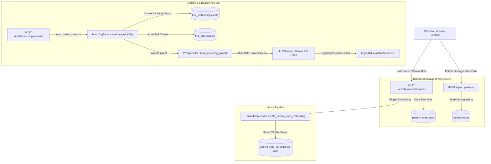

# MedMatch Capstone — Phase 4: Patient Clinical Information Pipeline Audit

## 1. Executive Summary & Audit Scope

This document provides a comprehensive audit of the patient data flow, data models, APIs, and clinical reasoning pipelines within the MedMatch repository.

The audit traces patient data from ingestion through database persistence, vector embedding, and language model evaluation, identifying structural coverage, information gaps, temporal limitations, uncertainty handling, and provenance preservation.

> [!IMPORTANT]
> **Production Preservation Rule:**
> In accordance with capstone safety rules, this audit is non-destructive. No production routes or schemas were altered.

---

## 2. End-to-End Current Patient Pipeline Flow

The current MedMatch system processes patient information through the following pipeline:

---

## 3. Structural Data Coverage vs. Free-Text Dependence

| Clinical Dimension | Currently Structured in DB | Exists Only in Free-Text Notes | Notes / Evidence in Codebase |
| :--- | :---: | :---: | :--- |
| **Demographics (Age, Gender)** | YES | — | Stored in `patients.age` (Integer) and `patients.gender` (String(20)). |
| **MRN & Identifiers** | YES | — | Stored in `patients.mrn` with unique constraint `(hospital_id, mrn)`. |
| **Primary Diagnosis & Stage** | YES (Basic) | YES (Detailed) | `patients.diagnosis` (String(255)), `cancer_type` (String(255)), and `stage` (String(50)) provide broad labels only. |
| **Histology / Cytology** | NO | YES | Found only within narrative clinical text in `patient_notes.note`. |
| **Biomarkers & Genomics** | NO | YES | Critical oncology markers (e.g., EGFR, ALK, KRAS, PD-L1 TPS) exist exclusively as free-text narrative. |
| **Prior Therapies & Regimens** | NO | YES | Prior systemic therapies, surgery dates, and radiation courses are unstructured. |
| **Washout Windows / Intervals** | NO | YES | E.g., "no chemotherapy within 28 days" requires free-text parsing. |
| **Laboratory Values** | NO | YES | ANC, platelet count, creatinine, total bilirubin, AST/ALT exist solely in clinical notes. |
| **Performance Status (ECOG/KPS)** | NO | YES | Performance scores (e.g., ECOG 0-1) are embedded in narrative notes. |
| **Organ Function & Cardiac Metrics** | NO | YES | LVEF, QTc interval, and pulmonary metrics are unstructured. |
| **Comorbidities & Active Infections** | NO | YES | HIV, Hepatitis B/C, and CNS metastases are mentioned only in notes. |
| **Concomitant Medications** | NO | YES | Prohibited concurrent medications are unstructured. |
| **Allergies & Contraindications** | NO | YES | Drug allergies and treatment contraindications are unparsed. |

---

## 4. Key Limitations & Research Gaps

### 1. Disconnect Between Patient Entity and Matching Pipeline
In `MatchingService.evaluate_eligibility` (`services/ai-service/app/services/matching_service.py:503-605`), the matching API takes a raw `patient_note: str`. The structured fields in the `Patient` model (`age`, `gender`, `cancer_type`, `stage`) are **not passed into the retrieval or LLM prompt**. The pipeline relies 100% on whatever the clinician re-types or pastes into the `patient_note` parameter.

### 2. Zero Temporal Representation
Neither the `Patient` nor `PatientNote` schemas support temporal reasoning:
- No field records disease progression dates, treatment stop dates, or washout timing.
- Relative temporal statements (e.g., "completed carboplatin/pemetrexed 3 weeks ago") cannot be evaluated against trial washout requirements without manual or LLM guesswork.
- Historical conditions (e.g., "childhood asthma, resolved") risk being conflated with active exclusion criteria.

### 3. Complete Absence of Uncertainty Modeling
Current clinical representations operate under a naive closed-world or binary paradigm:
- The system cannot distinguish between:
  1. Condition explicitly affirmed (e.g., "Patient has brain metastases").
  2. Condition explicitly negated (e.g., "No brain metastases on MRI").
  3. Condition suspected / uncertain (e.g., "Possible leptomeningeal disease, MRI pending").
  4. Condition not mentioned / unknown (e.g., Note says nothing about brain metastases).
- Under the current prompt, if a marker or condition is not mentioned in the note, the LLM either places it in `missing_information` or makes an unverified assumption.

### 4. Zero Provenance Attribution
When Gemini outputs an `EligibilityResponse`:
- It provides a text summary and string arrays of `matched_inclusion`, `failed_inclusion`, `triggered_exclusion`.
- There is **no link** back to the exact sentence, line, or character span of the patient note that triggered the decision.
- Clinical auditability is impossible without manual re-reading of the entire patient chart.

### 5. Multi-Tenant Isolation Analysis
- Tenant isolation is strictly enforced at the repository and service levels using `hospital_id`.
- `PatientRepository` and `PatientNoteRepository` filter every database query by `hospital_id`.
- `MatchingService._validate_user_hospital` validates JWT claims against the requested resource.
- Any future patient clinical information extraction architecture must preserve this strict tenant boundary.

---

## 5. Phase 4 Objectives & Architecture Roadmap

To address these research gaps without destabilizing production, Phase 4 establishes:
1. **Canonical Patient Clinical Profile (`PatientClinicalProfile`):** Modular Pydantic schema representing structured oncology concepts.
2. **Clinical Fact Model (`ClinicalFact`):** Atomic fact representation supporting concept, normalized value, unit, assertion, temporality, and uncertainty.
3. **Formal Temporal Representation:** Explicit current vs. historical status, date anchors, and relative intervals.
4. **Uncertainty & Negation Semantics:** Non-collapsing states for affirmed, negated, uncertain, conflicting, patient-reported, and unmentioned facts.
5. **Traceable Fact Provenance:** Source note ID, character spans, and extraction metadata.
6. **Deterministic Profile Validation:** Automated validation enforcing clinical schema rules and flagging contradictions.
7. **Controlled Development Fixtures & Test Suites:** Synthetic fixtures and automated test suites verifying all edge cases.
