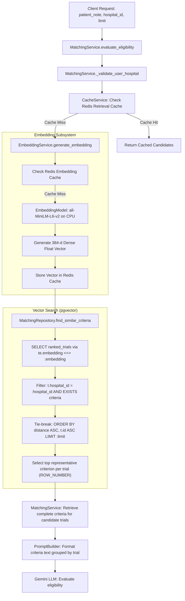

# MedMatch Capstone — Phase 5: Retrieval Engine Pipeline Audit

## 1. Executive Summary & Audit Scope

This audit examines the retrieval layer of the MedMatch platform across all architectural levels: query ingestion, embedding generation, vector persistence, similarity scoring, candidate ranking, tenant isolation, and downstream handoff to language models.

> [!IMPORTANT]
> **Production Preservation Rule:**
> In accordance with capstone research guidelines, this audit is strictly non-destructive. No production routes, database tables, or matching routines were altered.

---

## 2. End-to-End Current Retrieval Flow (Baseline E0)

---

## 3. Systematic Architectural Findings

### 1. Query Representation & Ingestion Flow
- **Input:** Unstructured free-text clinical note (`patient_note: str`, minimum 10 characters).
- **Transformation:** The string is stripped of leading/trailing whitespace (`text.strip()`) but receives **zero clinical entity normalization, query expansion, or keyword extraction**.
- **Limitation:** A 500-word clinical note containing multiple diagnoses, past medications, and lab values is compressed into a single 384-dimensional vector. High-frequency narrative prose dilutes the dense representation of rare but decisive eligibility keywords (e.g., specific genetic mutations like `EGFR T790M`).

### 2. Embedding Model & Vector Space
- **Model:** `sentence-transformers/all-MiniLM-L6-v2` loaded locally via `EmbeddingModel` singleton.
- **Dimensionality:** 384 dimensions (`pgvector.sqlalchemy.Vector(384)`).
- **Device:** CPU inference using thread-safe singleton lock.
- **Limitation:** `all-MiniLM-L6-v2` is a general-domain English sentence embedder trained on web sentence pairs. It was not fine-tuned on biomedical literature (such as BioBERT, PubMedBERT, or MedCPT), leading to known semantic drift on complex medical nomenclature, abbreviations, and clinical numbers.

### 3. Database Schema & Storage (pgvector)
- **Tables:**
  - `trial_embeddings`: `(id UUID, trial_id UUID, embedding vector(384), model_name varchar(100), created_at, updated_at)`.
  - `criteria_embeddings`: `(id UUID, criteria_id UUID, embedding vector(384), model_name varchar(100), created_at)`.
- **Foreign Keys:** Cascading foreign key to `trials.id` and `trial_criteria.id`.

### 4. Similarity Metric & Distance Interpretation
- **Metric:** Cosine distance operator `<=>` in pgvector:
  $$\text{distance}(u, v) = 1 - \frac{u \cdot v}{\|u\|_2 \|v\|_2}$$
- **Range:** $[0.0, 2.0]$, where $0.0$ indicates identical direction, $1.0$ indicates orthogonal vectors, and $2.0$ indicates opposing directions.
- **Ordering:** Strictly ascending (`ORDER BY distance ASC`), meaning lower distance is higher relevance.

### 5. Indexing & Computational Complexity
- **Existing Indexes:**
  - `ix_trial_embeddings_trial_id` (Unique B-tree).
  - `ix_criteria_embeddings_criteria_id` (Unique B-tree).
- **Vector Index Status:** **ABSENT**. There is neither an HNSW index nor an IVFFlat index on either table.
- **Execution Mechanism:** Every retrieval query performs a sequential scan (brute-force exact kNN) over all trials belonging to `hospital_id`.
- **Performance Characteristics:** Highly accurate (100% recall with no ANN approximations), but computational complexity scales linearly: $O(N \cdot D)$, where $N$ is the number of hospital trials and $D = 384$.

### 6. Candidate Filtering & Top-K Logic
- **Two-Stage Ranking in SQL:**
  1. `ranked_trials` selects the top $K$ trials (default $K=10$, clamped between 1 and 100) based on `te.embedding <=> :embedding`.
  2. `ranked_criteria` joins `criteria_embeddings` and partitions by `trial_id`, returning the single most similar criterion (`criterion_rank = 1`) per candidate trial.
- **Deduplication:** Guaranteed exactly one criterion per trial in the preliminary result set.

### 7. Tenant Isolation & Security
- **Defense in Depth:**
  1. `MatchingService._validate_user_hospital`: Enforces that `current_user["hospital_id"] == hospital_id`.
  2. SQL Query: `WHERE t.hospital_id = :hospital_id` prevents cross-tenant access at the database level.
  3. Redis Caching: Cache keys are tenant-isolated (`f"{hospital_id}:{patient_note}"`).

### 8. Handoff to Eligibility Reasoning
- **Handoff Mechanism:** Once candidate trials are retrieved via top-K vector search, `MatchingService._get_complete_trial_criteria` retrieves **every** inclusion and exclusion criterion belonging to those candidate trials from `trial_criteria`.
- **Prompt Construction:** `PromptBuilder.build_matching_prompt` groups all criteria by trial and passes them alongside `patient_note` to Gemini.

---

## 4. Research Gaps & Deficiencies of Baseline E0

| Research Dimension | Current Production Baseline (E0) | Research Deficiency / Opportunity |
| :--- | :--- | :--- |
| **Query Formulation** | Raw unstructured note text embedded directly. | Whole-note embedding loses granular entity signal; needs structured fact / keyword query extraction (E1). |
| **Lexical Matching** | None. Pure dense vector search. | Fails on exact medical acronyms, gene variants (e.g. `EGFR L858R`), and clinical drug codes (E2). |
| **Hybrid Fusion** | None. | Cannot balance semantic breadth with exact keyword matching (E3). |
| **Reranking** | None. Output is sorted solely by cosine distance. | Dense distance does not capture cross-attention alignment between patient traits and trial criteria (E4). |
| **ANN Indexing** | Sequential scan (No HNSW/IVFFlat). | Adequate for small fixtures; requires HNSW design for large-scale benchmarks. |
| **Criterion Provenance** | Returns DB UUID and description. | Does not link back to source PDF pages or character offsets established in Phase 3. |

---

## 5. Architectural Boundaries & Safe Extension Points

1. **Production Matcher Remains Protected:** Production routes (`/matching/`, `/matching/evaluate`) continue using `MatchingService` and `MatchingRepository` without disruption.
2. **Pluggable Research Boundary:** Phase 5 introduces canonical retrieval contracts (`RetrievalRequest`, `RetrievalResult`, `RetrievalContract`) and pluggable retrievers (`DenseRetriever`, `LexicalRetriever`, `HybridRetriever`, `RerankingRetriever`) in `scripts/retrieval_engine.py` and `scripts/retrieval_evaluation.py`.
3. **No Upstream/Downstream Scope Creep:** No changes to Gemini reasoning prompts or Phase 4 patient extraction models.
