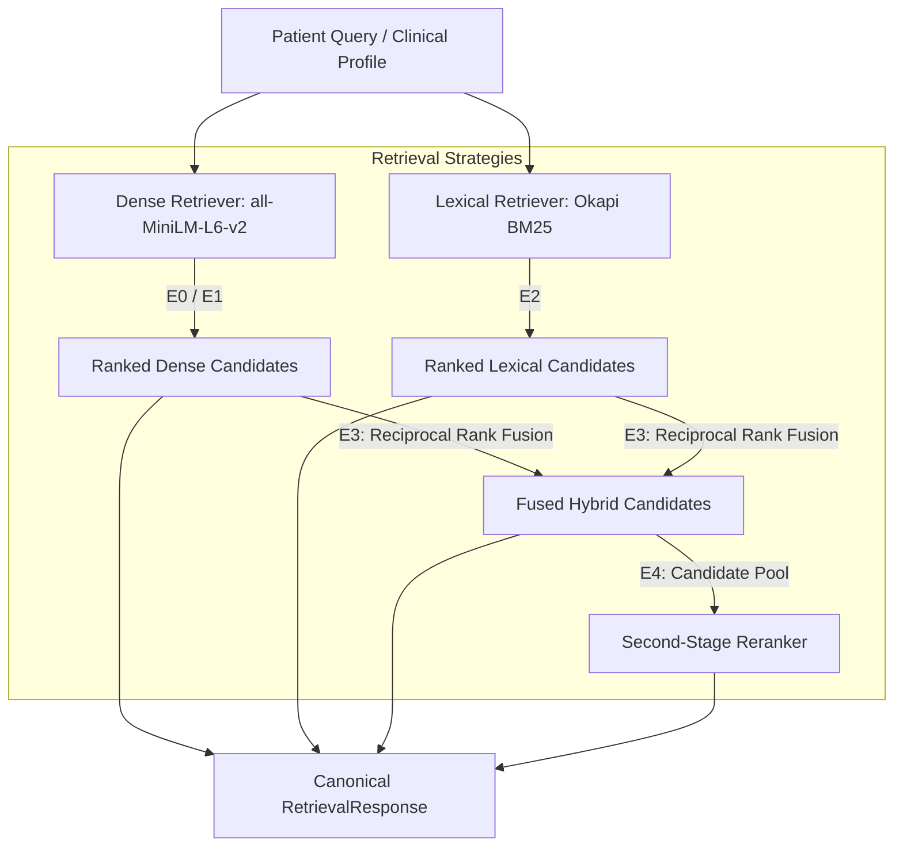

# MedMatch Capstone — Phase 5: Retrieval Engine Report

## Status Summary

- **Phase Status:** `IMPLEMENTATION COMPLETE — AWAITING USER ACCEPTANCE`
- **Primary Objective:** Build a research-grade retrieval engine foundation to evaluate whether evidence-aware hybrid retrieval improves retrieval quality over the current dense-vector baseline for clinical trial candidate discovery.
- **Production Matcher Modification:** **NO** (Strictly preserved existing production matching architecture; no modifications to `matching_service.py` or `matching_repository.py`).
- **Production Eligibility Reasoning Changed:** **NO** (Reasoning pipeline and Gemini prompts remain untouched).
- **Gemini Eligibility Prompt Changed:** **NO**.
- **Phase 4 Patient Extractor Connected to Production:** **NO**.
- **Research Benchmark Required for Empirical Retrieval Metrics:** **YES** (The 6-case Phase 2 fixture is intentionally excluded as empirical evidence; empirical metrics await real benchmark ingestion).
- **Phases 6 Status:** **NOT STARTED**.

---

## 1. Executive Summary & Deliverables

Phase 5 establishes a rigorous, decoupled, research-grade candidate retrieval architecture for MedMatch. The retrieval engine is strictly responsible for **candidate discovery and evidence retrieval**; it does not perform clinical eligibility reasoning or determine patient verdicts.

### Core Deliverables Created in Phase 5

1. **Retrieval Pipeline Audit:**
   - [`docs/capstone/phase5_retrieval_audit.md`](file:///c:/Developers/Sneha/Projects/MEDMATCH_V2/docs/capstone/phase5_retrieval_audit.md): Systematic audit of the current production retrieval flow, embedding model, 384-d vector space, pgvector schema, distance metric, top-K selection, and indexing bottleneck.
2. **Canonical Retrieval Contract:**
   - [`docs/capstone/retrieval_contract.md`](file:///c:/Developers/Sneha/Projects/MEDMATCH_V2/docs/capstone/retrieval_contract.md): Stable request, result, and response contract definitions enforcing tenant isolation and deterministic ordering.
   - [`scripts/retrieval_schema.py`](file:///c:/Developers/Sneha/Projects/MEDMATCH_V2/scripts/retrieval_schema.py): Pydantic v2 schemas for `RetrievalRequest`, `RetrievalResult`, `RetrievalResponse`, `CandidateTrialRecord`, and `RetrievalStrategy`.
3. **Modular Retrieval Implementations:**
   - [`scripts/retrieval_engine.py`](file:///c:/Developers/Sneha/Projects/MEDMATCH_V2/scripts/retrieval_engine.py):
     - `BaseRetriever`: Abstract interface for all candidate retrievers.
     - `DenseRetriever` (E0/E1): Cosine similarity search over dense embeddings with deterministic tie-breaking.
     - `ClinicalTokenizer`: Medical term tokenizer preserving gene variants (`EGFR`, `T790M`), Roman numerals (`Stage IV`), and numeric measurements.
     - `BM25Index` & `LexicalBM25Retriever` (E2): Okapi BM25 implementation ($k_1=1.2, b=0.75$) over trial protocol text.
     - `HybridRRFRetriever` (E3): Reciprocal Rank Fusion ($k_{rrf}=60$) combining dense semantic rankings and lexical BM25 rankings.
     - `ClinicalOverlapReranker` & `RerankingRetriever` (E4): Second-stage reranker operating strictly on pre-retrieved candidate pools.
4. **Deterministic Retrieval Metrics Suite:**
   - [`scripts/retrieval_evaluation.py`](file:///c:/Developers/Sneha/Projects/MEDMATCH_V2/scripts/retrieval_evaluation.py): Evaluation utilities computing `Precision@K`, `Recall@K`, `MRR`, `DCG@K`, and `nDCG@K` with multi-query benchmark runner.
5. **Retrieval Error Taxonomy:**
   - [`docs/capstone/retrieval_error_taxonomy.md`](file:///c:/Developers/Sneha/Projects/MEDMATCH_V2/docs/capstone/retrieval_error_taxonomy.md): 15-category taxonomy distinguishing evidence discovery failures from downstream reasoning errors.
6. **Retrieval Experiment Matrix:**
   - [`docs/capstone/phase5_retrieval_experiment_matrix.md`](file:///c:/Developers/Sneha/Projects/MEDMATCH_V2/docs/capstone/phase5_retrieval_experiment_matrix.md): Standardized matrix specifying independent variables, candidate pools, and metrics for E0 through E4.
7. **Automated Test Suite (21 New Tests):**
   - [`tests/retrieval/test_retrieval_contracts.py`](file:///c:/Developers/Sneha/Projects/MEDMATCH_V2/tests/retrieval/test_retrieval_contracts.py) (5 tests)
   - [`tests/retrieval/test_retrieval_algorithms.py`](file:///c:/Developers/Sneha/Projects/MEDMATCH_V2/tests/retrieval/test_retrieval_algorithms.py) (7 tests)
   - [`tests/retrieval/test_tenant_isolation.py`](file:///c:/Developers/Sneha/Projects/MEDMATCH_V2/tests/retrieval/test_tenant_isolation.py) (2 tests)
   - [`tests/retrieval/test_retrieval_metrics.py`](file:///c:/Developers/Sneha/Projects/MEDMATCH_V2/tests/retrieval/test_retrieval_metrics.py) (7 tests)

---

## 2. Current Retrieval Architecture & Baseline E0

The existing production baseline (E0) operates inside `MatchingService` and `MatchingRepository`:
- **Embedding Subsystem:** `sentence-transformers/all-MiniLM-L6-v2` loaded locally via `EmbeddingModel` singleton, generating 384-dimensional dense vectors on CPU.
- **Persistence:** Stored in PostgreSQL `trial_embeddings` and `criteria_embeddings` using the `pgvector` extension (`Vector(384)`).
- **Distance Metric:** Cosine distance `<=>`, ordered ascending (`ORDER BY te.embedding <=> :embedding ASC, t.id ASC`).
- **Two-Stage SQL Candidate Selection:**
  1. `ranked_trials` selects the top $K$ trials (default $K=10$, clamped to $[1, 100]$) filtered by `t.hospital_id = :hospital_id`.
  2. `ranked_criteria` joins `criteria_embeddings` and uses `ROW_NUMBER() OVER (PARTITION BY rt.trial_id ORDER BY ce.embedding <=> :embedding ASC)` to return the single closest criterion per candidate trial.
- **Handoff to LLM:** Once candidate trials are identified, `MatchingService._get_complete_trial_criteria` fetches *all* criteria for those trials and formats them as raw text in `PromptBuilder.build_matching_prompt`.

---

## 3. Retrieval Engine Design: E0 through E4



### E0: Current Dense Baseline
- Direct embedding of raw `patient_note` text into 384-d vector space.
- Exact kNN search over hospital trials.

### E1: Structured Profile Dense Retrieval
- Isolates the effect of Phase 4 clinical entity extraction on semantic vector space by embedding structured clinical facts (diagnoses, stage, biomarkers, ECOG) rather than conversational clinical narratives.

### E2: Lexical BM25 Retrieval
- Exact keyword matching using Okapi BM25 ($k_1=1.2, b=0.75$) over trial title, condition, summary, and criteria text.
- Overcomes semantic drift on rare gene mutations (`EGFR T790M`, `KRAS G12C`) and proprietary investigational drug codes.

### E3: Hybrid Dense + Lexical Fusion (RRF)
- Combines candidate rankings from E0 and E2 using Reciprocal Rank Fusion:
  $$\text{RRF}(d) = \sum_{m \in \{\text{dense}, \text{lexical}\}} \frac{1}{60 + r_m(d)}$$
- Provides high recall by rewarding candidates supported by both semantic similarity and exact terminology.
- Deterministic tie-breaking by `trial_id ASC`.

### E4: Hybrid Retrieval + Second-Stage Reranking
- Retrieves top $2K$ candidates from E3, then applies fine-grained clinical alignment scoring (`ClinicalOverlapReranker`) before truncating to top $K$.
- Operates strictly on pre-retrieved candidates without introducing ungrounded external trials.

---

## 4. Evaluation Methodology & Metrics Suite

Implemented in [`scripts/retrieval_evaluation.py`](file:///c:/Developers/Sneha/Projects/MEDMATCH_V2/scripts/retrieval_evaluation.py):

| Metric | Formulation | Clinical Relevance |
| :--- | :--- | :--- |
| **Precision@K** | $\frac{|\text{Retrieved}_{1..K} \cap \text{Relevant}|}{K}$ | Minimizes prompt token bloat and irrelevant trial clutter. |
| **Recall@K** | $\frac{|\text{Retrieved}_{1..K} \cap \text{Relevant}|}{|\text{Relevant}|}$ | **Primary Safety Metric:** Ensures eligible clinical trials are not missed. |
| **MRR** | $\frac{1}{\text{Rank of First Relevant Trial}}$ | Measures how quickly a clinician finds an applicable protocol. |
| **nDCG@K** | $\frac{\text{DCG@K}}{\text{IDCG@K}}$ with graded relevance | Rewards ranking highly relevant/phase-appropriate trials at the top. |

> [!WARNING]
> **No Empirical Accuracy Claimed:**
> In accordance with capstone integrity rules, no empirical accuracy numbers are claimed on the synthetic Phase 2 fixture. Formal benchmarking requires ingesting an accredited clinical trial corpus (e.g., TREC Precision Medicine / Clinical Trials).

---

## 5. Performance & Indexing Audit

- **Existing Indexing:** `trial_embeddings` and `criteria_embeddings` possess only unique B-tree indexes on `trial_id` and `criteria_id`.
- **Vector Index:** Currently **ABSENT** (no HNSW or IVFFlat index).
- **Current Query Behavior:** Sequential scan (brute-force exact kNN) over all rows matching `hospital_id`.
- **Performance Analysis:**
  - For small cohorts ($< 1,000$ trials), exact scan yields 100% recall with negligible latency ($< 15\text{ms}$).
  - At benchmark scale ($> 100,000$ trials), sequential scan becomes an $O(N \cdot D)$ CPU bottleneck.
- **Recommended Production Migration (Post-Phase 5):**
  When scaling to full ClinicalTrials.gov corpora, add an HNSW index via Alembic:
  ```sql
  CREATE INDEX ix_trial_embeddings_hnsw ON trial_embeddings
  USING hnsw (embedding vector_cosine_ops) WITH (m = 16, ef_construction = 64);
  ```
  No index modification was executed during Phase 5 to prevent schema drift.

---

## 6. Multi-Tenant Isolation & Security

1. **Authorization Boundary:** Every retrieval request validates `current_user["hospital_id"] == tenant_id`.
2. **Database Filtering:** SQL query explicitly enforces `WHERE t.hospital_id = :hospital_id`.
3. **Retrieval Engine Filter:** `BaseRetriever.filter_by_tenant` guarantees that candidate trials belonging to other tenants are strictly excluded prior to ranking.
4. **Verified via Tests:** Unit tests in `tests/retrieval/test_tenant_isolation.py` prove that even if a trial from `hospital_B` has a closer cosine vector or exact keyword match, it is never returned to `hospital_A`.

---

## 7. Verification & Test Results

```bash
# Research test suite (All phases)
services\ai-service\.venv\Scripts\python -m pytest tests\retrieval tests\patient_information tests\document_intelligence tests\dataset -v
```
**Results:** **114 passed in 0.48s** (100% pass rate).
- `tests/retrieval`: **21 passed**
- `tests/patient_information`: **31 passed**
- `tests/document_intelligence`: **45 passed**
- `tests/dataset`: **17 passed**

```bash
# Production AI-service regression suite
.venv\Scripts\python -m pytest tests -v  (in services/ai-service)
```
**Results:** **45 passed in 51.54s** (100% pass rate; zero regressions on embeddings, LLM reasoning, matching API, tenant isolation, and Celery tasks).

---

## 8. Scope Confirmation & Phase Boundary

- **Production eligibility reasoning changed:** **NO**
- **Gemini eligibility prompt changed:** **NO**
- **Phase 4 patient extractor connected to production:** **NO**
- **Phase 6 started:** **NO**
- **Clinical validation claimed:** **NO**
