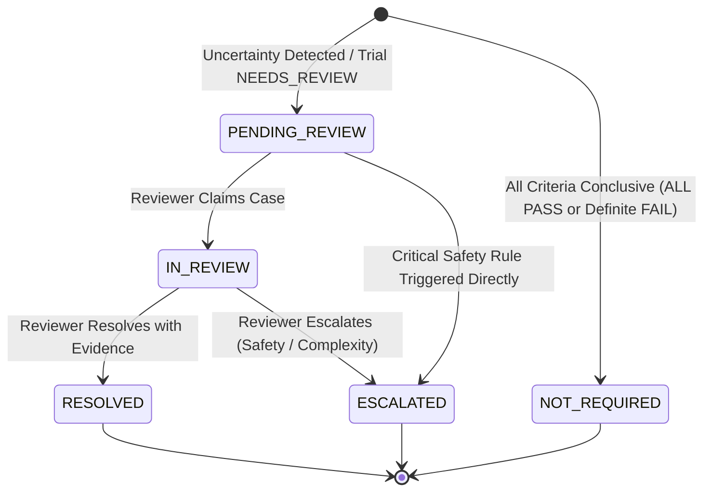

# Phase 9: Human Review Workflow & State Machine

## 1. Overview

The MedMatch Human Review Workflow provides a closed-loop adjudication protocol for cases where machine-generated eligibility reasoning cannot safely reach a definitive conclusion.

Key principles:
1. **Machine Immutability**: The original automated reasoning, confidence scores, and extracted claims are permanently captured in `original_machine_output` and never overwritten.
2. **Deterministic Triage**: Case routing and priority are computed purely through transparent, reproducible rules.
3. **Mandatory Evidence Binding**: Human clinical reviewers cannot override an `UNKNOWN` to `PASS` or `FAIL` without supplying explicit evidence citations (`evidence_references`).
4. **Audit Trail**: Every state transition generates an immutable audit event.

---

## 2. Review State Machine

### 2.1 State Definitions
- **`NOT_REQUIRED`**: Automated reasoning determined all criteria with verified evidence.
  - Trial status is either `ELIGIBLE` (all pass) or `INELIGIBLE` (one or more fail with verified evidence and no critical conflicts).
- **`PENDING_REVIEW`**: Case routed to queue due to missing data, ambiguity, conflict, or grounding failure.
- **`IN_REVIEW`**: Synthetic reviewer has claimed the case and is inspecting evidence.
- **`RESOLVED`**: Reviewer recorded an adjudication decision with justification and evidence references.
- **`ESCALATED`**: Case escalated to a multi-disciplinary panel due to active contradictions or high-risk clinical ambiguities.

---

## 3. Reviewer Decisions

A reviewer may render one of six formal decisions:
1. **`CONFIRM_PASS`**: Agrees with a machine `PASS` verdict.
2. **`CONFIRM_FAIL`**: Agrees with a machine `FAIL` verdict (patient is ineligible).
3. **`RESOLVE_PASS`**: Resolves an `UNKNOWN` or disputed criterion to `PASS` by citing verified clinical evidence not previously ingested or resolved.
4. **`RESOLVE_FAIL`**: Resolves an `UNKNOWN` to `FAIL` by identifying an uncaptured contraindication or exclusion.
5. **`INSUFFICIENT_EVIDENCE`**: Confirms that patient record remains insufficient to determine eligibility. Patient remains un-enrolled.
6. **`ESCALATE`**: Forwards case to institutional review or principal investigator.

---

## 4. Evidence Constraint Enforcement

When a reviewer issues `RESOLVE_PASS` or `RESOLVE_FAIL`, the system programmatically enforces:
$$\text{len}(\text{evidence\_references}) \ge 1$$
If a reviewer attempts to override a machine verdict without supplying supporting evidence citations, the resolution request is rejected immediately with a validation error.
