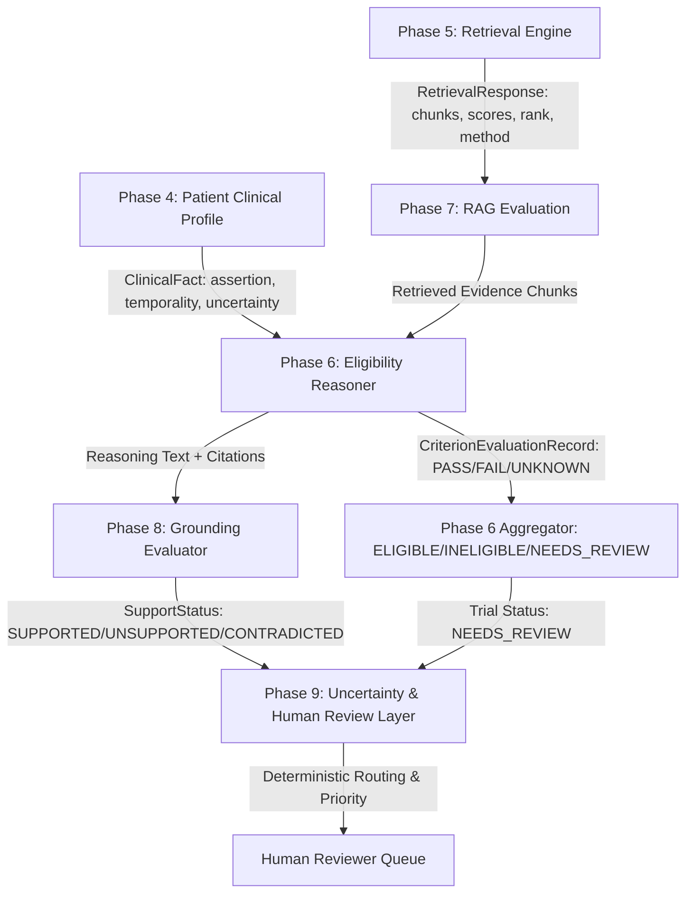

# Phase 9: Uncertainty & Human Review Audit

## 1. Audit Objective & Scope

This audit evaluates the information representation, uncertainty handling, conflict manifestations, and human review touchpoints across the MedMatch architecture established in Phases 4 through 8.

The goal is to determine:
1. Where patient clinical facts enter the reasoning pipeline and how uncertainty is attached.
2. Where retrieved trial protocol evidence enters the pipeline and how retrieval uncertainty is preserved or lost.
3. Where criterion-level reasoning produces `PASS`, `FAIL`, or `UNKNOWN` and how uncertainty propagates.
4. Where trial-level aggregation occurs and whether reasons for uncertainty are preserved or flattened.
5. How evidence grounding (Phase 8) informs uncertainty (unsupported claims, contradictions, insufficient evidence).
6. What information is currently available to a human reviewer and what gaps must be bridged by Phase 9.

---

## 2. Ingestion & Uncertainty Lifecycle Across Prior Phases

### 2.1 Phase 4: Patient Clinical Information (`scripts/patient_schema.py`)
- **Representation**:
  - `ClinicalFact` models concept, value, unit, `assertion` (`AFFIRMED`, `NEGATED`, `POSSIBLE`, `HISTORICAL`, `UNKNOWN`), `temporality` (`CURRENT`, `HISTORICAL`, `DATE_SPECIFIC`, `DURATION`, `BEFORE_EVENT`, `AFTER_EVENT`, `RELATIVE_INTERVAL`, `UNKNOWN`), and `uncertainty` (`KNOWN`, `UNKNOWN`, `NOT_MENTIONED`, `UNCERTAIN`, `CONFLICTING`, `PATIENT_REPORTED`, `CLINICIAN_DOCUMENTED`).
- **Audit Findings**:
  - Phase 4 explicitly defined `CONFLICTING`, `UNCERTAIN`, and `NOT_MENTIONED`.
  - **Strength**: Explicit distinction between `NOT_MENTIONED` and `NEGATED` (missing $\neq$ absent).
  - **Gap**: When two clinical documents present differing values (e.g. HbA1c 8.2% on Jan 10 vs 7.1% on Feb 15, or conflicting allergy reports), Phase 4 stores them as separate facts or flags `CONFLICTING`, but does not provide a formal resolution protocol or tie them to downstream criterion impact.

### 2.2 Phase 5: Retrieval Engine (`scripts/retrieval_schema.py`, `scripts/retrieval_engine.py`)
- **Representation**:
  - `RetrievalRequest`, `RetrievalResponse`, `ScoredChunk`, tracking `retrieval_method`, `rank`, `similarity_score`, `provenance`.
- **Audit Findings**:
  - Retrieval engine provides evidence passages from protocol documents.
  - **Strength**: Chunks preserve provenance (`document_id`, `section_id`, `chunk_id`).
  - **Gap**: When retrieval confidence is low (e.g., maximum similarity score below threshold, or zero chunks retrieved for an obscure inclusion criterion), the retriever returns an empty or low-relevance set. Previously, downstream components received this as empty evidence without a structured `INSUFFICIENT_RETRIEVAL` uncertainty flag.

### 2.3 Phase 6: Eligibility Reasoning & Aggregation (`scripts/eligibility_schema.py`, `scripts/eligibility_aggregator.py`)
- **Representation**:
  - Three-valued criterion evaluation: `CriterionEvaluationStatus` (`PASS`, `FAIL`, `UNKNOWN`).
  - Aggregation logic:
    - If ANY criterion is `FAIL` $\rightarrow$ `INELIGIBLE`.
    - Else if ANY criterion is `UNKNOWN` $\rightarrow$ `NEEDS_REVIEW`.
    - Else if ALL criteria are `PASS` $\rightarrow$ `ELIGIBLE`.
- **Audit Findings**:
  - **Strength**: Strict deterministic three-valued logic. `UNKNOWN` is never collapsed into `PASS` or `FAIL`.
  - **Gap**: The aggregated trial status `NEEDS_REVIEW` is coarse. It does not explain **why** the criterion was `UNKNOWN` (e.g., missing patient lab vs. ambiguous temporal window vs. conflicting records). Furthermore, an evaluator cannot tell whether the `UNKNOWN` is easily resolvable by a simple chart query or requires an escalated medical panel review.

### 2.4 Phase 7: RAG vs. NON-RAG Isolation (`scripts/rag_experiment.py`, `scripts/nonrag_experiment.py`)
- **Audit Findings**:
  - NON-RAG (E5) relies on internal parametric knowledge for protocol criteria, leading to higher hallucination and omission rates.
  - RAG (E6–E8) grounds criteria in retrieved protocol passages.
  - **Gap**: When retrieved evidence conflicts with patient facts (e.g. protocol requires therapy within 30 days, but patient record says 45 days), the reasoner must reject or fail the criterion, but if the patient record date is ambiguous ("recently"), the reasoner marks `UNKNOWN`. Phase 7 demonstrated that retrieval alone cannot resolve intrinsic clinical ambiguity in patient notes.

### 2.5 Phase 8: Evidence Grounding & Hallucination Auditing (`scripts/grounding_schema.py`, `scripts/grounding_validator.py`)
- **Representation**:
  - `GroundingClaim`, `GroundingEvidence`, `CitationValidationRecord`.
  - Five-status support: `SUPPORTED`, `PARTIALLY_SUPPORTED`, `UNSUPPORTED`, `CONTRADICTED`, `INSUFFICIENT_EVIDENCE`.
  - Taxonomy H1–H10 (e.g., H1 fabricated fact, H6 contradiction, H7 citation mismatch, H8 unsupported conclusion).
- **Audit Findings**:
  - **Strength**: Phase 8 provides a fine-grained audit of reasoning text fidelity. It catches claims where the machine asserts `PASS` despite zero supporting evidence (`H8`).
  - **Gap**: Phase 8 evaluates and scores the claims, but does **not route** cases to human intervention. When Phase 8 detects an `UNSUPPORTED` claim or an `H6` contradiction in machine reasoning, the trial decision must NOT be trusted autonomously; it must be intercepted and routed to human review.

---

## 3. Seven Dimensions of Uncertainty in MedMatch

Phase 9 synthesizes these audit findings into seven foundational uncertainty categories:

| Dimension | Description | Originating Phase | Impact on Automated Decision | Routing Requirement |
|:---|:---|:---|:---|:---|
| **1. Missing Patient Fact** | Required clinical data (e.g. HER2 status, baseline LVEF) is unrecorded | Phase 4 (`NOT_MENTIONED` / `UNKNOWN`) | Cannot evaluate criterion $\rightarrow$ `UNKNOWN` | `NEEDS_REVIEW` |
| **2. Conflicting Evidence** | Multiple records assert contradictory statuses or values | Phase 4 (`CONFLICTING`), Phase 8 (`CONTRADICTED`) | Incompatible premises $\rightarrow$ unreliable automated decision | `NEEDS_REVIEW` / `ESCALATED` |
| **3. Temporal Ambiguity** | Event timing is relative or undefined (e.g. "prior stroke", "recent chemotherapy") | Phase 4 (`RELATIVE_INTERVAL` / `UNKNOWN`) | Cannot confirm whether event falls within protocol window | `NEEDS_REVIEW` |
| **4. Numerical Ambiguity** | Measurement lacks units, spans a borderline interval, or has conflicting assays | Phase 4 labs, Phase 8 numerical claims | Borderline cutoff satisfaction uncertain | `NEEDS_REVIEW` |
| **5. Insufficient Retrieval** | Retriever returns low-scoring or empty chunks for criterion | Phase 5 retriever | Reasoner lacks protocol evidence | `NEEDS_REVIEW` |
| **6. Unsupported Inference** | Machine reasoning extrapolates clinical conclusions without source grounding | Phase 8 (`UNSUPPORTED` / H5 / H8) | Machine hallucination hazard | Intercept $\rightarrow$ `NEEDS_REVIEW` |
| **7. Grounding Contradiction** | Machine claim inverts or directly contradicts patient or protocol evidence | Phase 8 (`CONTRADICTED` / H6) | Direct reasoning error | Intercept $\rightarrow$ `ESCALATED` |

---

## 4. Reconciling Ontologies Across Phases

To eliminate confusion between overlapping labels across phases, Phase 9 establishes an explicit ontological mapping:

| Concept Domain | Phase 4 (Patient) | Phase 6 (Reasoning) | Phase 8 (Grounding) | Phase 9 (Canonical Uncertainty) |
|:---|:---|:---|:---|:---|
| Fully confirmed fact | `KNOWN` (`AFFIRMED`) | `PASS` / `FAIL` | `SUPPORTED` | `RESOLVED` |
| Absent from record | `NOT_MENTIONED` | `UNKNOWN` | `INSUFFICIENT_EVIDENCE` | `MISSING` |
| Internal clinical doubt | `UNCERTAIN` | `UNKNOWN` | `INSUFFICIENT_EVIDENCE` | `LOW_CONFIDENCE` |
| Discrepant data points | `CONFLICTING` | `UNKNOWN` | `CONTRADICTED` | `CONFLICTING` |
| Vague timing / unit | `UNKNOWN` temporality | `UNKNOWN` | `PARTIALLY_SUPPORTED` | `AMBIGUOUS` |
| Outdated record | `HISTORICAL` | `UNKNOWN` (if recency required) | `INSUFFICIENT_EVIDENCE` | `STALE` |
| Empty protocol context | N/A | `UNKNOWN` | `INSUFFICIENT_EVIDENCE` | `INSUFFICIENT_EVIDENCE` |

---

## 5. Audit Conclusions & Phase 9 Requirements

1. **Deterministic Propagation**: Uncertainty must flow upward:
   $$\text{Fact / Evidence Uncertainty} \longrightarrow \text{Criterion Uncertainty} \longrightarrow \text{Trial Eligibility Status} \longrightarrow \text{Review Routing \& Priority}$$
2. **Preservation of Machine Outputs**: Human review must **never overwrite** the original machine decision; it must append an auditable review record.
3. **Evidence Requirement**: Reviewers cannot resolve uncertainty without providing explicit evidence references where evidence is required.
4. **Pure Isolation**: The review subsystem is an analytical and workflow evaluation layer; production services remain completely isolated.
