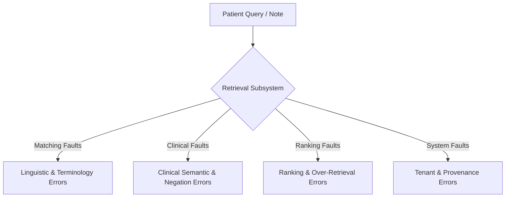

# Clinical Trial Candidate Retrieval — Error Taxonomy

## Scope & Methodological Notice

> [!WARNING]
> **TAXONOMIC CLASSIFICATION NOTICE:**
> The error categories defined in this document represent a comprehensive failure catalog for clinical candidate trial and criterion retrieval.
>
> **RETRIEVAL ERRORS ARE NOT ELIGIBILITY REASONING ERRORS.**
> Retrieval failures occur during candidate search, ranking, and filtering. They represent failures of **evidence discovery**, not failures of downstream clinical logic.
>
> **NO EMPIRICAL FAILURE RATES ARE CLAIMED.**
> In accordance with research integrity standards, error incidence rates can only be reported once measured against a verified, double-annotated gold-standard benchmark corpus.

---

## Error Classification Matrix

---

## Detailed Retrieval Error Categories

| # | Error Code | Error Category | Clinical & Technical Description | Retrieval Consequence |
| :---: | :--- | :--- | :--- | :--- |
| 1 | `ERR_RET_MISSED_CRITERION` | **Missed Relevant Criterion** | The target trial is retrieved, but the specific criterion directly satisfying or disqualifying the patient is omitted from the top candidate pool. | Downstream LLM reasons on incomplete trial criteria; false verdict. |
| 2 | `ERR_RET_MISSED_TRIAL` | **Missed Relevant Trial** | An eligible clinical trial fails to appear anywhere in the top-K retrieved candidate list. | False negative; patient is never considered for an eligible trial. |
| 3 | `ERR_RET_LEXICAL_MISMATCH` | **Lexical Mismatch** | Query and trial criteria use synonymous clinical expressions that share zero lexical tokens (e.g., "high blood pressure" vs "arterial hypertension"). Pure lexical search fails. | Lexical BM25 score is 0.0; trial dropped without dense fallback. |
| 4 | `ERR_RET_SEMANTIC_MISMATCH` | **Semantic Mismatch / Embedding Drift** | General-domain embedding model maps clinically distant conditions close together in vector space (e.g., small cell vs non-small cell lung cancer). | Irrelevant trials crowd out true oncology targets in top-K. |
| 5 | `ERR_RET_ABBREVIATION_MISMATCH` | **Abbreviation Mismatch** | Query uses shorthand ("NSCLC", "SBRT", "DVT", "IHC") while protocol uses expanded names ("non-small cell lung cancer", "stereotactic body radiation therapy"). | Lexical overlap failure without medical synonym expansion. |
| 6 | `ERR_RET_TERMINOLOGY_MISMATCH` | **Nomenclature / Coding Mismatch** | Protocol specifies proprietary drug compound or research code (e.g., "AZD9291", "MK-3475") while patient note uses generic or brand name ("osimertinib", "Keytruda"). | Extreme lexical disconnect; requires ontology cross-referencing. |
| 7 | `ERR_RET_NEGATION_ERROR` | **Negation-Induced Retrieval Error** | Dense vector search retrieves a trial because the patient note contains the word "metastases", failing to perceive that the sentence said "NO active brain metastases". | Irrelevant trials targeting metastatic disease retrieved inappropriately. |
| 8 | `ERR_RET_TEMPORAL_ERROR` | **Temporal Expression Retrieval Error** | Retrieval fails to distinguish historical resolved conditions from active conditions, retrieving trials whose exclusion is triggered only by active disease. | Dilutes top-K candidates with irrelevant safety screens. |
| 9 | `ERR_RET_NUMERICAL_UNIT_ERROR` | **Numerical / Unit Retrieval Error** | Patient note lists "ANC 1.5 x 10^9/L" while trial lists "ANC >= 1500/mcL". Neither dense nor uncalibrated lexical search resolves unit equivalence. | Candidate trial receives low similarity despite exact threshold satisfaction. |
| 10 | `ERR_RET_OVER_RETRIEVAL` | **Over-Retrieval / Low Precision** | Top-K candidate list contains dozens of loosely related trials, exceeding LLM prompt context window capacity and increasing inference costs. | High token overhead; attention dilution in eligibility reasoning. |
| 11 | `ERR_RET_DUPLICATE_EVIDENCE` | **Duplicate Evidence** | Multiple minor amendments of the same protocol or identical criteria returned as separate top candidates, crowding out distinct trials. | Wasted candidate slots in top-K pool. |
| 12 | `ERR_RET_RANKING_INVERSION` | **Ranking Inversion Error** | The most relevant trial is placed at rank 15 instead of rank 1-5, causing it to be truncated when $K=10$. | Discards high-probability trial before reasoning stage. |
| 13 | `ERR_RET_METADATA_FILTER_ERROR` | **Metadata / Filter Error** | Hard filter drops an eligible trial due to stale status (e.g., trial labeled "Completed" in local DB while active elsewhere). | Systematic candidate exclusion regardless of textual relevance. |
| 14 | `ERR_RET_TENANT_LEAKAGE` | **Tenant-Isolation Error** | Search query returns trials from another hospital's tenant database. | **Fatal Security & Regulatory Breach:** Cross-tenant clinical data leakage. |
| 15 | `ERR_RET_PROVENANCE_LOSS` | **Provenance Loss** | Candidate returned as an opaque vector distance without tracing which protocol text or criterion ID produced the match. | Unverifiable candidate selection; un-auditable clinical pipeline. |
